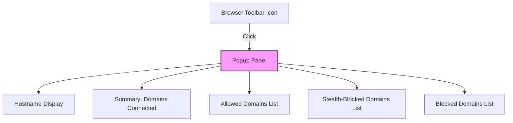

# Understanding the Popup Panel

## Workflow Overview

### Task Description
This guide helps you understand how to use the uBO Scope popup panel to interpret network connection data for the active browser tab. You'll learn how the extension categorizes third-party domains into allowed, blocked, and stealth-blocked, and how to read and analyze connection counts effectively.

### Prerequisites
- uBO Scope installed and activated in your browser.
- Browser tab open with active network requests (preferably a website with third-party content).
- Basic understanding of third-party domains in web browsing.

### Expected Outcome
You will be able to confidently:
- Open and navigate the popup panel.
- Distinguish between ‘allowed’, ‘blocked’, and ‘stealth-blocked’ domain lists.
- Understand what the domain counts mean and how they relate to your browsing privacy.
- Use visual cues and counts to analyze third-party connections per tab.

### Time Estimate
5–10 minutes to fully explore and understand the popup panel.

### Difficulty Level
Beginner to Intermediate

---

## Step-by-Step Instructions

### 1. Opening the Popup Panel
- Click the uBO Scope toolbar icon in your browser to open the popup panel.
- The popup displays data related to the currently active tab.
- The page title section shows the hostname of the active tab.

### 2. Reading the Domain Counts Summary
- At the top, find the **domains connected** summary which shows the total count of distinct third-party domains contacted.
- This count reflects the number of unique external domains that your browser connected to in this tab session.
- Remember, a lower number indicates fewer third-party connections, which is typically better for privacy.

### 3. Understanding the Categories
The popup panel splits third-party connections into three categories:

#### a. Not Blocked (Allowed)
- Domains and hostnames listed here represent third-party servers that your browser successfully connected to.
- These connections were allowed by your content blocker or occurred due to no blocking.

#### b. Stealth-Blocked
- This category shows domains that were **stealth-blocked**, meaning connections were prevented in a way invisible to the website’s scripts.
- Stealth blocking helps avoid detection of blocking activity by web pages, aiding in maintaining webpage functionality while protecting privacy.

#### c. Blocked
- Domains here represent third-party connections that were directly blocked by content blockers or network protections.
- These requests failed or were cancelled by the blocking rules.

### 4. Interpreting Domain Rows
- Each category lists domains with an associated count indicating how many times connections to that domain were made.
- Domains are displayed in Unicode with any Punycode decoded to readable names.

### 5. Relating to the Toolbar Badge
- The badge number on the extension icon mirrors the **allowed** category domain count for the active tab.
- This offers a quick visual indicator of third-party exposure.

### 6. Refresh and Data Update
- The popup updates dynamically when you navigate to different tabs or interact with new web pages.
- To get fresh data, close and reopen the popup or switch tabs.

### 7. Troubleshooting Empty or Missing Data
- If the popup shows 'NO DATA' or zero connections:
  - Ensure uBO Scope is enabled and allowed to run on the site.
  - Confirm your browser supports the required `webRequest` APIs.
  - Check for any extension permission issues.
  - See the [Troubleshooting Common Issues](getting-started/first-use-validation/troubleshooting-common-issues) guide.

---

## Examples & Visual Overview

### Example: Popup Panel on a News Website
- Assume you visit a news site that loads multiple third-party trackers and ad servers.
- Opening the popup shows:
  - **Allowed**: cdn.example.com (15 connections), analytics.example.net (20 connections)
  - **Stealth-Blocked**: tracker.hiddenads.com (5 connections)
  - **Blocked**: ads.badexample.org (10 blocked connections)
- The toolbar badge shows “2” because there are 2 distinct allowed domains.

### Code Snippet for Domain Display (HTML Template)
```html
<template id="domainRow">
    <div class="row"><span class="domain">_</span><span class="count badge">_</span></div>
</template>
```
- This {domain, count} pair is repeated for each domain in the categories.

### Panel Layout Diagram


---

## Troubleshooting & Tips

### Common Issues
- **No Data Displayed**: Confirm extension permissions and reload the page.
- **Counts Stay at Zero**: Visit a site known for multiple third-party connections to verify.
- **Misleading High Count**: Remember that allowed connections include CDN and essential third-party domains.

### Best Practices
- Use the popup panel to compare third-party connections across tabs and sites.
- Monitor the **stealth-blocked** category to better understand connections your blockers are invisibly preventing.
- Use domain counts to fine-tune your content blockers or privacy filters.

### Performance Note
- The popup fetches data asynchronously; brief delays in showing data are normal right after page load.

### Alternative Views
- While the popup shows per-tab data, consider using the toolbar badge as a quick ongoing gauge of third-party activity.

---

## Next Steps & Related Content

- **Installation & Setup**: [Installation and First Use](guides/getting-started-workflows/installation-quickstart)
- **Validating Installation**: [Is uBO Scope Working?](getting-started/first-use-validation/validate-extension-working)
- **Understanding Terminology**: [Fundamental Terms & Concepts](overview/core-concepts-architecture/terminology)
- **System Architecture**: [How uBO Scope Works](overview/core-concepts-architecture/system-architecture)
- **Troubleshooting**: [Troubleshooting Common Issues](getting-started/first-use-validation/troubleshooting-common-issues)

Explore these to deepen your mastery and use uBO Scope with confidence.