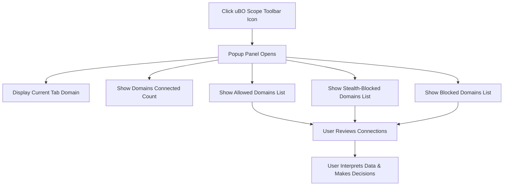

# Reveal and Review Remote Connections

This guide walks you through using the uBO Scope popup panel to explore all network connections initiated by the current webpage. You will learn how to read connection statuses, understand the significance of the badge count, and distinguish between allowed, blocked, and stealth-blocked remote domains.

---

## 1. Workflow Overview

### Task Description
Explore the uBO Scope extension popup to reveal detailed network connection data per active browser tab — identifying all attempted and active third-party connections, categorized by their request outcome.

### Prerequisites
- uBO Scope installed and enabled in your browser.
- You have visited a webpage for which you want to investigate remote connections.
- The extension has the necessary permissions (`webRequest`, `activeTab`, `storage`) configured to monitor network requests.

### Expected Outcome
You will be able to:
- Open the uBO Scope popup and see all distinct remote domains contacted by the current webpage.
- Understand the meaning of connection status groups: allowed, blocked, and stealth-blocked.
- Interpret the numerical badge count on the toolbar icon as a summary of distinct allowed third-party domains.

### Time Estimate
Approximately 5 minutes to open, review data, and interpret the results for a single webpage.

### Difficulty Level
Beginner — no prior technical knowledge required beyond using a browser with extensions.

---

## 2. Step-by-Step Instructions

### Step 1: Open uBO Scope Popup Panel
- Click the uBO Scope icon in your browser toolbar.
- The popup panel appears, displaying the network connections summary for the active tab.

*Expected Result:* The popup header shows the domain of the current webpage at the top.

### Step 2: Review the Domains Connected Summary
- At the top of the popup, locate the section labeled `domains connected: X`, where `X` is the total number of distinct remote domains contacted.

*Expected Result:* A count reflecting how many unique third-party domains the page has attempted to or successfully connected with.

### Step 3: Understand the Connection Status Sections
The popup divides domains into three categories:

- **Not Blocked (Allowed):** Domains the webpage successfully connected to without being blocked.
- **Stealth-Blocked:** Domains where connection attempts were silently intercepted or redirected by the content blocking mechanism, preventing detection by the webpage.
- **Blocked:** Domains where connection attempts were explicitly blocked and failed to connect.

Each section lists domains with a count indicating the number of requests made to that domain.

*Action:* Scroll through the domains listed under each category to identify connections.

### Step 4: Interpret Domain Names
- Domains shown are decoded using Punycode conversion to display Unicode characters when applicable.
- Subdomains and the root domains are shown, helping you understand from which third-party servers resources are fetched or blocked.

*Example:* `example.cdn.com` with a count `5` means 5 requests were sent to `example.cdn.com`.

### Step 5: Relate Badge Count to Allowed Domains
- The extension’s toolbar icon badge shows the number of distinct third-party domains **allowed** (not blocked).
- This count helps you quickly gauge the level of third-party connections from the current page.

*Tip:* A lower badge count indicates fewer distinct remote third-party servers contacted, which often aligns with increased privacy.

### Step 6: Use the Data for Privacy or Performance Audits
- Use the detailed lists to audit which domains your visited pages communicate with.
- Identify any unexpected or suspicious domains, or validate that known trackers are blocked.

*Decision Point:* Depending on your findings, you may want to adjust your content blocker settings or filter lists to tighten or loosen blocking.

---

## 3. Examples & User Scenarios

### Scenario 1: Confirming a Content Blocker’s Effectiveness
- Visit a webpage known to load ads and trackers.
- Open the uBO Scope popup.
- You see several domains under "blocked" and "stealth-blocked," indicating blocking is active.
- The allowed count is low, confirming that fewer third-party connections are established.

### Scenario 2: Detecting Unexpected Third-Party Connections
- You notice a domain under "allowed" that you do not recognize.
- Research the domain to assess if it's a legitimate CDN or a potential privacy concern.
- Refine your blocking rules if necessary.

---

## 4. Troubleshooting & Tips

### Common Issues
- **No data displayed in popup:** 
  - Ensure the current tab is fully loaded.
  - Verify uBO Scope permissions are granted.
  - Try refreshing the webpage.

- **Badge count does not update:**
  - This may reflect delayed processing; wait a few seconds.
  - Restart the browser or disable/re-enable the extension if the issue persists.

- **Domain names appear as Punycode:**
  - This is normal for internationalized domain names; the extension converts them to Unicode where possible.

### Best Practices
- Regularly review domains under blocked and stealth-blocked for insights into your content blockers’ behavior.
- Use the detailed lists to inform filter list improvements or to detect whether certain trackers bypass blocking.

### Performance Considerations
- The popup fetches data asynchronously; in tabs with very high request counts, some delay before full data appears is expected.

### Alternative Approaches
- Combine uBO Scope observations with browser developer tools network tab for deeper analysis.

---

## 5. Next Steps & Related Content

- After reviewing remote connections, proceed to [Interpreting the Badge Count and Results](https://documentation-url/guides/getting-started-workflows/interpreting-badge-count) to better understand the badge reporting.
- For initial setup, consult [Install and Configure uBO Scope](https://documentation-url/guides/getting-started-workflows/install-configure-extension).
- Explore [Core Concepts & Terminology](https://documentation-url/overview/core-concepts/core-terminology) for a deeper understanding of connection outcome definitions.

---

## Additional Reference

### Popup Panel Structure Overview
- **Page Hostname:** Shows the domain of the current tab.
- **Domains Connected:** Summary count of distinct third-party domains contacted.
- **Sections:** Lists categorized by outcome:
  - Allowed (Not Blocked)
  - Stealth-Blocked
  - Blocked
- **Each Domain Entry:** Displays domain name and number of connection attempts.

---

## Visual Representation

---

## Summary
This page guides you through interpreting the uBO Scope popup for your current browser tab. It reveals all third-party domains involved in network requests, sorted by connection status, enabling you to audit and understand your privacy exposure at a domain level.

---