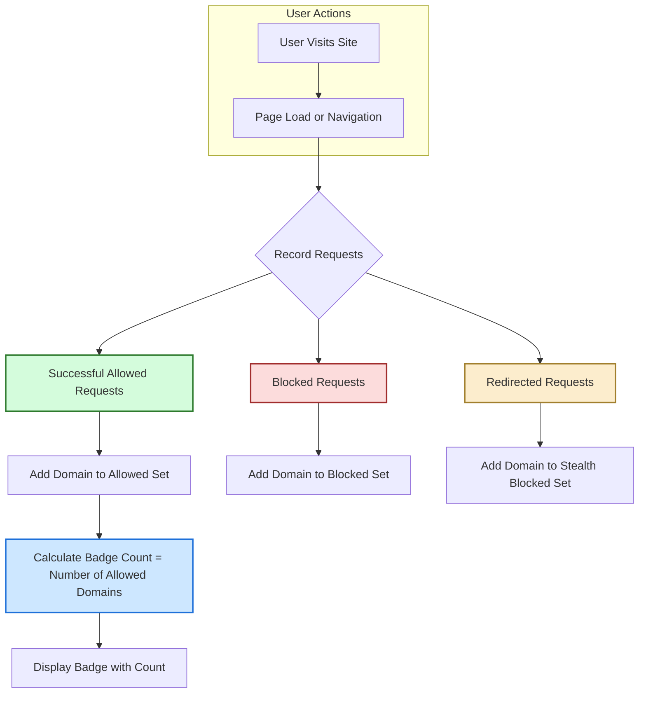

# Understanding the Toolbar Badge

Discover what the badge count means, why a lower number is better, and how to interpret changes as you browse. This guide demystifies the badge logic and addresses common misconceptions about content blockers versus connection counts.

---

## 1. What the Toolbar Badge Represents

When you install and use uBO Scope, you'll notice a numeric badge appearing on its toolbar icon. This badge is not just a random number but a meaningful signal reflecting your browsing privacy landscape:

- **Badge Count Meaning:** The number displayed is the count of **distinct third-party remote servers** your current tab has connected to.
- **Why Distinct Third-Party Servers?** Each server represents an external domain that your browser communicated with beyond the primary site you visited.

**Key Insight:** A _lower_ badge count **means better privacy and fewer external connections**, while a _higher_ count indicates your tab is connecting to many third-party servers.

> Remember, third parties are not inherently bad; many are legitimate providers like Content Delivery Networks (CDNs). Still, this badge helps you see how many unique third-party connections your browsing generates.

---

## 2. How uBO Scope Calculates the Badge

### Network Requests Tracking

uBO Scope listens to network events using browser APIs to track all outgoing requests made by webpages:

- It captures the **outcome of each network request** independently of content blockers.
- Outcomes recorded include:
  - **Allowed**: The request successfully reached its server.
  - **Stealth-blocked**: Requests blocked silently by stealth techniques.
  - **Blocked**: Requests outright blocked or failed.

### Aggregation Logic

- The badge count reflects the **number of distinct domains** for which successful connections were made (i.e., the `allowed` category).
- When the tab navigates to a new page, tracking resets to provide up-to-date counts specific to the current URL's browsing context.

### How Domains Are Counted

- Counting is based on **domains, not individual URLs or resources**. For example, multiple resources from `cdn.example.com` count as one.
- Domains are extracted by parsing hostnames from request URLs and identifying their registrable public suffixes.

This approach offers a clear and concise view of how many unique third-party servers are actually in use.

---

## 3. Interpreting Badge Variations While Browsing

### When the Badge Changes

- **Page Load:** The badge resets and recalculates for the new main document.
- **Dynamic Content:** As the page fetches additional resources (e.g., scripts, images, iframes), the badge updates if new third-party domains are contacted.
- **Redirects and Errors:** Redirected requests or those blocked do not increase the badge count.

### Practical Scenario

Suppose you visit a news site:

- The badge starts at zero.
- As content loads, connections to the main site and a CDN increase the badge to 1 or 2.
- Later, an embedded video player from another domain loads, increasing the badge count.
- If your content blocker blocks some ads or tracking domains, the badge count stays lower, reflecting fewer active third parties.

### What a Stable or Decreasing Badge Means

- No new distinct third-party connections have occurred.
- Effective content blocking or minimal third-party resource usage by the visited site.

---

## 4. Common Misconceptions Debunked

### Myth 1: Lower Block Count Means Better Blocking

<u>Reality:</u> The badge reflects **allowed connections**, not blocks. A high block count can accompany more risky third-party connections if the blocker lets through more domains.

### Myth 2: "Ad blocker test" sites show reliable results

<u>Reality:</u> These test sites use artificial requests that don’t reflect real-world browsing. uBO Scope measures actual network connections happening in your browser, providing a realistic privacy snapshot.

### Myth 3: All third-party domains are malicious or trackers

<u>Reality:</u> Many third parties provide essential functionality (e.g., CDNs, payment processors). The badge count helps you see the full extent of third-party exposure but does not label them intrinsically good or bad.

<Note>
Use the badge as a tool to understand your exposure; combine it with the detailed popup report for deeper insights into the nature of each third party.
</Note>

---

## 5. How to Use the Badge Effectively

### Step-by-Step Workflow

<Steps>
<Step title="Observe the Badge">
Check the badge number before and after visiting a site to gauge third-party exposure.
</Step>
<Step title="Open the Popup Panel">
Click the uBO Scope icon to view detailed lists of allowed, stealth-blocked, and blocked domains.
</Step>
<Step title="Analyze Allowed Domains">
Identify legitimate services (CDNs, analytics) versus unknown or suspicious third parties.
</Step>
<Step title="Note Blocked Domains">
See which third parties are successfully blocked, indicating your content blocker effectiveness.
</Step>
<Step title="Repeat Across Sites">
Compare badge counts to learn which sites expose you to more third-party contacts.
</Step>
</Steps>

### Tips for Maximizing Value

- Use the badge to spot unexpected increases when browsing trusted sites; this might reveal hidden tracking.
- Combine badge observations with uBO Scope’s popup details for richer context.
- Remember the badge updates dynamically as pages load resources.

<Callout title="Tip">A consistently low badge count correlates with fewer hidden third-party connections and better privacy.</Callout>

---

## 6. Troubleshooting Badge Issues

| Problem                          | Cause & Solution                                                                                  |
|---------------------------------|-------------------------------------------------------------------------------------------------|
| Badge shows no number or zero    | No third-party connections yet; refresh page or visit different site.                            |
| Badge does not update            | Ensure uBO Scope is enabled and has necessary permissions; try reinstalling or restarting browser. |
| Badge number seems too high      | Some legitimate third parties inflate the count; consult the popup to understand domains listed. |
| Inconsistent badge and popup data| Check for browser bugs or extension conflicts that interfere with network event reporting.      |

<Warning>If you notice persistent badge issues, validate installation and permissions using the guide <a href="/getting-started/getting-value-quickstart/validating-installation">Validating Installation</a>.</Warning>

---

## 7. Summary

The uBO Scope toolbar badge is your real-time indicator of how many unique third-party servers your tab connects to, providing crucial transparency into your browsing privacy. Interpreting the badge as a count of allowed connections—not blocks—and combining this view with detailed popup data empowers you to make informed decisions about your web exposure.

---

## Related Documentation & Next Steps

- [Interpreting the Badge and Popup](/getting-started/getting-value-quickstart/interpreting-badge-popup) — Understand the detailed popup panel connected to the badge.
- [Validating Installation](/getting-started/getting-value-quickstart/validating-installation) — Confirm your extension is working correctly.
- [Reviewing Third-Party Connections](/guides/getting-started-workflows/reviewing-domain-connections) — Deep dive into analyzing third-party domains.
- [Debunking Block Count Myths](/guides/applied-scenarios-best-practices/debunking-block-count-myths) — Explore common blocker misconceptions.
- Official uBO Scope GitHub Repository for the latest source and updates: [https://github.com/gorhill/uBO-Scope](https://github.com/gorhill/uBO-Scope)

---

This page fits squarely within your onboarding journey, building on installation confirmation and leading you towards effective usage and deeper privacy understanding.

---

#### Visual Summary of Badge Logic

---

## Final Notes

- The badge focuses strictly on **distinct third-party domains with allowed connections**.
- Use the badge alongside the popup panel for comprehensive visibility.
- Understand the badge as an informative privacy metric, not a pass/fail blocker score.

