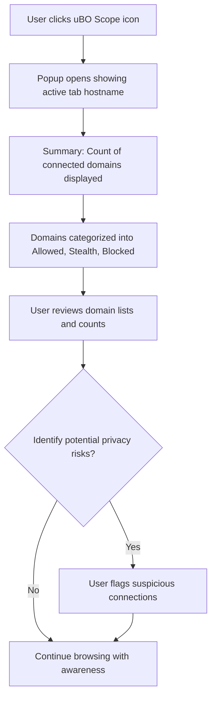

# Basic Usage: Analyzing Site Connections with uBO Scope

Unlock the power of uBO Scope to instantly understand third-party network connections on any webpage you visit. This guide walks you through opening the popup interface, grasping the meaning behind categorized connection outcomes, and confidently spotting potential privacy risks in real time.

---

## 1. Understanding What You Will Accomplish

**Goal:** Learn how to open and interpret the uBO Scope popup to analyze the distinct third-party servers connected to the active browser tab, categorized by connection outcome.

**Why it matters:** Visibility into allowed, stealth-blocked, and blocked domains empowers you to make informed privacy decisions by seeing which remote servers a webpage contacts and which are blocked.

**What you’ll get:** Hands-on steps to open the popup, read the domain lists for each outcome, and quickly assess third-party connections.

**Estimated time:** 5 minutes

**Difficulty:** Beginner

---

## 2. Step-by-Step Walkthrough

### Step 1: Open the uBO Scope Popup

1. Navigate to the browser toolbar where uBO Scope is installed.
2. Click the uBO Scope extension icon to open the popup window.

> <Check> If the popup does not open, verify that the extension is installed and enabled in your browser settings.

### Step 2: Identify the Active Tab Hostname

- At the top of the popup, note the hostname and domain of the active tab’s main webpage.
- The domain is displayed clearly and provides context for all reported connections.

### Step 3: Review the Total Connected Domains Count

- Just below the hostname, find the summary section showing the count of distinct third-party domains connected.
- A smaller count generally indicates fewer third-party connections and potentially better privacy.

### Step 4: Understand the Three Outcome Categories

The popup groups third-party domains into three clearly demarcated sections:

- **Not Blocked (Allowed)**: Domains that successfully connected on the current tab.
- **Stealth-Blocked**: Domains where the connection was deliberately blocked in a stealthy manner, making it invisible to the webpage but logged by uBO Scope.
- **Blocked**: Domains with failed connection attempts (blocked explicitly) detected by the extension.

> <Tip> Each category represents a different privacy posture—allowed means active connections, stealth-blocked means silent blocking, and blocked indicates outright failures.

### Step 5: Explore Domains and Request Counts

- Within each section, domains are listed alongside a count badge showing how many requests were made to each domain.
- Domains are sorted alphabetically for ease of scanning.

### Step 6: Interpreting the Data

- Use the counts and category to quickly identify heavily contacted domains, which could be legitimate providers (e.g., content delivery networks) or trackers.
- Stealth-blocked domains often represent invisible tracking attempts blocked in a way that avoids webpage detection.
- Blocked domains may indicate attempt failures possibly due to your content blocker or browser-level blocking.

---

## 3. Real-World Example

Imagine you're on an online news website:

- Upon opening uBO Scope’s popup, you see:
  - **Not Blocked:** cdn.examplecdn.com (35), fonts.googleapis.com (10)
  - **Stealth-Blocked:** tracker.ads.com (18), analytics.somedata.org (22)
  - **Blocked:** tracking.badads.net (7), badscripts.eviltracker.com (3)

Interpretation:

- The site loads legitimate resources from CDN and font providers.
- Several invisible trackers are stealth-blocked, protecting your privacy without altering page behavior.
- Some known malicious trackers are blocked explicitly.

---

## 4. Troubleshooting Common Issues

<AccordionGroup title="Troubleshooting the Popup and Data Display">
<Accordion title="Popup Does Not Open">
- Ensure the extension is enabled and a compatible browser version is used (Chrome 122+, Firefox 128+, Safari 18.5+).
- Restart your browser if necessary.
- Confirm the extension icon is visible in the toolbar.
</Accordion>
<Accordion title="No Data or Missing Domains">
- Make sure you're viewing an active tab and that uBO Scope has permission to read network requests.
- Check browser permissions for `activeTab` and `webRequest` APIs.
- Reload the webpage to generate fresh network requests.
- Some requests may not be visible if the webpage uses protocols outside HTTP(S) or WebSocket.
</Accordion>
<Accordion title="Badge Count Not Updating">
- Network requests are processed with a slight delay (up to 1 second).
- If the count remains stale, try closing and reopening the popup.
- Check for conflicts with other extensions that might block or interfere with uBO Scope.
</Accordion>
</AccordionGroup>

---

## 5. Best Practices & Tips

- Regularly check the popup when visiting new or privacy-sensitive websites to monitor unexpected connections.
- Use the categorized domain lists to identify potential privacy risks quickly without manually digging through logs.
- Remember that not all allowed third-party connections are harmful; some are essential for site functionality.
- Pay special attention to stealth-blocked entries as indicators of background tracking attempts.

---

## 6. Next Steps and Related Documentation

- To deepen your understanding, explore the [Core Concepts & Terminology](../overview/core-concepts-arch/core-concepts-terminology) page for the classification logic behind allowed, stealth, and blocked categories.
- Learn how to interpret raw network requests in the [Interpreting Network Request Data](../guides/deep-dive-analysis/interpreting-network-data) guide.
- For installation or configuration help, refer to the [Installing and Enabling uBO Scope](../guides/getting-started/installation) guide.
- Familiarize yourself with the Popup UI and Toolbar Badge details in the [Understanding the Popup and Badge](../guides/getting-started/understanding-ui-badge) page.

---

## 7. Visual Summary of Workflow

---

For complete source code and updates, visit the [uBO Scope GitHub repository](https://github.com/gorhill/uBO-Scope).

---

## Frequently Asked Questions

<AccordionGroup title="FAQ">
<Accordion title="What does 'stealth-blocked' mean?">
Stealth blocking prevents a connection from being established while hiding this action from the webpage, making it undetectable by scripts on the site. uBO Scope logs these to inform you of silent blocking.
</Accordion>
<Accordion title="Why is the badge count important?">
The badge shows the distinct count of third-party domains that successfully connected, which gives a quick privacy indicator. Lower counts signify fewer third-party servers accessed.
</Accordion>
<Accordion title="Can uBO Scope block third-party connections?">
No, uBO Scope is a reporting tool only. It does not block connections itself but accurately reports what is allowed or blocked by other content blockers or browser mechanisms.
</Accordion>
</AccordionGroup>

---

Feel empowered to investigate and understand every external connection made by your browser with uBO Scope’s straightforward popup interface.