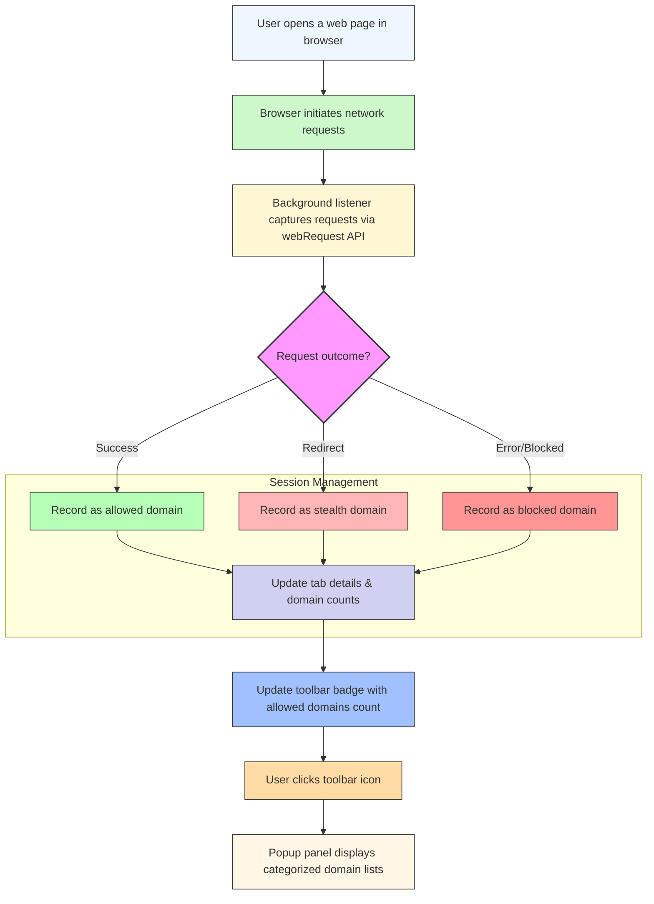

# Revealing Third-Party Connections: The Core Workflow

Discover how uBO Scope uncovers every connection your browser attempts or successfully makes to third-party remote servers. This guide walks you through the typical flow from loading a web page to interpreting the badge count in the toolbar and diving into the popup panel to examine all connection details.

---

## 1. Understanding the Core Workflow

When you navigate to a website, your browser loads multiple resources—some from the site itself (first-party), others from various third parties providing content, analytics, ads, or functionalities. uBO Scope is designed to track and expose these third-party connections transparently, so you can see which remote servers your browser communicates with.

The workflow covers:

- How uBO Scope tracks network requests in the background.
- How it categorizes outcomes of these requests.
- How it summarizes and displays the count of third-party domains via the toolbar badge.
- How you interact with the popup panel to reveal connection details.

### Prerequisites

- You have installed and enabled uBO Scope in your browser.
- Your browser supports the `webRequest` API (all major desktop browsers including recent versions of Chrome, Firefox, and Safari).
- You have visited at least one website after installation to generate connection data.

### Expected Outcome

- A toolbar badge indicating the number of distinct third-party domains connected from the current tab.
- A popup panel that reveals lists of domains grouped by connection status: allowed, stealth-blocked, and blocked.

### Time Estimate

- This workflow takes approximately 5 minutes to complete as you browse and explore the popup.

### Difficulty Level

- Beginner to intermediate users comfortable with browser privacy extensions.

---

## 2. Step-by-Step Walkthrough

<Steps>
<Step title="Open a Web Page">
Begin by opening any website in your browser after installing uBO Scope. This action triggers network requests from your browser to various domains for resources like images, scripts, and fonts.

**Outcome:**
- Browser sends network requests captured by uBO Scope's background service.
- The extension begins measuring connections associated with your current tab.

<Check>
Ensure the website you open is active and fully loaded to generate comprehensive connection data.
</Check>
</Step>

<Step title="uBO Scope Records Network Events">
uBO Scope listens to network traffic via the browser's `webRequest` API. It records three types of network events:

- **Allowed**: Successful connections that completed without issues.
- **Stealth-blocked**: Redirected connections that were silently blocked or modified.
- **Blocked**: Connections that resulted in errors or were actively blocked.

These events are associated with the tab ID and the hostname of the requests.

**Outcome:**
- The background monitors collect hostname and domain info.
- Distinct domains are tracked in categorized sets.

<Info>
The extension uses the Public Suffix List to correctly identify organizational domains, avoiding counting subdomains separately.
</Info>
</Step>

<Step title="Observe the Toolbar Badge Count">
After processing network requests, uBO Scope updates the badge count on its toolbar icon for the active tab. This count represents the number of unique third-party domains from which your browser loaded resources.

**Outcome:**
- A numeric badge appears showing connected third-party domain count.

<Note>
A lower badge number signifies fewer connections to external servers, which is usually better for privacy.
</Note>

<Warning>
The badge does NOT count blocked domains; it reflects only third-party domains from which your browser has successfully fetched resources.
</Warning>
</Step>

<Step title="Open the Popup Panel to Inspect Details">
Click the uBO Scope toolbar icon to open the popup panel. Here, you see a categorized summary of all third-party domains connected in the active tab:

- **Not Blocked** (allowed)
- **Stealth-Blocked** (redirected or modified requests)
- **Blocked** (failed or blocked requests)

Each domain listed shows a count badge indicating how many requests were made.

**Outcome:**
- Explore the specific domains involved in each category.

<Tip>
Use this info to assess privacy risks by identifying unexpected domains or high counts from third parties.
</Tip>
</Step>

<Step title="Interpret Connection Categories and Counts">
Understanding the statuses helps you assess the quality of content blocking and your exposure:

- **Allowed:** These are third-party domains your browser successfully connected to.
- **Stealth-Blocked:** Connections attempted but altered or redirected in a way that content blockers handle transparently.
- **Blocked:** Failed or actively blocked connections.

**Outcome:**
- Develop insight into actual third-party exposure.
- Use the counts to understand volume and frequency of requests per domain.

<Warning>
Do not confuse the number of blocked requests with the badge number, as these represent different concepts.
</Warning>
</Step>
</Steps>

---

## 3. Real-World Example

Imagine browsing a news website. You expect the browser to connect to the site’s own domain plus a handful of CDNs and analytics platforms. uBO Scope's badge shows 5, indicating connections to 5 unique domains besides the main site.

Opening the popup reveals:

- **Not Blocked**: example-cdn.com (12 requests), analytics.net (3 requests)
- **Stealth-Blocked**: trackers.example-ads.com (5 requests)
- **Blocked:** unwanted-tracker.com (4 requests)

You notice an unexpected domain with multiple allowed requests, which might warrant further investigation or adjusting your content blocking rules.

---

## 4. Troubleshooting & Tips

### Common Issues

- **Badge Count Doesn't Update:** Make sure you have refreshed the tab after installing uBO Scope, as data is associated with specific tabs.
- **Popup Panel Shows "NO DATA":** Check if the current tab is still active and supports the `webRequest` API. Some internal browser pages or certain extension pages do not provide data.
- **Unexpectedly High Counts:** Consider that some services use multiple subdomains or CDNs; these will appear as separate domains if organizational domains differ.

### Best Practices

- Regularly review the popup panel to understand your typical browsing footprint.
- Use uBO Scope alongside content blockers for a comprehensive privacy overview.
- Keep uBO Scope updated to benefit from improvements to domain identification and measurement accuracy.

### Performance Considerations

uBO Scope batches network request events and processes them at regular intervals (about one second apart) for efficiency and to avoid impacting browser performance.

<Tip>
Patience is key when opening the popup immediately after page load; give uBO Scope a moment to process all requests.
</Tip>

---

## 5. Next Steps & Related Content

- Explore the [Understanding the Popup Panel](../../guides/interpreting-results/understanding-popup) guide for deep dives into domain categories.
- Learn about [Badge Logic and Best Practices](../../guides/interpreting-results/badge-logic-best-practices) to master the meaning of badge counts.
- Consult [Validating Measurements & Badge Counts](../../getting-started/first-use-validation/validating-measurements) for how to ensure uBO Scope works correctly in your setup.
- For installation instructions, see [Installing uBO-Scope in Your Browser](../guides/getting-started/install-extension).

---

## Summary Diagram: Core Workflow of uBO Scope

---

## Notes

uBO Scope treats all network requests independently of content blocker controls or DNS filtering. It provides a transparent and unfiltered view of remote domains your browser interacts with.

The Public Suffix List is used internally to correctly identify organizational domains, ensuring accurate grouping of third-party domains even when many subdomains are involved.

---

For more in-depth context and to understand product value, review the product overview and other guides in the Documentation navigation.
