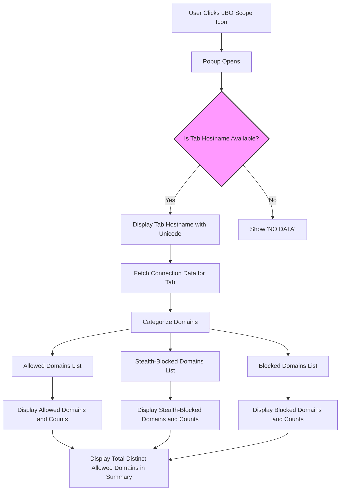

# Exploring the uBO Scope Popup Interface

## Overview
The uBO Scope popup interface offers a clear and immediate view of the network connections made by the current browser tab. It categorizes domains based on connection outcomes, presents a concise summary, and displays the tab's hostname context. This guide walks you through interpreting the sections of the popup interface, understanding badge counts, and navigating the UI to extract meaningful privacy insights right after setting up the extension.

---

## Prerequisites
- uBO Scope installed and active in your browser.
- Access to a tab with loaded webpage content.
- Basic understanding of browser extensions and navigation.

---

## What You Will Achieve
By the end of this guide, you will be able to:
- Recognize and interpret the different domain categories shown.
- Understand the significance of the badge count on the toolbar icon.
- Navigate and read the popup UI effectively to assess third-party connections.

---

## Interface Components Explained

### 1. Tab Hostname Display
- Located at the top of the popup.
- Shows the full hostname of the active tab, split into two parts if the subdomain differs from the registered domain.
- Uses Unicode conversion for internationalized domains, ensuring clarity.

### 2. Summary Section
- Displays the total count of distinct domains connected to by the current tab.
- The count reflects the number of unique domains that were contacted and not blocked.

### 3. Outcome Sections
The main popup body is divided into three categories, each listing domains and their connection attempt counts:

#### a. Not Blocked (Allowed)
- Domains from which the browser successfully fetched resources.
- Reflects connections permitted by content blockers or browser settings.

#### b. Stealth-Blocked
- Domains that are blocked through subtle or indirect means (e.g., redirects).
- Meant to show domains that were intercepted without explicit user notice.

#### c. Blocked
- Domains explicitly blocked from the current tab's requests.
- Includes failed network requests due to content blocking or errors.

Each domain entry shows:
- The domain name.
- A count badge indicating the number of requests made to that domain.

---

## Step-by-Step Usage

<Steps>
<Step title="Open the uBO Scope Popup">
To access the popup, click the uBO Scope extension icon on your browser toolbar. The popup appears showing the hostname and connection data for the active tab.
</Step>

<Step title="Interpret the Tab Hostname">
Check the tab hostname at the top. If the subdomain is different from the main domain, it’s displayed separately for clarity.

Example: For 'mail.google.com', 'mail.' is shown separately from 'google.com'.
</Step>

<Step title="Review the Summary Count">
Look at the summary section under the hostname to see the total number of distinct domains contacted. Lower counts generally indicate fewer third-party connections.

This number corresponds to the distinct domains listed under the 'not blocked' section.
</Step>

<Step title="Explore the Not Blocked Domains">
Expand or scroll to the 'not blocked' section. This list shows domains from which resources were successfully loaded.

Each domain has a count badge representing request frequency. Frequent domains could indicate CDNs or legitimate third-party providers.
</Step>

<Step title="Examine the Stealth-Blocked Domains">
Review domains under the 'stealth-blocked' category. These are domains with connections silently redirected or indirectly prevented.

Understanding stealth blocking helps in identifying subtle blocking actions which might affect how your browser loads content.
</Step>

<Step title="Check the Blocked Domains">
The 'blocked' section lists domains that failed to connect due to blocking or errors.

High counts here might suggest aggressive content blocking or network issues.
</Step>

<Step title="Analyze Domain Counts and Patterns">
Use the counts to identify which third-party domains are most contacted and which are blocked. This insight can guide privacy decisions or investigation of network behavior.
</Step>
</Steps>

---

## Practical Tips
- **Focus on distinct domains, not total requests.** The badge count on the toolbar represents distinct third-party domains contacted to avoid skewing by multiple requests to the same domain.
- **Use the stealth-blocked section to detect subtle filtering.** This can unveil content blockers’ hidden behaviors.
- **Internationalized domain names are displayed in Unicode.** This helps recognize domains properly without punycode confusion.
- **If you see "NO DATA",** ensure the tab is active and that uBO Scope has permission to monitor network requests.

---

## Common Pitfalls
- Expect that the popup data updates only for the currently active tab and may take a second to refresh after page loads.
- The badge count reflects the allowed third-party domains count, **not total blocked or stealth domains.**
- Some legitimate third-party domains (such as CDNs) appear frequently and are not necessarily privacy concerns.

---

## Troubleshooting

<AccordionGroup title="Troubleshooting Tips for Popup Data">
<Accordion title="The Popup Shows NO DATA or a Blank Summary">
- Ensure uBO Scope is properly installed and enabled.
- Reload the page and reopen the popup.
- Confirm permissions for webRequest API are granted.
- Check for browser API limitations or conflicts with other extensions.
</Accordion>
<Accordion title="Domain Lists Appear Empty Despite Activity">
- Wait a few seconds to allow data processing.
- Switch to the tab you expect to monitor.
- Try browsing to a different website to generate fresh network requests.
</Accordion>
<Accordion title="Badge Count Does Not Match Popup Domain Counts">
- Badge counts only show distinct allowed domains, excluding blocked and stealth-blocked.
- The popup details all three categories separately for comprehensive understanding.
</Accordion>
</AccordionGroup>

---

## Example Scenario
Imagine browsing a news website. You open the uBO Scope popup and see:
- **Not Blocked:** 5 domains including `cdn.fastly.net` and `googleapis.com`.
- **Stealth-Blocked:** 1 domain with `tracker.example.com` (possibly silently redirected).
- **Blocked:** 3 domains including known advertising servers.

The toolbar badge shows "5", indicating five distinct domains allowed. You recognize legitimate CDN providers and spot subtle blocking of trackers, confirming the extension’s transparency and effective privacy filtering.

---

## Summary
The uBO Scope popup UI empowers you to monitor live third-party network connections by categorizing domains into allowed, stealth-blocked, and blocked. Reading the hostname context, domain lists, and badge counts equips you to make informed privacy and security decisions right from your browser.

---

## Next Steps
- Explore the guide on [Understanding Badge Counts and Connection Outcomes](https://github.com/gorhill/uBO-Scope/blob/main/docs/guides/core-workflows/understanding-badge-and-outcomes.md) to deepen your interpretation skills.
- Refer to troubleshooting guides if you encounter no data or empty popup scenarios.
- Combine with filter list insights for enhanced privacy diagnostics.

---

## References
- [uBO Scope GitHub Repository](https://github.com/gorhill/uBO-Scope)
- [Installation and Configuration Guide](https://github.com/gorhill/uBO-Scope/blob/main/docs/guides/getting-started/install-configure.md)
- [Popup.js Source Code](https://github.com/gorhill/uBO-Scope/blob/main/js/popup.js)
- [Background.js Source Code](https://github.com/gorhill/uBO-Scope/blob/main/js/background.js)

---

# Visual Representation of Popup Flow

