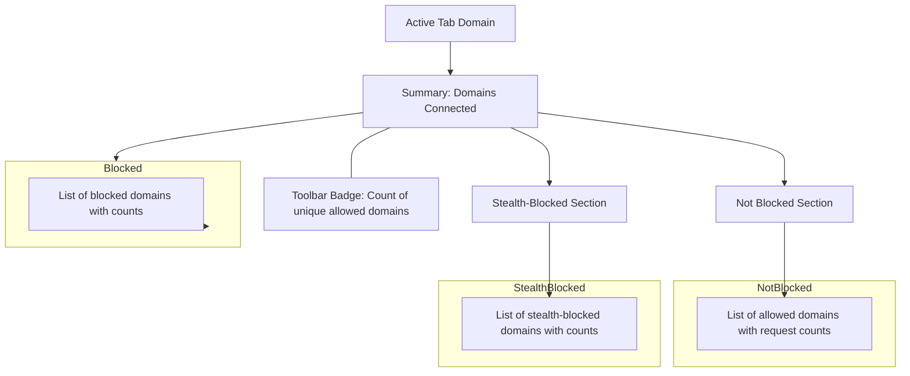

# Exploring the Popup Interface

## Overview

The uBO Scope popup interface provides an immediate, clear summary of the third-party remote server connections initiated by the current browser tab. This guide will walk you through each section of the popup, helping you interpret the real browsing data displayed and understand the toolbar badge count. With this knowledge, you can quickly assess your web exposure per tab.

### What You Will Learn
- How to open and read the uBO Scope popup interface
- The meaning of each popup section: domain summary, connection categories, and counts
- How the toolbar badge relates to the popup data

### Prerequisites
- uBO Scope extension installed and activated in your browser
- A browsing session with at least one active tab
- Basic familiarity with domain names and web concepts

### Expected Outcome
After this guide, you will confidently read the popup interface to see detailed domain connection summaries for the active tab and relate these insights to the toolbar badge count.

---

## Understanding the Popup Interface

The popup is organized into distinct sections that collectively paint a picture of third-party domains contacted during browsing. It dynamically updates as data is collected.

### 1. Tab Hostname Display
- **Location:** Top header (`#tabHostname`)
- **Function:** Shows the main domain (effective second-level domain) of the active tab along with any subdomain prefix.

#### How to Interpret:
- The main domain appears in the second span.
- If a subdomain exists (e.g., `news.example.com`), the prefix `news.` shows in the first span.

This helps confirm which website's network requests you are viewing.

---

### 2. Summary Section
- **Location:** Section with id `summary`
- **Text:** 'domains connected: X' where X is a localized number

#### What It Represents:
The total count of unique third-party domains connected from the current tab. This number mirrors the toolbar badge count (which shows the number of distinct domains allowed).

---

### 3. Outcome Sections
The popup divides observed third-party connections into three categories reflecting the request's ultimate result:

| Section             | Meaning                                          | User Value                         |
|---------------------|-------------------------------------------------|----------------------------------|
| **not blocked**     | Requests allowed by content blocking or firewall | Domains loaded openly             |
| **stealth-blocked** | Requests blocked stealthily (undetectable blocking) | Domains silently intercepted or redirected |
| **blocked**         | Requests outright blocked (error events)          | Domains prevented from loading   |

Each section contains a scrollable list of domains with counts.

#### Domain Rows
- Each domain is shown with a badge indicating how many requests were made to it.
- Domains are sorted alphabetically for easy lookup.

---

## Step-by-Step: Accessing and Using the Popup

<Steps>
<Step title="Open the uBO Scope Popup">
Click the uBO Scope extension icon in your browser's toolbar. The popup will open, showing data for the current active tab.
</Step>
<Step title="Read the Tab Hostname">
Look at the header. Identify the active tab's root domain and any subdomain present.
</Step>
<Step title="Check the Domain Connection Summary">
Note the 'domains connected: X' value. This number represents how many distinct third-party domains your browser contacted during the tab session.
</Step>
<Step title="Interpret Connection Outcomes">
Explore each connection category:
- **Not Blocked:** See which domains successfully loaded.
- **Stealth-blocked:** Notice domains where connections were redirected or blocked silently.
- **Blocked:** Identify domains with explicitly blocked network requests.
</Step>
<Step title="Analyze Domain Counts">
For each domain, review the request count badge to gauge interaction frequency, providing insight into how persistent the connections are.
</Step>
</Steps>

---

## Practical Tips
- **Reload the Tab:** To see updated connections, reload the active tab, then re-open the popup.
- **Compare Domains:** Use domain counts to identify heavily contacted third parties, which might impact performance or privacy.
- **Understand Badge Count:** The toolbar badge always shows the active tab’s unique allowed domains count (matching the "not blocked" section).
- **Use Unicode Support:** Domain names are displayed in Unicode, converting punycode (e.g., `xn--`) for readability.

---

## Common Scenarios & Clarifications

<AccordionGroup title="Popup Interface FAQs">
<Accordion title="Why are some domains only in stealth-blocked or blocked sections?">
Requests listed under 'stealth-blocked' were blocked in a way invisible to the website (like redirections), whereas 'blocked' domains had outright blocked requests. This categorization helps you understand the blocking method used against third parties.
</Accordion>
<Accordion title="Why might the 'domains connected' count not include stealth-blocked or blocked domains?">
The popup summary count and toolbar badge reflect only the 'not blocked' domains to inform you about successful connections. Stealth and blocked domains represent connections that were intercepted or prevented.
</Accordion>
<Accordion title="What if the popup shows 'NO DATA'?">
This indicates no connection data is available for the current tab. Try refreshing the tab, ensuring the extension permissions are granted, or checking for setup issues in the troubleshooting guide.
</Accordion>
</AccordionGroup>

---

## Troubleshooting Popup Data Issues

- **Empty Section Lists:** If any connection category shows no domains, the absence means no network requests with that outcome occurred during the tab session.
- **No Domains Connected:** The summary will show '?' or zero if no data is available or no distinct domains could be recorded.
- **Permissions & Browser Support:** Confirm that the extension has the required `webRequest` and tab permissions. Unsupported browsers or misconfigured permissions may prevent data collection.
- **Reloading Required:** Network data is collected over time; opening the popup immediately after tab load may show incomplete data.

Refer to the [Troubleshooting Common Setup Issues](/getting-started/first-run-usage/troubleshooting-install) guide for detailed checks.

---

## Summary

The uBO Scope popup empowers you to easily assess third-party domain exposure per tab with distinct categorization of connection outcomes. By reviewing domain lists and request counts in each section alongside the toolbar badge, you gain actionable insight into your browsing network interactions.

---

## Next Steps

- Visit the [Verifying Operation and Understanding the Badge](/getting-started/first-run-usage/validation-and-badge) guide to learn how popup data corresponds with badge counts.
- Explore [Monitoring Third-party Connections](/guides/practical-use-cases/monitoring-3rd-party-connections) for practical approaches to using these insights.
- Consult the [Core Concepts & Terminology](/overview/core-architecture-concepts/core-concepts-and-terminology) page to deepen your understanding of outcome categories.

---

## Visual Layout of the Popup Interface

---

## Example Popup Data Sample

| Section       | Domain           | Request Count |
|---------------|------------------|---------------|
| Not Blocked   | example.com      | 12            |
| Not Blocked   | cdn.example.com  | 30            |
| Stealth-Blocked | tracker.bad.com | 8             |
| Blocked      | ads.example.net  | 17            |

This indicates that while some requests were blocked or stealth blocked, your browser made successful connections to `example.com` and its CDN.

---

By mastering the popup interface, you leverage uBO Scope effectively for transparency and control over your browsing network interactions.

---

# References
- [Toolbar Badge Explained](/getting-started/first-run-usage/validation-and-badge)
- [Troubleshooting Installation Issues](/getting-started/first-run-usage/troubleshooting-install)
- [Product Introduction: What is uBO Scope?](/overview/product-introduction/what-is-ubo-scope)
