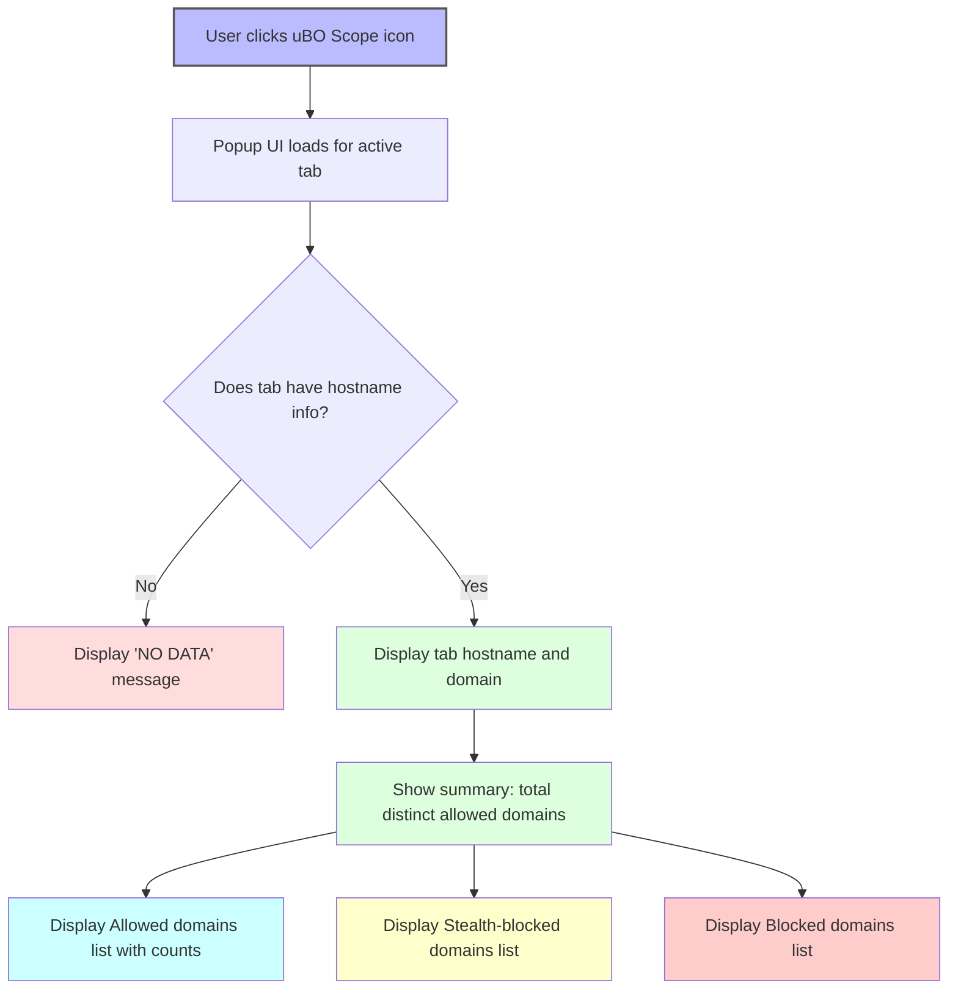

# Your First Connection Analysis: A Guided Tour

## Workflow Overview

### Task Description
This guide walks you through the process of opening the uBO Scope popup UI and interpreting its core information. You'll learn to analyze the real-time summary of third-party connections per browser tab, distinguish between allowed, blocked, and stealth domains, and understand how these metrics provide insights into your browsing privacy.

### Prerequisites
- uBO Scope extension installed and active on your browser.
- A web page loaded with network activity (ideally with third-party content).
- Basic familiarity with browser tabs and toolbar extensions.

### Expected Outcome
By following this guide, you will confidently read and understand the data presented by uBO Scope’s popup, enabling you to assess third-party network requests and identify potential privacy concerns.

### Time Estimate
Approximately 5–10 minutes.

### Difficulty Level
Beginner to Intermediate

---

## Step-by-Step Instructions

### Step 1: Open the uBO Scope Popup
- Click the uBO Scope icon in your browser toolbar.
- The popup UI will load, displaying details about third-party connections for the current browser tab.

> **Expected Result:** The popup header shows the tab’s hostname and domain.

### Step 2: Understand the Header
- The large heading at the top displays the current tab's hostname split visually into the subdomain portion (if any) and the primary domain.
- For example, if the tab hostname is `www.sample.com`, the popup shows `www.` and `sample.com` distinctly.

### Step 3: Review the Summary Section
- Below the header, locate the summary indicating the total number of connected third-party domains.
- This number corresponds to distinct remote servers allowed by your content blockers.

> **Tip:** A lower number here generally means fewer third-party connections, which often implies better privacy.

### Step 4: Explore the Three Domain Sections
The popup categorizes third-party domains into three clear sections:

1. **Not Blocked (Allowed):**
   - Lists third-party domains your browser successfully connected to during this tab session.
   - Each domain is accompanied by a count indicating how many network requests to that domain occurred.

2. **Stealth-Blocked:**
   - Contains domains with network requests that were redirected in a stealthy manner.
   - These stealth-blocked requests are often invisible to web pages and reflect advanced blocking behavior.

3. **Blocked:**
   - Shows domains for which requests were explicitly blocked and failed.
   - This is useful for verifying which unwanted connections were stopped.

> **Expected Outcome:** Each domain row shows the domain name and the total request count, helping you identify frequently connected or blocked servers.

### Step 5: Recognize Unicode Domain Names
- Domains displayed use Unicode representation for better readability.
- For instance, international domain names encoded in Punycode are converted back to their native Unicode form in the UI.

### Step 6: Interpreting the Data
- Use the data to:
  - Confirm which third parties are essential or benign by checking the allowed list.
  - Detect potentially suspicious domains in the stealth or blocked lists.
  - Assess if your content blocker is behaving as expected.

### Step 7: Refresh and Re-analyze
- Reload the active webpage to update the connection data.
- Reopen the popup to observe updated connection metrics reflecting the latest network activity.

---

## Examples & Real-World Scenario

Imagine visiting a popular news site:

- Opening the uBO Scope popup immediately shows the main domain plus a list of known content delivery networks (CDNs) under "Not Blocked".
- You notice some tracking domains under "Stealth-Blocked," indicating your blocker silently prevents their activity without breaking the page.
- The "Blocked" list may include known ad servers, confirming your filter lists are effective.

This immediate insight allows you to verify that essential services are accessed while unwanted trackers are blocked.

---

## Troubleshooting & Tips

<AccordionGroup title="Common Issues and Solutions">
<Accordion title="Popup Shows 'NO DATA' or Blank Header">
- Ensure the tab you are examining has loaded properly with active content.
- The extension relies on network events that could be delayed or missing if the page has no third-party requests.
- Try refreshing the tab and reopening the popup.
</Accordion>
<Accordion title="Counts Don't Update After Navigation or Tab Switch">
- Close and reopen the popup after switching tabs.
- Wait a moment if the extension is processing network events.
- Verify that your browser permissions for uBO Scope are correctly granted.
</Accordion>
<Accordion title="Domain Lists Appear Empty or Missing Entries">
- Confirm you have the latest version of the extension installed.
- Some domains might be missed if network requests bypass standard browser APIs.
- Check your content blocker settings to ensure compatibility.
</Accordion>
</AccordionGroup>

<Tip>
To enhance your analysis, consider monitoring multiple tabs and comparing their popup data to identify patterns of third-party connections across different sites.
</Tip>

---

## Next Steps & Related Content

- **Installation Guide:** Ensure uBO Scope is installed and configured properly.
- **First Run & Basic Configuration:** Customize extension permissions and behavior for your browsing setup.
- **Practical Use Cases:** Learn how to map allowed vs blocked third-party domains across your browsing sessions.
- **Troubleshooting Common Issues:** Resolve installation or display problems.

Explore these guides to deepen your understanding and optimize your privacy monitoring with uBO Scope.

---

## Summary Diagram

This diagram illustrates the user flow for opening and interpreting uBO Scope’s popup interface.

---