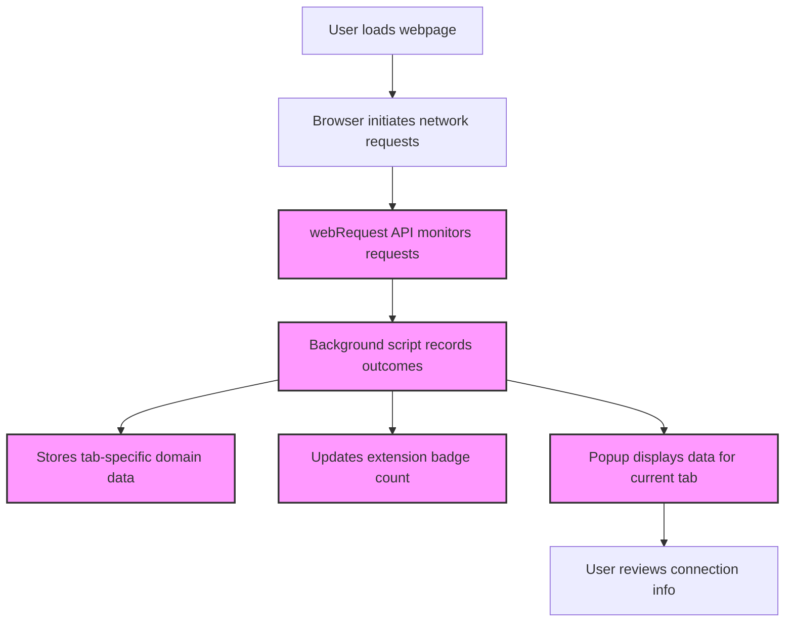

# Running Your First Network Analysis with uBO Scope

Welcome to your practical introduction to using uBO Scope to analyze network connections generated by webpages. This guide provides a step-by-step tutorial so you can confidently monitor, interpret, and make sense of remote server connections your browser initiates while loading websites.

---

## 1. What You Will Achieve

By following this guide, you will:
- Learn how to open and navigate the uBO Scope popup interface.
- Understand the meaning behind the domain connection tables shown.
- Identify which remote servers your browser connected to during page loads, including allowed, stealth-blocked, and blocked requests.
- Interpret connection outcomes to gain insight into the network activity of webpages.

### Prerequisites

- uBO Scope extension installed and active in your browser.
- Familiarity with your browser’s toolbar where extension icons appear.
- A website loaded in an active tab to analyze.

### Estimated Time

About 5–10 minutes.

### Skill Level

Beginner to intermediate.

---

## 2. How to Run Your First Network Analysis

### Step 1: Locate and Open the uBO Scope Popup

1. Find the uBO Scope icon in your browser's toolbar. It appears as the extension's distinctive icon.
2. Click the icon to open the popup window.

<Check>
If you do not see the icon, check the extension is installed and pin it to your toolbar if needed. Refer to [Installing and Setting Up uBO Scope](guides/getting-started/install-setup) for installation help.
</Check>

### Step 2: View Remote Server Connection Summary

- At the top of the popup, notice the hostname and domain of the current active tab.
- The "domains connected" summary shows the total number of distinct domains your browser connected to.

### Step 3: Understand the Three Domain Outcomes

Below the summary, the popup divides connections into three sections:

- **Not Blocked (Allowed):** Domains to which network requests were allowed without interference.
- **Stealth-Blocked:** Domains for which requests were stealthily blocked during redirects or other means without obvious blocking events.
- **Blocked:** Domains where network requests were explicitly blocked (errors in connection).

Each section contains a table listing domains and the count of requests associated with each.

### Step 4: Recognize Domain Counts and Patterns

- The count next to each domain indicates how many connections or requests were attempted involving that domain.
- Larger counts reflect domains providing multiple resources or connections.
- A low number in "allowed" usually points to minimal third-party connections, often a sign of good privacy hygiene.

### Step 5: Refresh and Analyze in Real Time

- Reload the active tab/page you want to analyze.
- Reopen the popup to see updated connection data reflecting the new page load.

<Info>
The badge on the extension's toolbar icon also updates automatically with the count of distinct allowed third-party connections, providing quick insight without opening the popup.
</Info>

---

## 3. Practical Example

Suppose you open uBO Scope on a news website:

- The popup displays the news website's primary domain at the top.
- The 'Not Blocked' section lists CDN providers (e.g., cdn.example.com) with high counts, indicating legitimate content delivery.
- The 'Stealth-Blocked' section includes tracking domains silently interrupted in redirects.
- The 'Blocked' section shows ad networks or tracking servers where requests failed.

You can conclude how your content blockers and browser privacy settings affect third-party requests effectively.

---

## 4. Common Pitfalls & Troubleshooting

### The Popup Shows "NO DATA" or is Empty

- Make sure the active browser tab has completed loading and network events have occurred.
- Refresh the webpage to trigger new requests.
- Restart the browser or reload the uBO Scope extension if data still does not display.

### Badge Count is Zero or Not Updating

- Confirm you're viewing a tab with active network requests.
- Verify browser permissions include access to webRequest API (see [Prerequisites & System Requirements](getting_started/setup_and_installation/prerequisites)).
- Check for conflicts with other extensions that may block or alter network monitoring.

### Domains Appear with Unicode or Punycode

- The popup converts punycode to Unicode for presentation. Some domains may still appear encoded if they are internationalized domains.

### Counts Seem High or Unexpected

- Some websites use multiple CDNs or tracking domains legitimately.
- The count reflects all distinct domains contacted, not just malicious ones.
- Refer to [Who Should Use uBO Scope?](overview/getting-started/who-should-use-ubo-scope) and [Core Concepts & Key Terms](overview/getting-started/core-concepts-and-terminology) to differentiate domain types.

---

## 5. Tips & Best Practices

- Analyze websites you frequently visit to understand their third-party connections.
- Use the stealth and blocked domains lists to identify trackers or ads being intercepted.
- Combine insights with your content blocker settings for better privacy control.
- Keep uBO Scope updated for accurate domain parsing and permission compliance.

---

## 6. Next Steps

- Explore [Understanding the Popup & Badge Count](guides/getting-started/understand-popup-badge) for deeper insight on data interpretation.
- Validate your content blocker effectiveness with [Validating Content Blocker Effectiveness](guides/practical-use-cases/validate-content-blocker).
- For installation or troubleshooting, see [Installing and Setting Up uBO Scope](guides/getting-started/install-setup) and [Troubleshooting Installation & Startup Issues](getting_started/first_run_validation/troubleshooting_installation).

---

## 7. Reference Diagram: How Network Requests Are Captured

This flow illustrates how uBO Scope monitors network requests in real time, processes outcome data, updates the UI and badge count, enabling you to assess connection transparency.

---