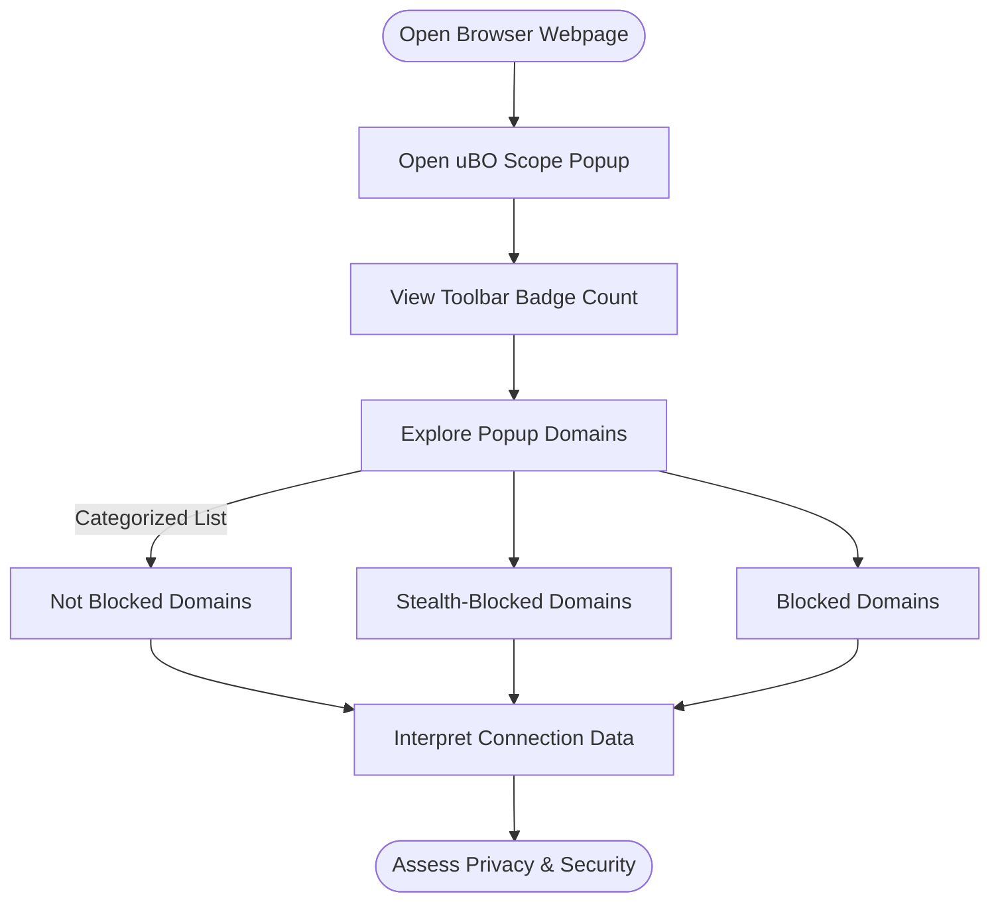

# Your First Network Analysis with uBO Scope

Discover how to use uBO Scope to gain immediate insight into the network behavior of the websites you visit. This guide walks you through opening the extension's popup interface, understanding the badge count on the toolbar, and interpreting which third-party servers your current webpage is connecting to.

---

## 1. Overview of Network Analysis Workflow

### What This Guide Helps You Accomplish
- Quickly open the uBO Scope popup in your browser.
- Interpret the badge count showing distinct third-party remote servers.
- Explore the detailed list of connected domains, categorized by their connection status.

### Prerequisites
- uBO Scope extension installed and enabled in your browser.
- Browsing a webpage loaded with active network requests.
- Permissions granted to the extension (usually handled automatically during installation).

### Expected Outcome
- Real-time visibility into the distinct remote third-party domains contacted by the active webpage.
- Clear categorization of connections: allowed, blocked, and stealth-blocked.
- A handy badge count on the browser toolbar reflecting third-party connection quantity.

### Time Estimate
- Approximately 5 minutes to open and explore your first network analysis.

### Difficulty Level
- Beginner: This workflow requires no prior technical knowledge.

---

## 2. Step-by-Step Instructions

### Step 1: Open the uBO Scope Popup
1. Locate the uBO Scope icon on your browser toolbar. It looks like a small shield marked "uBO Scope".
2. Click the icon to open the popup interface.

_Expected result_: The popup opens showing network connection data for the current active tab.

> If you do not see the icon:
> - Make sure the extension is installed.
> - Pin the extension to the toolbar if your browser supports it.

### Step 2: Understand the Toolbar Badge Count
- The badge number on the uBO Scope icon indicates **how many distinct third-party remote servers your current webpage connected to**.
- A lower number typically indicates fewer third-party connections, often correlated with better privacy.

> Practical tip: Third-party domains usually include CDNs, analytics servers, ad networks, and other external services.

### Step 3: Explore the Popup Interface
- The popup divides domains into three categories:
  - **Not Blocked**: Domains for which connections were allowed.
  - **Stealth-Blocked**: Domains where blocking was attempted but requests were redirected or altered stealthily.
  - **Blocked**: Domains for which connection attempts failed or were outright blocked.

- Each category lists domains with the count of connection attempts.

_Expected result_: You get a detailed, per-domain view of network connections.

### Step 4: Interpret Domain Information
- Domains are displayed using proper Unicode rendering for internationalized domain names.
- Counts next to each domain reflect the number of unique connection attempts.

> Best practice: Look for unfamiliar or suspicious third-party domains to assess your browsing privacy.

---

## 3. Real-World Example

Imagine you visit a news site. On opening the uBO Scope popup:
- The badge shows `3` — indicating three unique third-party domains contacted.
- In the popup, you see:
  - Not Blocked:
    - `cdn.newsprovider.com` (15 connections)
    - `images.cdnprovider.net` (10 connections)
  - Stealth-Blocked:
    - `tracker.adsprovider.com` (5 connections)
  - Blocked:
    - `ads.badadvertiser.net` (3 connections)

This gives you clarity on which domains are truly connecting behind the scenes.

---

## 4. Troubleshooting & Tips

### Common Issues
- **No badge count shown**: The extension might not have permission or the tab has no network traffic yet.
- **Popup shows no data**: This can occur if you open the popup immediately after loading a new page; wait a moment and retry.
- **Domains appear unfamiliar**: Research suspicious domains manually for security concerns.

### Tips for Success
- Use uBO Scope alongside your content blocker to verify what connections are actually allowed or blocked.
- Refresh pages and watch the badge update to observe real-time changes.
- Regularly check the list for stealth-blocked domains especially if privacy is a concern.

---

## 5. Next Steps & Related Content

After completing your first network analysis, consider exploring:

- [Installation and Setup Guide](/guides/getting-started/installation-setup) to ensure optimal configuration.
- [Understanding the Badge and Popup Data](/guides/interpreting-results/badge-meanings) to deepen your understanding of connection statuses.
- [Comparing Content Blockers Accurately](/guides/real-world-use-cases/comparing-blockers) for evaluating privacy tools.
- [Troubleshooting Installation & First-Run Issues](/getting-started/troubleshooting/common-installation-issues) if you encounter problems.

---

## Appendix: Glossary

- **Third-Party Server**: A server domain different from the webpage's main domain.
- **Stealth-Blocked**: Requests that were blocked in a way that the website cannot detect.
- **Badge Count**: The visible number on the toolbar icon representing unique third-party connections.

## Visual Workflow Overview

This diagram illustrates the user journey from visiting a webpage to analyzing the network request data through uBO Scope.

---

For further support or to contribute, visit the project's GitHub page: [uBO-Scope Repository](https://github.com/gorhill/uBO-Scope).