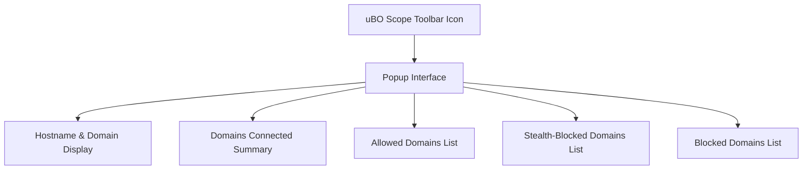

# Your First Analysis: Reviewing Connections

Welcome to your first deep dive into uBO Scope. This guide walks you through revealing all attempted or successful remote server connections made by the webpage you visit, helping you interpret what you see and understand the meaning behind allowed, stealth-blocked, and blocked domains. By the end, you'll confidently decode the connection landscape for any website you analyze.

---

## 1. What This Guide Helps You Accomplish

When you visit a webpage, numerous network requests occur — some allowed, some blocked, others stealth-blocked. This page guides you step-by-step on how to use uBO Scope’s popup interface to identify these connections, understand their outcomes, and extract meaningful privacy insights.

---

## 2. Prerequisites Before Starting

- **uBO Scope installed and active** on one of the supported browsers (Chromium 122.0+, Firefox 128.0+, Safari 18.5+).
- Basic understanding of your browser’s toolbar and how to activate extensions.
- Familiarity with the concept of domains and hostnames (the guide will clarify key terms).

If you need help installing or configuring uBO Scope, please refer to the [Installing and Setting Up uBO Scope](../getting-started/install-extension) and [Basic Configuration and Permissions](../getting-started/installation-and-setup/basic-configuration) guides.

---

## 3. Expected Outcome

By completing this guide, you will:

- Open and navigate the uBO Scope popup panel for the current tab.
- Identify the number of distinct third-party domains connected.
- Distinguish between `allowed`, `stealth-blocked`, and `blocked` connection outcomes.
- Understand how to interpret domain counts and connection summaries.
- Be equipped to make informed assessments of third-party presence on webpages.

---

## 4. Time Commitment

This guide takes approximately 5–10 minutes, depending on your familiarity with browser extensions and domains.

---

## 5. Step-by-Step Instructions

<Steps>
<Step title="Open the uBO Scope Popup Interface">
1. While viewing any webpage, click the uBO Scope toolbar icon in your browser.
2. The popup window will open, displaying connection information for the active tab.
3. Wait a moment if data appears to be loading (the popup will automatically populate).

> **Outcome:** You’ll see the hostname of the current page displayed prominently.
</Step>

<Step title="Review the Summary Count">
1. At the top of the popup, locate the section labeled `domains connected:` followed by a number.
2. This number indicates how many distinct third-party domains have successfully connected (i.e., resources were fetched).
3. A lower number is preferable from a privacy standpoint.

> **Outcome:** You know the exact count of unique remote third-party domains your page connected to.
</Step>

<Step title="Explore Domains by Outcome Categories">
The popup organizes domains into three groups:

- **Not Blocked (allowed):** Domains from which network requests succeeded.
- **Stealth-Blocked:** Domains with connections redirected stealthily (e.g., by stealth-blocking mechanisms).
- **Blocked:** Domains with network requests that were explicitly blocked or failed.

1. Scroll to each section to review the list of domains.
2. Each domain entry includes a count of network requests made to that domain.

> **Decision Point:**
- If many allowed domains appear, you may be connecting to numerous third parties.
- Stealth-blocked domains indicate connections that were silently redirected, common with sophisticated content blockers.
- Blocked domains reveal what the extension or your other privacy tools successfully prevented.
</Step>

<Step title="Interpret Domain Names and Counts">
1. The domain names shown are here resolved to top-level registered domains (e.g., `example.com`), abstracting from subdomains.
2. Domains may display counts indicating how many requests originated from them.
3. Hover or visually parse the entries to observe if a few domains dominate requests or if many show small counts.

> **Outcome:** You understand the distribution and intensity of third-party connections.
</Step>

<Step title="Understand Hostname Display">
1. At the top of the popup, the page’s tab hostname and domain are shown.
2. The domain is the organizational domain derived from the hostname.
3. This contextualizes the data to the page you are analyzing.

> **Tip:** If the hostname is a long subdomain, the domain section helps focus on the main site entity.
</Step>

<Step title="Use the Toolbar Badge for Quick Insight">
1. Observe the uBO Scope icon badge, which reflects the number of distinct allowed third-party domains on the current tab.
2. This badge updates live as the page loads or network requests change.

> **Note:** A blank badge means no allowed third-party connections have been detected.
</Step>

<Step title="Validate Your Findings with Real Browsing">
1. Visit a few popular websites.
2. Open the popup and observe domain counts and categories.
3. Compare how third-party connections differ between sites, reflecting different tracking and resource models.

> **Outcome:** You solidify your ability to interpret uBO Scope data in practical scenarios.
</Step>
</Steps>

---

## 6. Practical Examples

### Example Scenario: Analyzing a News Website

1. Visit `example-news.com` with uBO Scope enabled.
2. Click the extension icon.
3. The popup shows:
   - `domains connected: 8`
   - Allowed domains include `cdn.example.com` (12 requests), `analytics.example.org` (3 requests).
   - Stealth-blocked domains include `tracking.badtracker.net` (1 request).
   - Blocked domains include `ads.spamnetwork.io` (4 requests).

**Interpretation:** The site loads content from a small set of third-party domains mostly allowed. A suspicious tracker was stealth-blocked, and aggressive ad domains were blocked.

---

### Example Scenario: E-commerce Site with Many Third Parties

1. Visit `shop.example.com`.
2. Popup shows:
   - `domains connected: 20`
   - Allowed domains vary widely: multiple CDNs, payment processors, chat widgets, and analytics.
   - Stealth-blocked domains may include redirect advertisers.
   - Blocked domains may include known surveillance or ad servers.

**Outcome:** Understanding the domain diversity helps you assess the potential privacy exposure and whether connections seem excessive for the site type.

---

## 7. Troubleshooting & Tips

<AccordionGroup title="Common Issues and Solutions">
<Accordion title="Popup Shows NO DATA or Blank">
- Ensure uBO Scope is installed and active.
- Refresh the tab to trigger new network data capture.
- Verify that necessary permissions are granted (see Basic Configuration guide).
- Try disabling other conflicting extensions.
</Accordion>
<Accordion title="Badge Count Not Updating">
- Badge updates once network activity completes; wait a few seconds.
- Check your browser permissions.
- Restart your browser if issues persist.
</Accordion>
<Accordion title="Domain Names Appear Punycode or Encoded">
- Domain names are displayed in Unicode to improve readability.
- Some rare internationalized domains may appear encoded if your system font lacks characters.
</Accordion>
<Accordion title="High Number of Allowed Domains Detected">
- This can indicate many third-party resources. Large sites may load many CDNs and trackers.
- Use blocking rules or other tools to reduce unwanted connections.
- Remember that not all third parties imply tracking; CDNs and essential services are common.
</Accordion>
</AccordionGroup>

<Tip>
For better privacy insights, focus on the number of distinct allowed third-party domains rather than just block counts. A lower allowed count reflects fewer third-party network connections, which usually means better privacy.
</Tip>

<Note>
uBO Scope reports all network requests observable via the browser's webRequest API, regardless of other blocking methods used (such as DNS blocking).
</Note>

---

## 8. Next Steps & Related Documentation

- Explore the [Understanding the Popup Interface](../guides/getting-started/understanding-popup) guide to deepen interpretation skills.
- Review [Interpreting Badge Counts for Privacy Insights](../guides/real-world-usage/interpret-badge) for practical privacy assessments.
- Consult [Quick Validation: Is uBO Scope Working?](../getting-started/first-steps-and-validation/quick-validation) if you encounter initial problems.
- For installation or setup steps, see the [Installing and Setting Up uBO Scope](../guides/getting-started/install-extension) documentation.

---

## 9. Summary

- uBO Scope’s popup shows a categorized snapshot of the third-party domains connected for the current webpage.
- The badge on the toolbar icon provides a live count of distinct allowed third-party domains.
- Understanding allowed, stealth-blocked, and blocked categories is essential for privacy analysis.
- Use the extension to perform consistent privacy evaluations across sites and validate content blocker effectiveness.

This guide equips you with the skills to effectively use uBO Scope's core interface for analyzing network connections in real time.

---

## Appendix: Terminology Quick Reference

| Term            | Meaning                                                                                               |
|-----------------|---------------------------------------------------------------------------------------------------|
| Hostname        | Full host identifier part of a URL (e.g., `news.example.com`).                                     |
| Domain          | The organizational registered domain derived from the hostname (e.g., `example.com`).             |
| Allowed         | Domains with network requests that completed successfully.                                          |
| Blocked         | Domains with network requests that were explicitly blocked or failed.                             |
| Stealth-Blocked | Domains with requests silently redirected or blocked in a way that tries to evade detection.      |

---

## Visual Layout of uBO Scope Popup

---

For more details about the underlying concepts of domain status and network request outcomes, see the [Core Terms & Concepts](../../overview/architecture-core-concepts/core-terms-concepts) documentation.

---