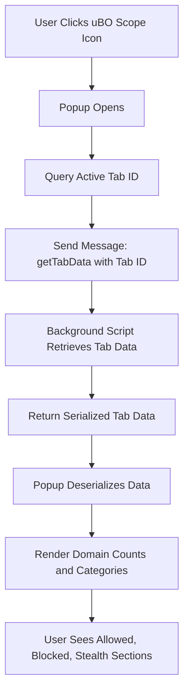

# Your First Connection Audit: Reading the Popup

## 1. Introduction

When you launch the **uBO Scope** popup, you gain a real-time window into the network connections made by the active browser tab. This page helps you understand how to interpret the information presented: a visual breakdown of connected domains categorized into **allowed**, **blocked**, and **stealth-blocked** sections. By mastering this view, you will be able to audit how websites connect to various remote servers and assess your browsing privacy exposure.

---

## 2. Prerequisites

Before you begin your first connection audit, ensure the following:

- uBO Scope is installed and enabled in your browser.
- You have loaded the webpage/tab you want to audit.
- The extension has permission to access active tab data.
- Your browser supports the `webRequest` API for monitoring network requests.

If these prerequisites aren’t met, the popup will show minimal or no data.

---

## 3. Opening the uBO Scope Popup

To start your audit:

1. Click the uBO Scope toolbar icon in your browser.
2. The popup window will display summarized network connection data for the active tab.

If the popup shows "NO DATA", refresh the tab or verify your installation (see the [Validating Your Installation](../getting-started/first-use-and-troubleshooting/validating-installation.md) guide).

---

## 4. Understanding the Popup Layout

The popup presents three core sections representing different connection outcomes:

### 4.1. Tab Domain Header

- Displays the **hostname** and **domain** of the active tab.
- The domain (e.g., `example.com`) is prominently shown.
- Any subdomain part is shown separately for clarity (e.g., `sub.` in `sub.example.com`).
- This helps orient you to which site’s connections you are auditing.

### 4.2. Summary Counter

- Shows the total number of distinct third-party domains connected to during the session.
- This is the count of unique remote servers your browser contacted for this tab.
- A lower count indicates fewer third-party connections, typically resulting in better privacy.

### 4.3. Connection Outcome Sections

Three vertical sections list domains categorized by the network request outcome:

| Outcome           | Meaning                                                    | Color Indicator        |
|-------------------|------------------------------------------------------------|-----------------------|
| **Not Blocked**   | Connections allowed and allowed by content blockers.       | Green background      |
| **Stealth-Blocked** | Requests intercepted or redirected stealthily, not shown as blocked by content blockers explicitly. | Red background        |
| **Blocked**        | Requests outright blocked (e.g., via content blockers).    | Red background        |

Each domain is accompanied by how many requests were made to it.

---

## 5. Step-by-Step: Reading the Popup

<Steps>
<Step title="Step 1: Identify the Main Domain">
Locate the header at the top showing the tab's hostname and domain. Confirm you are viewing the correct webpage’s connections.
</Step>
<Step title="Step 2: Review the Summary">
Check the total number of distinct domains connected to. This gives an at-a-glance measure of third-party exposure.
</Step>
<Step title="Step 3: Explore Allowed Domains">
In the 'not blocked' section, review which third-party domains your browser accessed without interference. This list reveals which connections your content blocker or DNS doesn’t prevent.
</Step>
<Step title="Step 4: Examine Stealth-Blocked Domains">
Understand that stealth connections were interrupted in a way that avoids detection by web pages or standard content blockers, but uBO Scope shows them here for transparency.
</Step>
<Step title="Step 5: Inspect Blocked Domains">
See which connections your blockers have explicitly prevented. This confirms active filtering and blocking effectiveness.
</Step>
</Steps>

**Expected Results:**
- Clear identification of connected domains.
- Accurate counts per domain.
- Visual separation between allowed, blocked, and stealth categories.

---

## 6. Practical Tips for Your Audit

- **Refresh When Needed:** Network connections update as you interact with pages. Refresh the popup by closing and reopening to see current data.
- **Low Allowed Count is Good:** A minimal allowed domain count generally means fewer third-party trackers or resources loaded.
- **Use Badge Counts:** The extension icon badge reflects allowed domain counts, providing quick privacy feedback.
- **Recognize Legitimate Third Parties:** Some allowed domains are necessary, like CDNs or APIs your visited site relies on.
- **Investigate Unexpected Domains:** Unknown or suspicious domains often indicate tracking or unwanted connections.

<Tip>
Domains displayed are shown using Unicode for readability, but underlying connections respect all IDN encodings.
</Tip>

---

## 7. Common Pitfalls and Troubleshooting

<AccordionGroup title="Troubleshooting Common Display Issues">
<Accordion title="Popup Shows 'NO DATA'">
- Make sure you have an active tab selected.
- Reload the tab or the popup.
- Validate installation and permissions (see [Validating Your Installation](../getting-started/first-use-and-troubleshooting/validating-installation.md)).
</Accordion>
<Accordion title="Badge Count is Zero but Connections Exist">
- Some connections may be stealth-blocked or blocked, affecting count.
- Verify content blockers aren’t interfering with extension monitoring.
- Consider timing: data updates may be async.
</Accordion>
<Accordion title="Unexpected Domains Appear in Allowed">
- Remember that some third-party domains are legitimate resources required for site functionality.
- Use domain lookup tools or filter lists to verify domain reputation.
</Accordion>
</AccordionGroup>

---

## 8. Next Steps

Once comfortable with interpreting the popup:

- Proceed to the [Interpreting Allowed, Blocked, and Stealth Domains](../guides/core-workflows/interpreting-domain-status.md) guide for deeper understanding.
- Explore [Auditing Third-Party and Remote Server Connections](../guides/core-workflows/auditing-third-party-connections.md) for best practices.
- Learn about [Best Practices for Content Blocking and Privacy Testing](../guides/core-workflows/best-practices-content-blocking.md) to use this data effectively.

---

## 9. Example Walkthrough

Imagine visiting `https://news.example.com`. You open the uBO Scope popup and see:

- **Header:** Shows `news.example.com` as hostname and `example.com` as domain.
- **Summary:** "domains connected: 15"
- **Allowed:** Includes domains like `cdn.example.net`, counting multiple requests.
- **Stealth-blocked:** Shows `ads.tracker.net` with fewer requests.
- **Blocked:** Lists `tracking.badsite.org` with blocked counts.

This reveals the site connects to several third-party resources, some blocked outright, some stealthily interrupted, and several allowed. From here, you may decide to refine your filtering or accept necessary third-parties.

---

## 10. Visual Diagram: Popup Data Flow Overview

This flow shows how popup retrieves and displays live network connection data for the currently active tab.

---

## 11. Reference Links

- [Validating Your Installation](../getting-started/first-use-and-troubleshooting/validating-installation.md)
- [Interpreting Domain Status](../guides/core-workflows/interpreting-domain-status.md)
- [Auditing Third-Party Connections](../guides/core-workflows/auditing-third-party-connections.md)
- [Best Practices for Content Blocking](../guides/core-workflows/best-practices-content-blocking.md)

---

## 12. Summary

The uBO Scope popup is your first tool for auditing real-time network connections made by the active tab. Understanding its layout and domain categorizations empowers you to visualize the privacy landscape of your browsing, inspect third-party resources, and make informed decisions about your network security and content blocking measures.