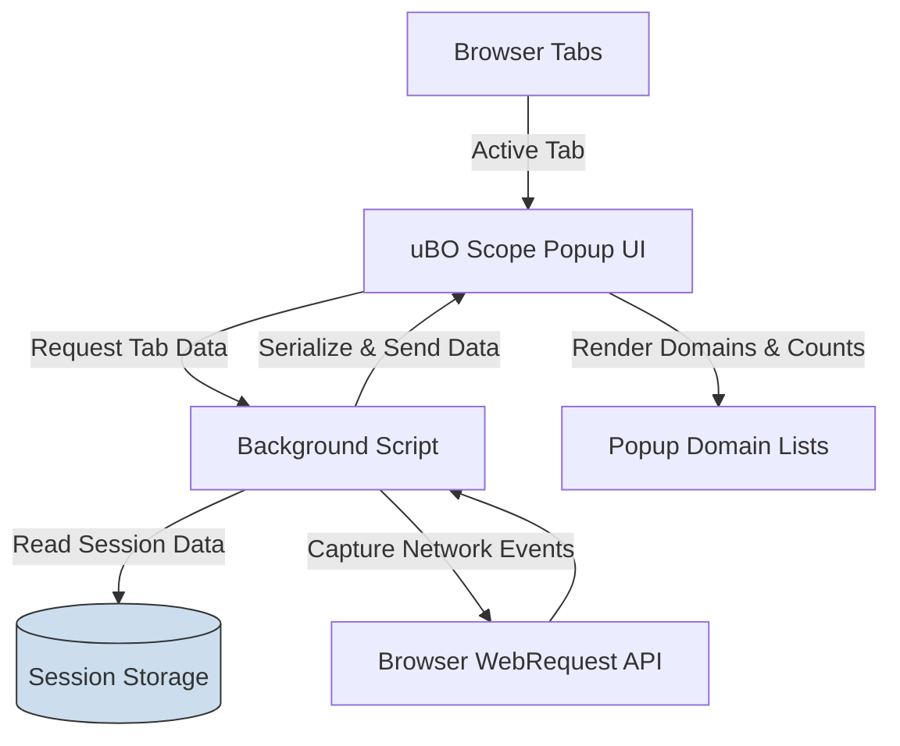

# Viewing Your First Connection Report

## Overview
This guide walks you through using the uBO Scope extension's popup interface to view detailed reports of network connections for the active browser tab. You'll learn to navigate the popup UI, interpret the lists of allowed, blocked, and stealth-blocked domains, and understand how uBO Scope visualizes network request outcomes on a per-tab basis.

## Prerequisites
- uBO Scope extension installed and enabled in your browser.
- An active browser tab with web activity (e.g., a website loaded).
- Browser versions supported: Chrome v122+, Firefox v128+, Safari v18.5+.

## Expected Outcome
By following this guide, you will:
- Open the uBO Scope popup for the active tab.
- Understand the significance of allowed, blocked, and stealth-blocked domains shown.
- Read the domain lists with their respective request counts.
- Understand how this reflects network behavior and content blocking.

## Time Estimate
Approximately 5 minutes.

---

## Step-by-Step Instructions

### 1. Open the uBO Scope Popup
- Click the uBO Scope extension icon located on your browser's toolbar. If the icon is not visible, ensure the extension is enabled and pinned.
- The popup will appear showing connection statistics related to the active browser tab.

### 2. Understand the Hostname Display
- At the top of the popup, observe the heading showing the hostname and domain.
- The hostname is split if it differs from the registered domain name; for example, `sub.example.com` will separately display the subdomain part and the main domain.

### 3. Review Connection Summary
- Below the hostname, the summary section states: **domains connected:** followed by a number.
- This number represents how many distinct domains your current tab connected to successfully and were _allowed_.

### 4. Explore the Three Outcome Sections
The popup breaks down connection attempts into three categories:

#### a. Not Blocked (`allowed`)
- Shows third-party domains that your browser connected to successfully without being blocked.
- Each listed domain includes a request count representing how many times resources were fetched.
- Typically, a low count here indicates minimal third-party exposure.

#### b. Stealth-Blocked (`stealth`)
- Lists domains for which requests were stealth-blocked.
- Stealth blocking is a subtle blocking mechanism used by some content blockers to hide blocking from the webpage.
- Domains here indicate connections blocked in a less obvious way.

#### c. Blocked (`blocked`)
- Lists domains for which network requests were explicitly blocked and failed.
- These domains represent failed connections typically prevented by content blockers or network filters.

### 5. Interpret Domain Rows
- Each domain entry shows:
   - The domain name (decoded from punycode if applicable).
   - A small badge displaying the number of times the domain was contacted.
- New domain rows are dynamically populated as uBO Scope receives network request data.

### 6. Understand When No Data Appears
- If the active tab has no network data, or uBO Scope lacks permissions, the hostname section will show 'NO DATA,' and the domain lists will be empty.

### 7. Monitor Live Updates
- The popup automatically refreshes data as new network events occur in the background.
- This dynamic view lets you watch your tab’s network activity in real time as you interact with webpages.

---

## Practical Tips
- **Refresh or reopen the popup** if you believe the data is outdated.
- **Consider the badge count** on the toolbar icon as a quick indicator of how many third-party domains your tab connects to.
- Use the popup to identify unexpected or suspicious third-party connections.
- Understand that ``stealth-blocked`` domains show where blocking is obfuscated to reduce webpage breakage or tracking detection.

## Common Pitfalls
- The extension only shows connections reported through the browser’s `webRequest` API; some low-level or native connections may not appear.
- If permissions are denied or the extension is disabled, the popup will not display connection data.
- A high number of allowed domains may indicate more third-party tracking than expected.

---

## Verification
Check the following to confirm successful viewing of connection reports:
- The popup displays the active tab hostname and domain.
- The number next to "domains connected:" matches the sum of allowed third-party domains.
- Domains are grouped and listed under the proper outcome sections (allowed, stealth, blocked).
- Request counts are shown correctly next to each domain.

---

## Example Scenario
Imagine you are visiting `example.com`.

1. Open the uBO Scope popup.
2. You see the hostname as "example.com" with the subdomain portion if applicable.
3. In the "not blocked" section, you see domains like `cdn.example.net` with request counts indicating resources loaded.
4. The "blocked" section lists domains like `tracker.badsite.com` indicating connections prevented.
5. The "stealth-blocked" section might include domains where stealth blocking manipulated requests.

This helps you assess how many third-party servers the webpage connects to and which connections are blocked.

---

## Next Steps & Related Content
- [Interpreting Toolbar Badge Counts](../practical-scenarios/interpreting-badge-counts) — Gain deeper insight into what the extension’s badge numbers mean.
- [Debunking Blocker Myths](../practical-scenarios/debunking-blocker-myths) — Understand common misconceptions about blocking efficacy.
- [Using uBO Scope with Other Content Blockers](../practical-scenarios/cross-checking-content-blockers) — Learn how to cross-verify blockage results.
- [Troubleshooting Common Issues](../../essential-usage/troubleshooting) — If you experience missing data or extension issues.

For software developers and maintainers, see the [Architecture & Data Flow](../../system-overview-and-features/architecture-dataflow) page for more technical details.

---

## Visual Diagram — How Popup Data Flows

---

## Troubleshooting & Tips
<AccordionGroup title="Troubleshooting & Tips">
<Accordion title="Popup Shows 'NO DATA' or Empty Lists">
- Ensure you have an active tab with web activity.
- Verify uBO Scope extension has the necessary permissions.
- Reload the tab or the popup.
- Check for conflicting extensions that might interfere with network reporting.
</Accordion>
<Accordion title="Badge Count Is Missing or Incorrect">
- Badge counts update based on allowed third-party domains for the current tab.
- If the popup shows connections but the badge doesn’t update, try restarting the browser.
</Accordion>
<Accordion title="Understanding Stealth Blocking">
- Stealth blocking prevents detection by webpages but still blocks connections.
- Domains listed under stealth should be considered blocked but are hidden from detection.
</Accordion>
<Accordion title="Optimizing Use">
- Use popup data alongside the badge to get a clear picture of network activity.
- Monitor multiple tabs individually by opening their respective popups.
- Use uBO Scope to validate content blocker effectiveness beyond simple block counts.
</Accordion>
</AccordionGroup>