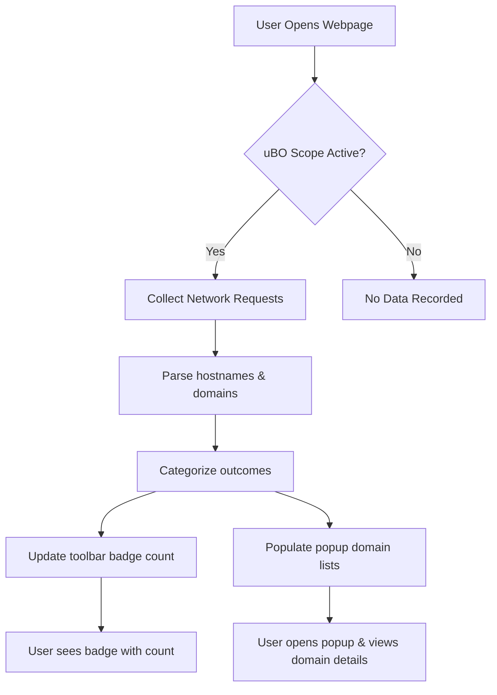

# Your First Scan: Understanding the Badge and Popup

## Overview
Welcome to your first interaction with uBO Scope! This guide walks you through how to interpret the toolbar badge, open the popup interface, and get an immediate overview of all third-party domain connections generated by the webpages you visit. By the end, you'll confidently understand what the badge number means and how to use the popup to gain transparency into your browsing connections.

---

## What You Will Achieve
- Understand the significance of the badge count on the browser toolbar icon.
- Learn how to open and navigate uBO Scope's popup panel.
- Interpret the categorized lists of connected domains: Allowed, Stealth-Blocked, and Blocked.
- Get practical tips for making sense of connection data in real browsing scenarios.

---

## Prerequisites
- You have successfully installed uBO Scope on your browser (Chrome, Firefox, or Safari).
- The extension has the necessary permissions (webRequest, activeTab, storage).
- You have opened or navigated to at least one webpage so that uBO Scope has connection data to present.

---

## Estimated Time
Approximately 5 minutes to complete the workflow and familiarize yourself with the interface.

---

# Step-by-Step Guide

### 1. Locate the Toolbar Badge Icon

- Look towards your browser's toolbar for the uBO Scope icon.
- The icon displays a numeric badge indicating the count of distinct third-party domains your browser has successfully connected to on the active tab.

> The badge count **reflects the number of unique allowed third-party remote servers** contacted by the current webpage. A lower count suggests fewer external connections, often equating to less exposure.

### 2. Click the uBO Scope Icon to Open the Popup Panel

- Clicking the icon launches the popup interface, showing detailed connection information.
- The popup is lightweight and designed for quick inspection without disrupting your workflow.

### 3. Understand the Popup Header

- At the top, the popup shows the hostname you are currently inspecting.
- If the hostname and domain are different (e.g., subdomain vs. main domain), both are displayed clearly for better clarity.

### 4. Review the Summary Section

- The summary area reports the total number of distinct domains connected across all categories.
- This summary is a quick measure of the network reach of the webpage currently loaded.

### 5. Explore the Three Connection Outcome Sections

The popup divides domain connections into three sections for easy interpretation:

#### Allowed (Not Blocked)
- These domains represent third-party servers that the browser successfully connected to.
- Typical entries: Content Delivery Networks (CDNs), legitimate APIs, or other necessary web services.

#### Stealth-Blocked
- Domains that experienced redirects or stealth blocking.
- These are connections where uBO Scope detected redirection or hidden blocking mechanisms.

#### Blocked
- Domains that had their network requests blocked by the browser or content blockers.
- This denotes requests prevented from completing.

> Each section lists domain names alongside a count badge indicating how many connections were made to that domain.

### 6. Interpret Domain Counts

- The count next to each domain reflects the number of connection attempts (successes or blocks) made during the page load.
- Multiple connections to a large streaming or ad network may result in a higher count.

### 7. Use the Domain List Widgets

- Scroll through each section to see all relevant third-party domains.
- Domains with zero counts or no entries for a category will automatically hide that section.

### 8. Practical Example

Imagine visiting example.com:

- The badge shows “3”. Clicking the icon reveals:
  - Allowed: cdn.example.net (5 connections), images.example.org (2 connections)
  - Stealth-Blocked: tracker.badads.com (1 connection)
  - Blocked: ads.examplead.com (4 connections)

This tells you example.com fetched resources from two allowed domains, attempted connection redirects with hidden blocking, and also successfully blocked ads.

---

## Tips & Best Practices

- **Reload your current webpage** to refresh data if you have just installed or enabled uBO Scope.
- **Watch the badge count** for changes as you navigate across sites — significant variations often indicate different network behavior.
- Use the **popup as a quick audit tool** whenever you suspect background connections or want to validate content blocker effectiveness.
- Remember, the badge only counts **distinct domains**, not total requests, so it is a concise summary.

---

## Common Pitfalls & Troubleshooting

<Accordion title="Popup Shows 'NO DATA' or Empty Domains">
If your popup shows 'NO DATA' or empty domain lists:

- Ensure the current active tab is fully loaded and is a web page, not about:blank or internal pages.
- Check that uBO Scope has all required permissions and is enabled.
- Reload the webpage; sometimes data collection may lag briefly.
- Confirm network requests are not made outside the browser's `webRequest` API scope.
</Accordion>

<Accordion title="Badge Count Is Always Zero">
- Verify the extension is not disabled by the browser.
- Confirm you are browsing pages that make external network requests. Empty or local pages will result in zero counts.
- Check for any permissions warnings on your extension management page.
</Accordion>

<Accordion title="Domain Names Appear Unsurprisingly Short or Odd">
- uBO Scope uses accurate domain parsing conforming to the public suffix list, including Unicode to punycode conversion.
- Some domains may appear as punycode if they use internationalized domain names; the popup converts these back to Unicode for readability.
</Accordion>

---

## What’s Next?

- Explore [Interpreting the Toolbar Badge & Popup](/getting-started/first-use/interpreting-badge-popup) for advanced usage insights.
- Review [Understanding Allowed, Blocked, and Stealth Domains](/guides/practical-workflows/understanding-domain-outcomes) to deepen your comprehension.
- If you encounter issues, consult [Troubleshooting & Quick Checks](/getting-started/first-use/troubleshooting-install-use).
- For initial setup or installation questions, refer to [Installing uBO Scope on Your Browser](/guides/getting-started/installing-ubo-scope).

---

## Additional Resources
- uBO Scope GitHub Repository: [https://github.com/gorhill/uBO-Scope](https://github.com/gorhill/uBO-Scope)
- Overview of uBO Scope: [What is uBO Scope?](/overview/product-intro/about-ubo-scope)
- Detailed Architecture: [System Architecture at a Glance](/overview/architecture-overview/system-architecture)

---

# Visual Summary

---

This flowchart illustrates how uBO Scope listens to network requests on a page, categorizes the domains by their connection outcome, updates the toolbar badge count accordingly, and populates the popup interface for user inspection.

---

# Summary

This page equips first-time users of uBO Scope with immediate, practical knowledge to:
- Understand the extension's toolbar badge representing third-party domain connections.
- Navigate and interpret the categorized summary in the popup interface.
- Identify allowed, stealth-blocked, and blocked domains within a browsing session.
- Troubleshoot common initial hurdles and make informed assessments on network connections.

By following this guide, users maximize the extension's value in transparency and privacy awareness right from the start.
