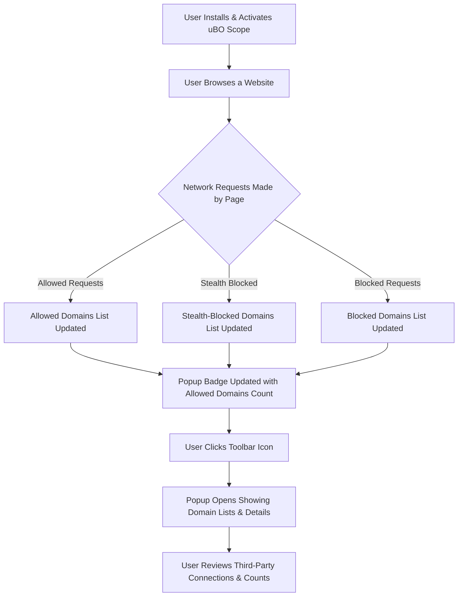

# Your First Network Insights

Discover how to use the uBO Scope popup to gain immediate visibility into third-party network requests on your active browser tab. This guide walks you through opening the popup, understanding the toolbar badge count, and interpreting the snapshot of network activity — empowering you to quickly spot which third-party domains your browser is communicating with.

---

### Workflow Overview

**What you will accomplish:** Learn to open and interpret uBO Scope's popup UI, understand the significance of the toolbar badge, and identify allowed, stealth-blocked, and blocked third-party domains in real-time.

**Prerequisites:**
- uBO Scope extension installed in your Chromium, Firefox, or Safari browser.
- Active webpage loaded in your browser tab.
- Basic familiarity with browser toolbar extensions.

**Expected outcome:**
- Ability to access and read the uBO Scope popup.
- Understand the badge number summarizing third-party domains.
- Recognize connection categories displayed in the popup.

**Time estimate:** 5 minutes

**Difficulty level:** Beginner

---

### Step-by-Step Instructions

<Steps>
<Step title="Open the uBO Scope Popup">
To start, locate the uBO Scope icon on your browser toolbar. Click the icon to open the popup window.

**Expected Result:** The popup displays the current tab’s hostname at the top, a summary count, and lists of domains grouped by connection status.
</Step>

<Step title="Interpret the Toolbar Badge Count">
Observe the numeric badge displayed on the toolbar icon.

- This number represents the count of distinct third-party domains with allowed connections in the active tab.
- A lower count generally indicates fewer third-party connections, which can imply stronger content blocking or fewer third-party resources.

**Tip:** The badge counts only third-party domains, excluding the primary site domain.
</Step>

<Step title="Understand the Popup Header">
At the top of the popup, you will see two parts:

- The left segment shows any subdomains leading up to the main domain.
- The right segment highlights the main domain of the active tab in Unicode (e.g., example.com).

This separation helps clarify the main site you are analyzing versus its subdomains.
</Step>

<Step title="Review the Summary Section">
Below the header, the summary shows how many distinct domains your browser connected to on this tab.

This count aggregates the total number of unique third-party domains with any network activity (mostly those allowed).
</Step>

<Step title="Explore the Connection Categories">
The main area of the popup displays three sections:

1. **Not Blocked** (green highlight): Domains where connections were successfully allowed.
2. **Stealth-Blocked** (red highlight): Domains where connections were stealthily blocked — the browser attempted to connect but the requests were silently prevented.
3. **Blocked** (red highlight): Domains where requests were actively blocked and failed.

**For each category, you see:**
- A domain name listed per row.
- A count badge to the right showing the number of requests made to that domain.

**Expected Result:** You can quickly identify which domains are accessing your browser and whether their requests are blocked or allowed.
</Step>

<Step title="Validate Your First Insights">
As you browse websites, open the popup to observe how third-party connections change live.

- A new domain appearing in "Not Blocked" reflects a successful connection.
- Domains moving between categories signal changes in allowed/blocking behavior.

Confirm that the popup updates by refreshing the page or switching tabs.
</Step>
</Steps>

---

### Examples & Real-World Scenarios

Imagine visiting an online news website. By opening the uBO Scope popup:

- You see the domain `cnn.com` is the main domain.
- The summary indicates `15` domains connected.
- Most allowed domains might be content delivery networks (CDNs) like `akamai.net` or analytics services.
- You spot a blocked domain related to an advertising network.

This snapshot helps you instantly understand what third parties are active behind the scenes.

**Example popup snapshot visualization:**

| Category          | Domains               | Count Example |
|-------------------|-----------------------|---------------|
| Not Blocked       | akamai.net            | 50            |
| Stealth-Blocked   | tracking-adserver.com  | 3             |
| Blocked           | adnetworkxyz.com      | 5             |

---

### Troubleshooting & Tips

<AccordionGroup title="Common Questions & Troubleshooting">
<Accordion title="Why is the badge count sometimes empty or zero?">
The badge shows the number of distinct third-party domains with allowed connections on the active tab.

- If the count is empty, it means there are no allowed third-party connections detected.
- This can occur on pages with no external content or after blocking all third parties.
- Make sure the tab is the active browsing tab when you check the badge.
</Accordion>

<Accordion title="The popup shows 'NO DATA' or blank domains list">
This indicates that uBO Scope has not yet received or processed network data for the current tab.

- Refresh the tab or navigate to another page to generate network requests.
- Confirm that the browser allows the extension’s permissions (webRequest and activeTab).
- Check if the browser or another extension blocks the extension’s access to network requests.
</Accordion>

<Accordion title="Can uBO Scope show websocket requests?">
Yes, uBO Scope listens to `webRequest` API events, including websocket (`ws://` and `wss://`) URLs on supported browsers.

- Websocket connection outcomes are similarly classified and included in domain counts.
- Note that some browsers or content blockers may limit visibility.
</Accordion>

<Accordion title="Understanding Stealth-Blocked vs Blocked">
- **Stealth-Blocked:** Requests are prevented silently, not triggering error status but counted as blocked.
- **Blocked:** Requests actively blocked with observable network errors.

Stealth blocking is used to hide blocking behavior from websites to prevent detection; uBO Scope detects these attempts.
</Accordion>
</AccordionGroup>

### Best Practices & Tips

- Regularly check the popup after visiting new or privacy-sensitive sites to understand third-party exposure.
- Consider the badge count as a *privacy health indicator* — the fewer third-party domains connected, the lower the tracking surface.
- Use the popup insight to guide your content blocker rules or filter list maintenance.
- Recognize that allowed domains often include essential CDNs and non-tracking services.

---

### Next Steps & Related Content

- After mastering your first network insights, advance to [Interpreting Connection Results](../analyzing-traffic/interpreting-traffic) to understand domain categorization in depth.
- Explore [Your First Session: Checking Connections](../../getting-started/first-use-and-validation/first-use) for a complementary walkthrough.
- Consult [Troubleshooting Common Issues](../../getting-started/first-use-and-validation/troubleshooting) if you encounter problems.
- Dive into [Why Use uBO Scope?](../../overview/product-intro-value/value-proposition) to understand the value of these insights for privacy and filter list maintenance.

---

### Visual Overview of User Flow

---

### Source Code Reference

- Popup UI markup and styling: [`popup.html`](popup.html), [`popup.css`](css/popup.css)
- Popup rendering logic and domain categorization: [`popup.js`](js/popup.js)
- Network request tracking and tab badge update: [`background.js`](js/background.js)
- Browser action configuration and manifest details: [`manifest.json`](platform/chromium/manifest.json)

Explore these files in the [uBO Scope GitHub repository](https://github.com/gorhill/uBO-Scope/tree/main) for deeper technical understanding.

---

<Tip>
The badge count on the toolbar icon is your first and fastest indicator of third-party network activity on the current tab. Lower is better for privacy and control.
</Tip>

<Note>
Not all third-party domains represent tracking or ads; CDNs and essential service domains will appear in the allowed list as well to deliver web content correctly.
</Note>

<Info>
Stealth blocking is a sophisticated technique to silently prevent requests without alerting the site; uBO Scope reveals these hidden attempts in a dedicated section.
</Info>

<Check>
Ensure your browser grants uBO Scope the required permissions (activeTab, storage, webRequest) for accurate monitoring.
</Check>
