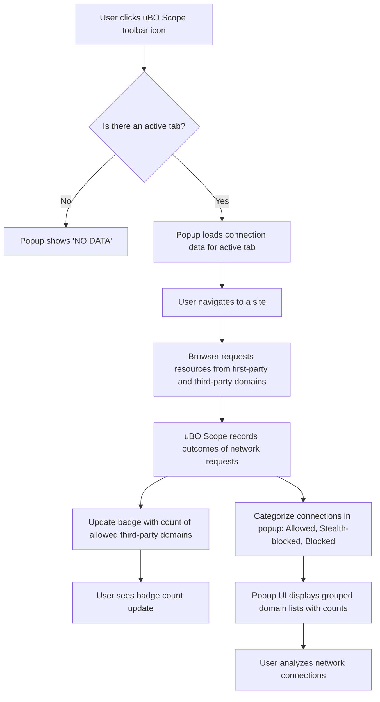

# First Inspection: Revealing Connections on a Webpage

## Overview
This guide walks you through your first inspection using uBO Scope, demonstrating how to open the extension's popup UI, navigate to a website, and identify third-party remote servers that your browser contacts. You'll learn to interpret the dynamic badge on the toolbar as well as the categorized connection outcomes displayed in the popup, enabling you to uncover the real network activity happening behind the scenes on any webpage.

---

## Prerequisites

- **uBO Scope extension installed and enabled** in your browser. Refer to the [Installation Guide](https://github.com/gorhill/uBO-Scope/blob/main/guides/getting-started/install-setup.mdx) for step-by-step instructions.
- A supported browser version (Chrome 122+, Firefox 128+, Safari 18.5+).
- Permissions requested by the extension are granted (e.g., `activeTab`, `webRequest`, and `storage`).
- Basic familiarity with browser extensions and toolbar icons.

---

## Expected Outcome

By the end of this guide, you will be able to:

- Open the uBO Scope popup and connect it to the active tab.
- Navigate to any website and see a real-time count of distinct third-party domains contacted.
- Understand the meaning of different visual indicators in the badge and popup UI.
- Confidently distinguish between allowed, stealth-blocked, and blocked connections.

---

## Time Estimate
Approximately 5–10 minutes, depending on browser speed and your familiarity with extension toolbars.

---

## Step-by-Step Instructions

### 1. Locate and Open the uBO Scope Extension

- Look for the uBO Scope icon in your browser toolbar. It is labeled with a shield icon and may display a numeric badge representing the count of distinct third-party domains contacted.
- Click the icon once to open the popup UI. The popup will load connection data related to the currently active browser tab.

### 2. Navigate to the Website You Want to Inspect

- In the active browser tab, enter the URL of the website you wish to analyze and load it completely.
- Wait a moment after page load to allow uBO Scope to collect and process network request data.

### 3. Observe the Toolbar Badge

- The badge on the extension icon shows a number that equals the count of **distinct third-party domains** the webpage attempted to connect to and were allowed.
- A lower number indicates fewer third-party connections, which often correlates with better privacy.

### 4. Examine the Popup UI Sections

The popup divides connection data into three main sections:

- **Not Blocked**: Lists third-party domains from which resources were successfully fetched.
- **Stealth-Blocked**: Lists third-party domains that were blocked stealthily, typically via redirection where the user cannot directly observe blocking.
- **Blocked**: Shows third-party domains successfully blocked by the content blocker or network layer.

Each section displays:

- Domains in alphabetical order,
- A badge with the count of network requests for that domain.

The top heading displays the domain of the active tab (in unicode), providing context for the network activity shown.

### 5. Interpreting the Data

- Domains in the **Not Blocked** list represent active third-party servers contacted and allowed.
- The **Stealth-Blocked** list contains third-party connections that were intercepted before full request completion.
- The **Blocked** list shows connections explicitly prevented from loading.

Use this segmentation to analyze the breadth and nature of third-party access on the current webpage.

### 6. Refresh and Repeat

- Reload the active webpage to refresh the data in the popup.
- Click the uBO Scope icon again to see freshly updated connection statistics.

### 7. Clearing and Resetting Data

- Tabs that are closed discard their connection data automatically.
- Switching to a new tab resets the popup to reflect that tab's network activity.

---

## Example Scenario

Imagine you want to audit the privacy exposure on `https://example.com`:

- Open uBO Scope by clicking its toolbar icon.
- The popup shows the tab's hostname at the top.
- The badge reads "5", indicating 5 different allowed third-party domains.
- In the popup, you see:
  - **Not Blocked** includes `cdn.examplecdn.com`, `tracker.adnetwork.com`.
  - **Stealth-Blocked** includes `redirector.ads.com`.
  - **Blocked** includes `badtracker.tracker.com`.

From this, you conclude that the site allowed some CDN and ad networks, stealth-blocked a redirector, and blocked a known tracker. This granular visibility is the core benefit of uBO Scope.

---

## Best Practices

- Always verify that the popup is showing data for the active tab.
- Consider reviewing multiple pages on the same site to get a holistic picture.
- Use the badge count as a quick privacy snapshot but dive into the popup for detailed analysis.
- Refresh the page if no data appears in the popup after navigating.

---

## Common Pitfalls and Troubleshooting

<AccordionGroup title="Troubleshooting Common Issues">  
<Accordion title="The Popup Shows 'NO DATA' or No Domains">  
- Make sure you have navigated to a site in the active tab.
- Reload the page a few seconds after opening the popup.
- Check extension permissions and browser version compatibility.
- Confirm uBO Scope is enabled in your extensions list.
</Accordion>  
<Accordion title="Badge Number Does Not Update">  
- Reload the tab to force network requests to be remeasured.
- Verify network requests are not blocked by browser or system-level tools before uBO Scope can observe them.
- Check for any other extensions that might interfere.
</Accordion>  
<Accordion title="Domains Are Not Grouped Correctly">  
- uBO Scope uses the Public Suffix List to identify base domains; some rare or new domain suffixes might not be immediately recognized.
- The extension periodically fetches updates to the suffix list to stay current.
</Accordion>  
</AccordionGroup>

---

## Additional Tips

- Use the popup UI alongside your content blocker’s dashboard for a more accurate picture of network requests.
- Share findings with filter list maintainers if you discover unexpected third-party connections.
- Combine uBO Scope with manual site review to decide what connections to allow or block.

---

## References and Next Steps

- For installation help, see [Installing and Setting Up uBO Scope](../guides/getting-started/install-setup).
- Learn to interpret the popup deeply at [Understanding the Popup and Badge](../getting-started/getting-going/exploring-popup).
- Explore [What is uBO Scope?](../../overview/introduction-group/what-is-ubo-scope) to understand its purpose and value.
- Troubleshoot with [Troubleshooting Common Issues](../getting-started/getting-going/troubleshooting-setup).

---

## Visual Walkthrough

---

This flow shows how users interact with the popup and how connection data visualizes network activity per browser tab.

---