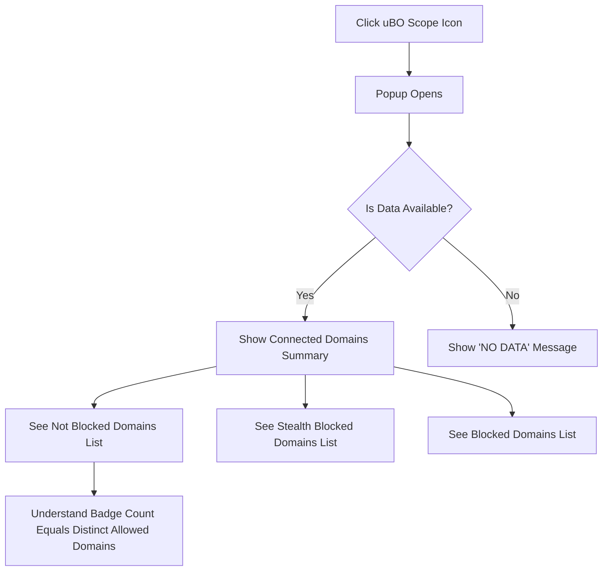

# Your First Look: Viewing Remote Connections

## Workflow Overview

This guide takes you step-by-step through opening the uBO Scope popup, deciphering the badge count on the toolbar icon, and understanding the table of third-party connections generated by the webpage you are visiting. By following it, you will quickly gain actionable insight into the remote servers your browser contacts, helping you verify network activity and privacy details.

### Prerequisites
- uBO Scope extension is installed and activated in your browser (Chromium 122+, Firefox 128+, or Safari 18.5+).
- Permissions for the extension are granted for the active tab and network monitoring.
- You have an active browser tab with web content loaded.

### Expected Outcome
You will be able to:
- Open the uBO Scope interface via the toolbar icon.
- Interpret the badge count showing distinct connected remote domains.
- Read and understand the categorized lists of remote connections: allowed, stealth-blocked, and blocked.

### Time Estimate
Approximately 5 minutes.

### Difficulty Level
Beginner.

---

## Step-by-Step Instructions

<Steps>
<Step title="Open the uBO Scope Popup">
1. Locate the uBO Scope icon in your browser's toolbar. It typically appears as a small badge with a count number.
2. Click the icon to open the popup interface.

**Expected Result:** A popup window appears displaying network connection data for the current active tab.
</Step>

<Step title="Interpret the Toolbar Badge Count">
1. Look at the badge number over the uBO Scope icon.
2. Understand that this number represents the count of **distinct third-party remote domains** your current tab connected to.

**Tip:** A lower badge count generally indicates fewer third-party connections, which may be preferable for privacy.

**Pitfall:** Do not confuse this count with block counts from other content blockers; this is about domains successfully connected.
</Step>

<Step title="Review the Popup's Summary Section">
1. Read the summary at the top of the popup, which states the number of connected domains.

**Expected Result:** The summary matches or closely reflects the badge count.

**Note:** If it reads 'NO DATA' or shows zero, refresh the page or verify permissions.
</Step>

<Step title="Examine the Three Domain Sections">
1. Below the summary, you will find three categorized sections:
   - **Not Blocked:** Domains your browser connected to without blockage.
   - **Stealth Blocked:** Domains where connections were redirected stealthily.
   - **Blocked:** Domains where connection attempts failed or were explicitly blocked.
2. Look at the domain names listed along with the number of connection attempts (count).

**Example:** If you see `cdn.example.com 5` under Not Blocked, it means 5 requests were allowed to that domain.
</Step>

<Step title="Read Domain Names in Native Unicode">
1. Note that international domain names will appear in their Unicode form for easier reading.
2. This conversion helps identify domains from non-Latin character sets easily.
</Step>
</Steps>

---

## Key Concepts

- **Third-Party Domains:** Domains different from the main page's domain which provide content or services.
- **Badge Count:** Represents the number of distinct third-party **allowed domains** connected by the current tab.
- **Allowed, Stealth Blocked, Blocked:** Categories reflecting the outcome of network requests as captured by uBO Scope.

Refer to [Core Concepts & Key Terms](/getting-started/essential-concepts/concepts-and-terminology) for detailed definitions and interpretations.

---

## Practical Tips & Best Practices

- Always open the popup for the active tab to see up-to-date connection data.
- Refresh the page if the popup fails to display recent connection information.
- Use the badge count as an immediate privacy indicator; investigate high counts by opening the popup.
- Recognize that some third-party connections, such as CDNs, are common and usually benign.

---

## Troubleshooting Common Issues

<AccordionGroup title="Troubleshooting Your First Look">
<Accordion title="Popup Shows 'NO DATA' or No Domains">
Possible Causes:
- Extension permissions not granted.
- Page did not fully load or no network activity detected.
- Browser compatibility issues or outdated version.

Resolution:
- Confirm permissions are granted for the active tab as explained in the [System Requirements & Supported Browsers](/getting-started/installation-basics/system-requirements).
- Reload the tab and reopen the popup.
- Verify your browser version is supported.
</Accordion>
<Accordion title="Badge Count Does Not Update">
Possible Causes:
- Network requests not yet processed by the extension.
- Background service worker or extension instance inactive.

Resolution:
- Wait a moment for network requests to be recorded.
- Try toggling the extension off and on or reloading the browser.
- Consult the [Troubleshooting Installation & Setup Issues](/getting-started/installation-basics/troubleshooting) guide for more.
</Accordion>
</AccordionGroup>

---

## Next Steps & Related Documentation

- After mastering your first look, deepen your understanding by reading [Interpreting the Badge Count and Popup Table](/guides/getting-started/understanding-badge-and-table).
- Learn how uBO Scope fits within your privacy setup by reviewing [Core Concepts & Key Terms](/getting-started/essential-concepts/concepts-and-terminology).
- For installation setup or troubleshooting, see [Installing and Activating uBO Scope](/guides/getting-started/install-and-activate) and the [Troubleshooting Installation & Setup Issues](/getting-started/installation-basics/troubleshooting).

---

## Example Scenario

Imagine you visit `https://example.com` and want to know what other servers your browser contacts.

1. Click the uBO Scope icon.
2. See the badge shows `7` indicating 7 unique third-party domains connected.
3. Open the popup and see domains like `cdn.example-cdn.com`, `ads.trackingservice.net`, and `analytics.example.org` listed.
4. You observe 5 domains under Not Blocked, 1 under Stealth Blocked, and 1 under Blocked.
5. This informs you that while most connections were successful, some were stealthily redirected or blocked.

This quick view helps you identify unexpected network activity effectively.

---

## How It Works Internally (Brief Overview for Context)

uBO Scope collects network request outcomes using browser `webRequest` API listeners. It categorizes domains by request outcome per active tab and updates both the popup UI and the toolbar badge accordingly. Domain names use the Public Suffix List to accurately group hostnames under registered domains, ensuring the badge count reflects truly distinct third-party domains.

For more on architecture, see [How uBO Scope Works (with Diagram)](/overview/concepts-architecture/system-architecture).

---

## Glossary

- **Hostname:** Full domain including subdomains (e.g., `cdn.example.com`).
- **Domain:** Registered domain from Public Suffix List (e.g., `example.com`).
- **Allowed:** Network requests that completed successfully.
- **Stealth Blocked:** Requests redirected or hidden from normal network visibility.
- **Blocked:** Requests failed to connect or were blocked by content blockers.

---

## Visual Summary

---

# References
- uBO Scope Official Repo: https://github.com/gorhill/uBO-Scope
- Public Suffix List: https://publicsuffix.org/

---

# Appendix: Source Files Relevant to this Page

- `popup.html` - Defines the popup interface layout.
- `js/popup.js` - Handles fetching and rendering domain connection data.
- `css/popup.css` - Styles the popup for readability.

These components collaboratively deliver the real-time domain connection insights you see in the uBO Scope popup.
