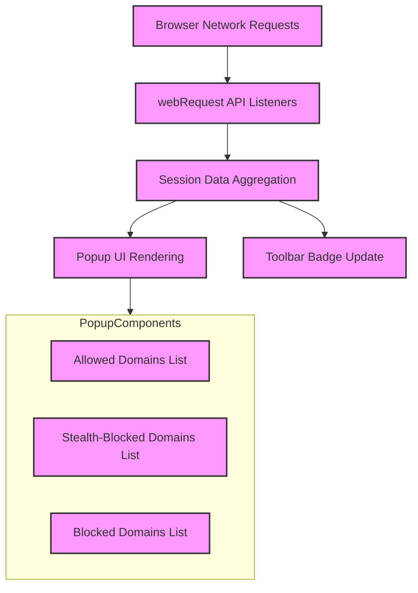

# Exploring the Popup UI

## Workflow Overview

### What This Guide Helps You Accomplish

This guide walks you through using the uBO Scope browser extension's popup interface. You'll learn how to interpret the list of domains connected from the active browser tab, understand the different connection categories (allowed, stealth-blocked, and blocked), and grasp how the popup data reflects real-time network activity reported via browser webRequest events.

### Prerequisites

- uBO Scope installed and enabled in your browser (Chromium, Firefox, or Safari).
- At least one active browser tab with web page content loaded.
- Basic understanding of browser extensions and visiting the extension’s popup.

### Expected Outcome

By the end of this guide, you will confidently read and interpret the domain connection lists in the popup, understand the meaning behind the badge count on the toolbar icon, and know how uBO Scope gathers and categorizes network connection data.

### Time Estimate

Approximately 5 to 10 minutes.

### Difficulty Level

Beginner

---

## Step-by-Step Instructions

### 1. Opening the uBO Scope Popup

- Click on the uBO Scope icon in your browser’s toolbar.
- The popup appears showing connection summaries for the currently active tab.

**What you should see:**
- The hostname or domain of the active tab displayed prominently at the top.
- Three distinct sections labeled “not blocked,” “stealth-blocked,” and “blocked.”
- Each section contains a list of domains with numeric badges showing connection counts.

### 2. Understanding the Badge Count on the Toolbar Icon

- The badge shows the number of distinct third-party remote domains for which a network connection was made successfully.
- A lower badge number indicates fewer third-party connections and potentially less exposure.

**Note:** This count is for _allowed_ connections only and is unrelated to the number of requests blocked.

### 3. Interpreting the Three Outcome Categories

- **Not Blocked (Allowed):** Domains with established network connections where resource fetching succeeded.
- **Stealth-Blocked:** Domains where the request was redirected or quietly blocked without explicit error reports, often leveraging stealth blocking techniques.
- **Blocked:** Domains where network requests failed or were actively blocked, e.g., by content blockers or network errors.

Each category lists domains logged from the active tab's network activity, along with how many times connections to these domains occurred.

### 4. Reading Domain Entries

- Domains are displayed in Unicode to ensure readability even for punycode-encoded internationalized domain names.
- Beside each domain is a numeric badge showing how many connections to that domain were recorded during the tab session.

### 5. How uBO Scope Gathers This Information

- The extension uses browser `webRequest` API listeners to monitor all network requests from web pages.
- Events are categorized as: `success` (allowed), `redirect` (stealth-blocked), or `error` (blocked).
- Requests are grouped per tab and processed in real time to update both the popup UI and toolbar badge.

### 6. Refreshing Data and Session Persistence

- The popup reflects the data accumulated during the current browsing session for that tab.
- Closing and reopening the popup refreshes the displayed data.
- Data is stored in the extension’s session storage and updated continuously.

### 7. Additional UI Details

- When the page’s host and domain differ (e.g., subdomains and main domains), the popup shows them clearly to avoid confusion.
- Counts are presented in localized number formatting for easy reading.

---

## Examples & Scenarios

### Example: Interpreting a Typical Popup View

- The badge shows **3**. This means three distinct third-party domains were fetched without blocking.
- Under "not blocked," you might see `cdn.example.net` with count `15` and `analytics.trusted.com` with count `5`.
- Under "stealth-blocked," a domain like `ads.badexample.org` might appear with a small count, indicating requests were quietly redirected or blocked.
- Under "blocked," `tracking.malicious.com` could appear to show active blocking.

This information helps you understand exactly which domains your browser connected to and their status.

### Scenario: Checking if a Privacy Extension is Working

- Open the popup and observe the number and identity of domains under "not blocked."
- Confirm suspicious third-party domains appear under "blocked" or "stealth-blocked".
- Use this as a double-check to see if your primary content blocker is effective.

---

## Troubleshooting & Tips

### Common Issues

- **Popup shows "NO DATA" or empty domains:** Make sure you have an active tab loaded with a webpage.
- **Badge count not updating:** Network requests may be outside the browser’s reach or the extension lacks proper permissions. Restart the browser or check permissions.
- **Domains don't appear expectedly:** Some network connections may be blocked before webRequest API can detect them, or due to browser limitations.

### Best Practices

- Regularly check the popup after loading various pages to get a feel for normal network connections.
- Use the badge count as your primary quick indicator of third-party connection exposure.
- Understand "stealth-blocked" as subtle blocking, which may not be obvious visually but significant for privacy.

### Performance Considerations

- The popup aggregates data on demand and updates asynchronously, minimizing browser performance impact.
- Clearing browser session or extension data can reset the popup stats.

### Alternative Approaches

- Combine uBO Scope with other developer tools or content blockers for deeper network analysis.
- Use the browser’s native webRequest debugging for low-level inspection if needed.

---

## Next Steps & Related Content

- Explore the [Analyzing Network Requests](https://docs.example.com/guides/real-world-usage/analyzing-network-requests) guide to deepen your understanding of how network data is captured and interpreted.
- Learn about [Debunking Content Blocker Myths](https://docs.example.com/guides/real-world-usage/debunking-content-blocker-myths) to avoid common misconceptions.
- For installation help, see the [Installing uBO Scope](https://docs.example.com/guides/getting-started/installing-ubo-scope) guide.
- Review the [First Run: What to Expect](https://docs.example.com/getting-started/first-use-setup/first-run) for new user onboarding.

---

## Diagram: Popup UI Data Flow from Network Requests

This diagram shows how network requests flow into uBO Scope's monitoring listeners, get aggregated per browsing session per tab, and then reflected in the popup UI and toolbar badge.

---