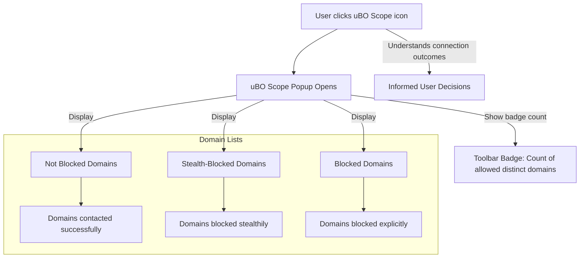

# Reading the Popup: Domains and Outcome Types

## Overview

This guide walks you through understanding the popup interface of uBO Scope, focusing specifically on how to interpret the displayed remote server domains and their connection outcomes. You will learn to distinguish between **allowed (not blocked)**, **stealth-blocked**, and **blocked** domains, and understand the meaning behind the badge count on the toolbar icon.

By mastering these concepts, you gain clear visibility into your browser's network activity, enabling informed decisions about your browsing privacy and content blocking effectiveness.

---

## What You Will Learn

- How to read the list of domains shown in the popup
- The difference between allowed, stealth-blocked, and blocked domains
- How the badge count relates to third-party domain connections
- Practical examples to interpret the data shown
- Tips to avoid common misconceptions when analyzing the popup

---

## Prerequisites

- uBO Scope installed and running in your browser
- Basic familiarity with browser extensions and the popup interface
- An active browser tab with some network activity (visiting websites)

---

## Understanding the Popup Interface

When you click the uBO Scope toolbar icon, the popup appears showing a summary of remote servers your current tab has connected to. It organizes domains based on the observed outcome of network requests.

### The Three Outcome Sections

1. **Not Blocked (Allowed)**
   - These domains represent servers that your browser successfully connected to.
   - They are third-party domains that were allowed by your content blockers or network settings.
   - The popup lists each such domain along with the count of connection attempts.

2. **Stealth-Blocked**
   - Domains in this section were subject to "stealth blocking".
   - Stealth blocking means connections were intercepted and prevented in a way that the page or script might not directly detect.
   - This often applies when connections are redirected or altered by content blocking mechanisms.

3. **Blocked**
   - These are domains for which connection attempts failed explicitly.
   - Your content blocker or another mechanism actively blocked these network requests.
   - These domains also show connection counts in the popup.

### Badge Count on Toolbar Icon

- The number displayed on the toolbar badge indicates the **number of distinct third-party remote servers that your current tab connected to and were not blocked**.
- Importantly, it counts unique domains across all allowed connections — a **lower number means fewer third-party connections** and generally a better privacy profile.
- The badge does *not* count stealth-blocked or blocked domains.

---

## Step-by-Step: Interpreting the Data

### 1. Open the Popup on an Active Tab

- Click the uBO Scope icon in your browser toolbar.
- The popup will display three sections: **not blocked**, **stealth-blocked**, and **blocked**.

### 2. Review the Hostname and Domain Header

- At the top, you see the hostname of the tab you are inspecting (the page you are currently viewing).
- The extension shows both the full hostname and the base domain (registrable domain) parsed via the Public Suffix List.

### 3. Examine the "Not Blocked" Section

- This list shows domains with which your browser successfully communicated.
- Each entry shows the domain and how many requests were made.
- Use this to identify which third parties the website is contacting.

### 4. Explore the "Stealth-Blocked" Section

- Here are domains where connection attempts were redirected or blocked stealthily.
- These requests never succeeded but might not be visible to the website.
- This indicates the content blocker is active and doing more than just passive blocking.

### 5. Check the "Blocked" Section

- This shows explicitly blocked network connection attempts.
- These connections failed outright due to blocking rules.
- The presence of blocked domains can signal aggressive filtering but does not necessarily mean more privacy since allowed domains still exist.

---

## Real-World Example

Imagine you visit a news website:

- The **"not blocked"** list shows `cdn.examplecdn.com` and `analytics.goodtracker.net` with counts 12 and 5 respectively.
- The **"stealth-blocked"** list shows `tracker.badtracker.com` with count 3.
- The **"blocked"** list shows `ads.unwantedads.com` with count 7.

Interpretation:
- Your browser loaded resources from legitimate CDNs and analytics services.
- Some known trackers were stealth-blocked, meaning the browser prevented the connection quietly.
- Ad-serving domains were explicitly blocked.
- The badge will show `2` because two distinct allowed domains are counted (cdn and analytics).

---

## Practical Tips and Best Practices

- **Lower badge counts are preferable:** fewer allowed third-party remote servers usually mean less unwanted tracking.
- **Stealth-blocked domains help reveal subtle blocking:** if your blocker supports stealth blocking, these domains will be hidden from websites.
- **Blocked domains indicate active filtering:** but high blocked counts don’t necessarily mean fewer allowed connections.
- **Focus on domains rather than requests:** the popup counts distinct domains, not requests, to give a clearer privacy picture.
- **Check domains in context:** some third-party connections are essential (e.g., CDNs), so zero allowed domains is unrealistic.

---

## Common Misunderstandings

- **"More blocks mean a better content blocker"** – Not always. High blocked counts can disguise more allowed third-party domains.
- **Counting requests equals counting privacy risk** – Not true; request counts are less meaningful than distinct domains.
- **Badge count includes all blocked domains** – It only counts allowed domains.

---

## Troubleshooting

- **Empty popup or "NO DATA" message**
  - Ensure you have an active tab with sufficient network activity.
  - Reload the page after installing uBO Scope.
  - Check extension permissions (storage, webRequest).

- **Badge does not update**
  - Wait a few seconds; updates occur asynchronously.
  - Reload the tab to refresh network requests.

- **Popup shows unexpected domains**
  - Some domains may be essential services or CDNs.
  - Verify with a manual domain lookup if unsure.

---

## Summary Diagram

---

## Next Steps & Related Documentation

- [Your First Run]( /getting-started/first-use-validation/your-first-run ) — for hands-on with uBO Scope popup
- [Understanding Connection Statistics]( /guides/analyzing-traffic/understanding-connection-stats ) — deeper dive into the metrics
- [Key Concepts & Terminology]( /overview/core-concepts-architecture/key-concepts-terminology ) — foundational meanings
- [Troubleshooting Installation & Setup]( /getting-started/first-use-validation/troubleshooting-installation ) — resolve connectivity issues

---

<u>Empower yourself with this understanding to confidently monitor and improve your browser's privacy by interpreting uBO Scope's insightful popup data.</u>
