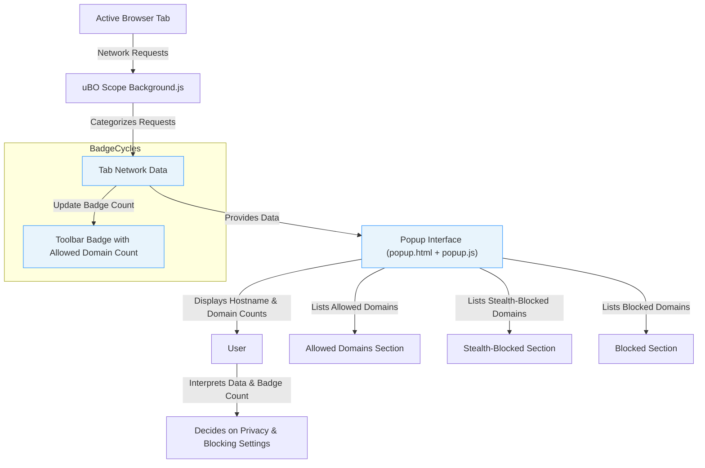

# Your First Look: Understanding the Popup UI

## Workflow Overview

### Task Description

This guide takes you on a practical tour of the uBO Scope extension popup interface. It helps you understand how to interpret domain connection statistics, categorize network connections into allowed, stealth-blocked, and blocked outcomes, and grasp the significance of the toolbar badge count. With this knowledge, you will immediately recognize suspicious or excessive third-party connections occurring in your browser.

### Prerequisites

- uBO Scope extension installed on a supported browser:
  - Chromium 122+
  - Firefox 128+
  - Safari 18.5+
- The extension has been granted necessary permissions at first launch (activeTab, webRequest, storage).
- You have opened uBO Scope popup by clicking its icon in the browser toolbar while on an active web page.

### Expected Outcome

- You will confidently navigate the popup UI with a clear understanding of:
  - The number of distinct third-party domains connected per active tab
  - The categories of connection outcomes: not blocked (allowed), stealth-blocked, and blocked
  - How to interpret domain counts and connection instances
  - The real meaning of the badge count displayed on the browser toolbar
- Ability to spot unusual or high volume third-party network activity.

### Time Estimate

10-15 minutes to read through and explore on actual web pages.

### Difficulty Level

Beginner to Intermediate – no prior network or privacy tool knowledge required.

---

## Step-by-Step Instructions

### 1. Open the uBO Scope Popup

- Click the uBO Scope icon in your browser toolbar while an active tab with a website loaded is open.
- The popup will display connection details relevant to the active tab.

### 2. Understand the Header Section

- **Hostname Display:** Top of the popup shows the current tab’s hostname split into two parts:
  - Left span: Any subdomains (e.g., `www.`)
  - Right span: The main registered domain (e.g., `example.com`)
- If no data is available for the tab, it shows `NO DATA`.

### 3. Check the Summary Section

- Below the hostname, the summary reads "domains connected: X", where X is the count of distinct third-party domains to which your browser attempted or made connections on this tab.
- This count reflects the real network activity, including allowed and stealth-blocked connections.

### 4. Explore Domain Connection Categories

The popup organizes domains into three outcome categories. Each category lists domains alphabetically with connection instance counts:

- **Not Blocked (Allowed):** Domains from which connections succeeded without being blocked.
- **Stealth-Blocked:** Domains that were silently blocked (e.g., via stealth blocking to avoid detection).
- **Blocked:** Domains whose network requests were actively blocked (including failed network requests).

Each category section shows:
- Section header with the category name
- A list of domain rows: each with domain name (Unicode displayed if punycode) and a numeric badge showing how many times connections occurred

### 5. Interpreting the Badge Count on Toolbar

- The number on the browser’s toolbar badge matches the count of distinct allowed third-party domains for the active tab.
- Lower badge counts generally indicate fewer third-party connections, which usually means better privacy.
- Remember, the badge excludes blocked or stealth connections.

### 6. Interact and Read Data Thoughtfully

- Use the data to identify:
  - Legitimate domains, such as well-known CDNs
  - Unexpected third parties contributing to your network activity
  - Excessive connections which might suggest privacy leaks or tracking
- Utilize this understanding to make informed decisions about content blockers or site trust.

### 7. Verify Display on Different Websites

- To see the popup UI in action, visit various websites and open the popup to observe real-time connection changes.
- Note how domain counts and categories vary based on site content and your blockers.

### Verification Steps

- Confirm the active tab’s hostname appears correctly at the top.
- Check the total domain count matches the number shown on the badge.
- Verify domain listings appear under appropriate outcome categories.
- Ensure counts correspond to connection instances noted.

---

## Examples & Real Scenarios

Imagine you are visiting an online news website:

- The popup shows `domains connected: 15`.
- Allowed domains include the news site’s CDN and popular analytics services.
- Stealth-blocked section lists some advertising domains silently blocked to avoid page breakage.
- Blocked section shows domains explicitly blocked by your content blocker.

You notice an unexpected domain with a high connection count under allowed domains – this indicates a third-party resource heavily involved in the page activity, worth further investigation.

---

## Troubleshooting & Tips

<AccordionGroup title="Common Issues and Solutions">
<Accordion title="Popup Shows 'NO DATA' or Is Empty">

- **Cause:** uBO Scope has not yet recorded network requests for the active tab or the tab has no network activity.
- **Solution:** Refresh the web page and reopen the popup. Ensure extension permissions are granted and the browser version is supported.
- Check related documentation: [First Launch and Permissions](getting-started/install-configure/first-launch), [Troubleshooting Common Issues](getting-started/using-validating/troubleshooting).

</Accordion><Accordion title="Badge Count Doesn't Match Popup Total Domains">

- **Cause:** The browser badge count only reflects allowed third-party domains, excluding stealth or blocked ones.
- **Tip:** Use this as an indicator of distinct successful third-party connections.

</Accordion><Accordion title="Domains List Looks Unfamiliar or Obfuscated">

- uBO Scope converts punycode domains into readable Unicode for easier recognition.
- You can recognize real-world domains better thanks to this feature.

</Accordion></AccordionGroup>

<Tip>
Tip: Regularly monitor the popup UI when browsing different sites to familiarize yourself with typical domain patterns, making suspicious connections easier to spot.
</Tip>

<Tip>
Best Practice: Use the popup’s categorized data to complement your content blocking strategy for enhanced privacy and site compatibility.
</Tip>

---

## Next Steps & Related Content

- After understanding the popup UI, deepen your knowledge by reviewing [Interpreting Network Activity and the Badge Counter](guides/using-ubo-scope/interpreting-network-activity). This guide explains the significance of network activity data and how to evaluate privacy implications.
- For insights into the terminology and core concepts used in the popup, see [Key Terminology and Concepts](overview/core-concepts-architecture/key-terminology).
- To verify your setup and ensure monitoring is functional, use the [Quick Validation Checklist](getting-started/using-validating/quick-validation).
- If you face issues or want to understand limitations, consult [Troubleshooting Common Issues](getting-started/using-validating/troubleshooting).

---

## Visual Diagram: Popup UI Data Flow

---

## Summary

This guide empowers you to master the uBO Scope popup UI, enabling immediate insight into your browser's third-party connections per tab. You learned how to read and interpret domain categories in the popup, understand the badge count’s meaning, and recognize potentially suspicious network activity. Equipped with this foundation, you will confidently use uBO Scope to support your privacy priorities.

---