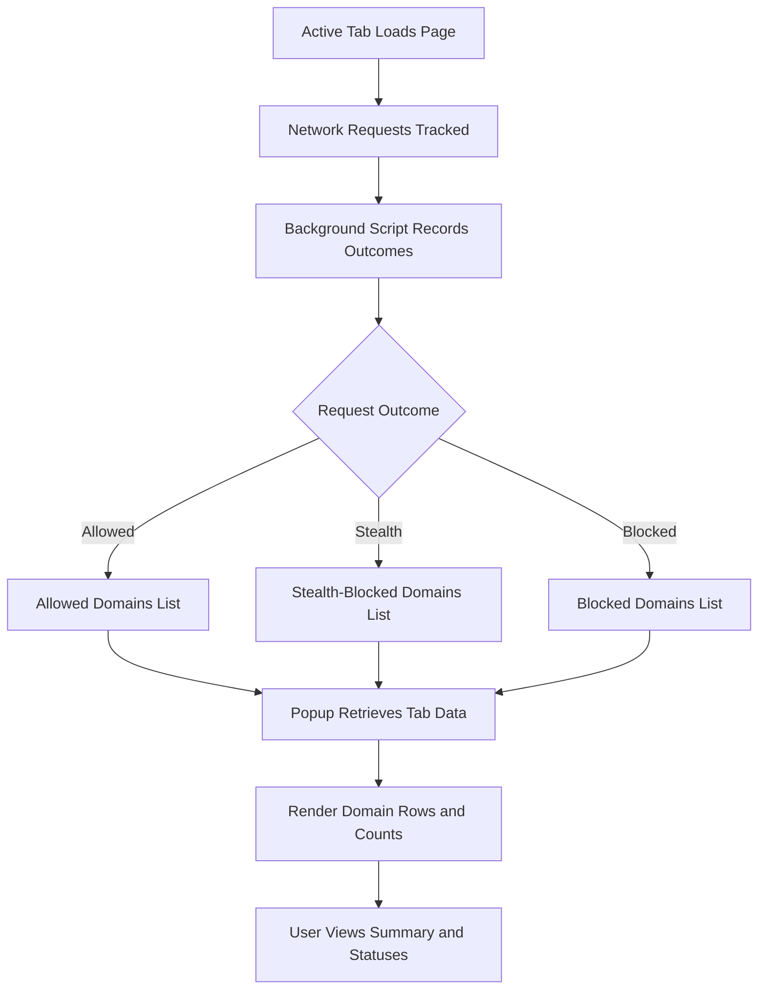

# Understanding the uBO Scope Popup Panel

## Overview

The uBO Scope popup panel delivers a real-time snapshot of all remote server connections a webpage initiates. This interface is your primary window into the network activity measured by uBO Scope, showing not only which connections were allowed but also those that were blocked or stealth-blocked by content blockers or other restrictions.

This guide walks you through each section of the popup panel, helping you interpret domain statuses, understand badge counts, and gain insight into how uBO Scope categorizes network requests to aid your privacy analysis.

---

## What You Will Achieve

By following this guide, you will:

- Understand the layout and key elements of the uBO Scope popup.
- Identify how allowed, stealth, and blocked domains are presented.
- Interpret the badge counts shown on the browser toolbar icon.
- Use the popup to analyze the network exposure of the currently active tab effectively.

**Time Estimate:** 5-10 minutes

**Difficulty Level:** Beginner

---

## Popup Panel Structure and User Flow

The uBO Scope popup is organized into distinct sections, each designed to provide clear insight into network connections for the active browser tab.

### 1. Tab Hostname Display

At the top, you see the domain and hostname related to the current browser tab:

- The **hostname** is shown first (e.g., `news.` for `news.example.com`), split visually if the hostname includes the domain.
- The **base domain** follows, displayed in Unicode for human readability, resolving any punycode-encoded international domain names.

If there is no data loaded, this area displays `NO DATA` in place of the domain.

### 2. Summary Section

Just beneath the hostname, find the **summary** section that reports the total number of distinct domains connected by the page.

- This count represents the number of unique third-party domains contacted.
- A lower count implies fewer third-party interactions—a typical goal for privacy-minded users.

### 3. Domain Status Sections

The main body consists of three clearly labeled sections showing domain connection outcomes:

- **Not Blocked (Allowed)**: Domains from which connections succeeded.
- **Stealth-Blocked**: Domains blocked in such a way that they remain hidden from the webpage's scripts.
- **Blocked**: Domains explicitly blocked, with connections prevented.

Under each section, uBO Scope lists relevant domains alongside a count of unique hostnames observed within that category.

### 4. Domain Rows

Each domain is presented in a row showing:

- The domain name (decoded from punycode if necessary).
- A badge showing how many hostnames under that domain were involved.

This granular detail helps distinguish between multiple subdomains and the overall domain's network footprint.

---

## Step-by-Step Usage

<Steps>
<Step title="Open the uBO Scope Popup">
Click the uBO Scope icon in your browser toolbar. The popup interface will appear, reflecting network data for the active tab.
</Step>
<Step title="Review the Tab Hostname Display">
Look at the top header to verify which site’s connections are being shown. Confirm the hostname matches your current tab.
</Step>
<Step title="Interpret the Summary Count">
Note the number indicating how many distinct domains the page connected to. This gives a quick privacy health check.
</Step>
<Step title="Explore Domain Categories">
Expand each section: Allowed, Stealth, Blocked. Pay attention to domain names and their occurrence counts.
</Step>
<Step title="Assess Connection Outcomes">
Understand that "Allowed" means connections succeeded as expected, "Stealth" means some requests were secretly blocked, and "Blocked" signals overt blocking.
</Step>
</Steps>

---

## Practical Examples

Suppose you visit a news site and open the uBO Scope popup.

- The hostname area shows: `news.` and then `example.com`.
- The summary says: "domains connected: 12".
- In the **Not Blocked** section, you see `cdn.example.org (4)` indicating four hostnames under that domain served content without blocks.
- The **Stealth-Blocked** section lists `tracking.badsite.net (2)`, showing two subdomains were stealth-blocked.
- The **Blocked** area includes `ads.evilads.com (1)`.

Using this, you understand the news site pulls content from multiple sources but blocks some known advertisers and trackers either openly or stealthily.

---

## Best Practices and Tips

- **Interpret Badge Counts Correctly:** The number you see on the browser toolbar icon reflects how many unique third-party domains were contacted and allowed. A lower badge count often means better network privacy.

- **Use Domain Breakdown to Spot Issues:** High counts in the blocked or stealth-blocked sections indicate active blocking policies at work, useful for auditing or filter list adjustment.

- **Reload Tabs to Refresh Data:** The popup data reflects the current tab’s activity since it was loaded. Reload your tab if you want to capture new network events.

- **Recognize Punycode Domains:** Domains with international characters are displayed in human-readable form, thanks to punycode decoding.

- **Cross-Reference with Network Requests:** Use the domain information here alongside browser developer tools to fully understand all web connections.

---

## Troubleshooting Common Issues

<AccordionGroup title="Troubleshooting the Popup Panel">
<Accordion title="Popup Shows 'NO DATA' or Blank">
This usually means no network data has been recorded for the current tab yet.

- Reload the tab to trigger new network requests.
- Ensure uBO Scope permissions and storage settings are correctly enabled.
- Confirm that the tab is active and properly reporting.
</Accordion>
<Accordion title="Badge Count Does Not Update">
- Sometimes badge counts lag due to delayed processing. Wait a moment or reload the tab.
- Verify that your browser allows the extension to intercept network requests.
- Restart the browser or disable/enabled the extension if the issue persists.
</Accordion>
</AccordionGroup>

---

## Summary Diagram: Popup Data Flow

---

## What’s Next?

- Explore [Analyzing Connections Made by Websites](/guides/workflows/analyzing-network-connections) to learn how to dig deeper into the network data.
- Review [Making Sense of Badge Counts and Domain Lists](/guides/workflows/interpreting-badge-counts) to sharpen your understanding of counts and categories.
- Visit [Troubleshooting Common Issues](/getting-started/troubleshooting/common-issues) if you encounter any problems with the popup or extension behavior.

---

## Additional Resources

- GitHub Repository: <https://github.com/gorhill/uBO-Scope>
- Overview of uBO Scope: [What is uBO Scope?](/overview/introduction-core-value/product-intro-value)
- Core Concepts: [Core Concepts & Terminology](/overview/architecture-concepts/core-terminology)

---

Thank you for choosing uBO Scope! Use the popup panel as your windows into network activity and privacy insight whenever you browse.

---