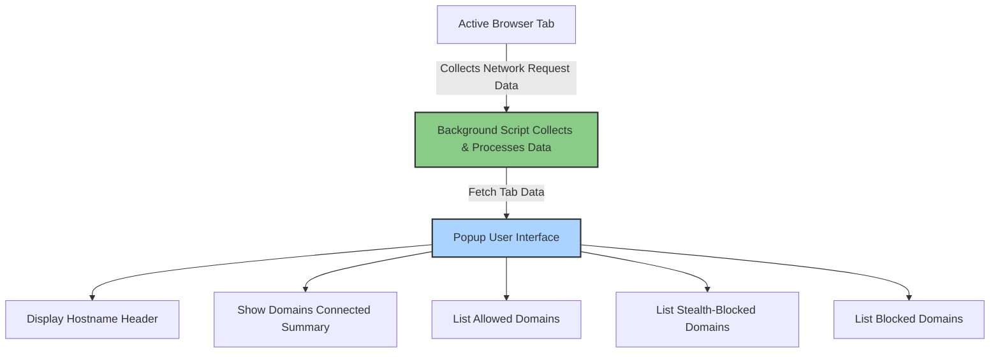

# First Look: The uBO Scope Popup Explained

Discover how to navigate and understand the main popup user interface of uBO Scope, where you will instantly see detailed information about third-party remote connections made by the active browser tab. This guide helps you interpret key data elements like domain connection lists and badge counts, empowering you to monitor which remote servers are contacted when browsing.

---

## Workflow Overview

### What You Will Achieve
By following this guide, you will learn how to access and interpret the uBO Scope popup. You'll gain immediate insight into:

- The domain names connected to by the active browser tab
- The classification of these connections as allowed, stealth-blocked, or blocked
- How to read the badge counts and domain summaries

### Prerequisites
- uBO Scope must be installed and active in your browser
- You should have loaded a webpage in the active tab to see connection data

### Expected Outcome
After completing this guide, you will confidently use the popup UI to:

- Identify all remote domains connected by the webpage
- Understand the status of each connection
- Use the data to evaluate site network activity

### Time Estimate
5 minutes

### Difficulty Level
Beginner - no technical knowledge required

---

## Step-by-Step Instructions

<Steps>
<Step title="Opening the uBO Scope Popup">
Locate the uBO Scope icon in your browser's toolbar.

- Click the icon to open the popup window.
- The popup automatically displays data related to the currently active tab.

**Expected Result:** The popup window opens showing the hostname of the current site and summary data.
</Step>

<Step title="Reading the Hostname Header">
At the top of the popup, observe the hostname section.

- The right side shows the registered domain (e.g., example.com).
- If the full hostname includes subdomains (e.g., sub.example.com), these are displayed on the left.

This helps understand exactly which part of the URL is being analyzed.

**Expected Result:** The hostname appears in Unicode, even if originally encoded (e.g., punycode).
</Step>

<Step title="Understanding the Domains Connected Summary">
Below the hostname, find the summary line displaying "domains connected" with a count.

- This number shows the total unique domains the active tab has connected to that were not blocked.
- A lower number is usually better, indicating fewer third-party connections.

**Expected Result:** The summary number updates dynamically with page activity.
</Step>

<Step title="Exploring the Allowed Domains Section">
The first main section is labeled **not blocked**.

- This lists every domain from which connections were successfully allowed.
- Each domain entry shows the domain name and the count of connections to that domain.

Review this list to identify which third parties actively loaded resources.

**Expected Result:** A list of domains with connection counts sorted alphabetically.
</Step>

<Step title="Reviewing the Stealth-Blocked Domains Section">
Next, observe the **stealth-blocked** section.

- These are domains where connections were stealthily redirected or hidden.
- This indicates attempts to block connections without fully outright blocking.

Understanding this helps evaluate how covert blocking may be operating on the page.

**Expected Result:** A domain list similar to the allowed section, showing stealth-blocked domains and counts.
</Step>

<Step title="Viewing the Blocked Domains Section">
Finally, see the **blocked** domains section.

- This lists domains where connection attempts were actively blocked.
- Counts indicate how many times connections to these domains were prevented.

Use this to verify what connections your content blocker or browser is blocking.

**Expected Result:** A list of blocked domains associated with the current tab.
</Step>
</Steps>

---

## Practical Tips & Best Practices

- **Refresh the popup after navigating:** The popup reflects data for your active tab when opened or refreshed. To see updated data after navigation, re-open the popup or switch tabs.

- **Interpreting badge counts:** The extension badge on your toolbar shows the number of allowed distinct third-party domains. This count is a helpful quick measure of third-party network footprint.

- **Consider domain grouping:** Domains shown correspond to registered domains (e.g., example.com), grouping related subdomains under one umbrella for clarity.

- **Unicode domain names:** Internationalized domain names are displayed in readable Unicode, so names like "xn--example" appear as their proper characters.

- **Stealth-blocked is a distinct category:** Don't confuse stealth-blocked connections with fully blocked; they are covertly redirected or hidden, indicating subtle filtering strategies.

- **Use counts to measure activity:** Connection counts give insight on how frequently a domain is contacted, which helps prioritize which third parties are most active.

---

## Troubleshooting Common Issues

<AccordionGroup title="Common Popup Issues and How to Fix Them">
<Accordion title="Popup Shows 'NO DATA' or Empty">
- Confirm uBO Scope is properly installed and enabled in the browser.
- Make sure you have active browsing activity in the current tab.
- Try refreshing the webpage and re-opening the popup.
- Check browser permissions to ensure uBO Scope has access to active tab data.
</Accordion>

<Accordion title="Domain Lists Are Not Populating Correctly">
- Network requests are gathered asynchronously; wait a few seconds after page load.
- Certain network activity may not be visible if blocked by other means outside the browser's APIs.
- Verify you are on a supported browser version (Chromium 122+, Firefox 128+, Safari 18.5+).
</Accordion>

<Accordion title="Badge Count Does Not Match Expectations">
- Badge shows only distinct allowed third-party domains, not total request counts.
- A higher badge count means more unique domains, not necessarily more or fewer blocked requests.
- Consider reviewing blocked and stealth-blocked sections for additional context.
</Accordion>
</AccordionGroup>

---

## Diagram: How the Popup Displays Data

This flow illustrates the key user journey: The active tab generates network data, the background script captures and categorizes it, and the popup UI displays this categorized data clearly to the user.

---

## Next Steps & Related Content

- Visit the [Understanding the Badge Count and Its Implications](../interpreting-badge-count) guide to deepen your understanding of badge metrics.
- Explore [Identifying All Third-Party Connections On Any Site](../../practical-guides/identify-connections) to learn how to leverage uBO Scope for in-depth network analysis.
- If you haven’t yet, complete the [Installing and Setting Up uBO Scope](../install-extension) guide for a full installation walkthrough.
- For background on how the extension functions internally, review the [Architecture Overview](../../core-concepts-architecture/architecture-overview).

---

<Tip>
Explore the popup UI regularly during your browsing sessions to gain immediate awareness of third-party connections your browser interacts with, helping you maintain privacy and security.
</Tip>

<Note>
Remember, the uBO Scope popup shows real-time data about network connections per tab. Data reflects the current tab's state and updates as you browse.
</Note>

---