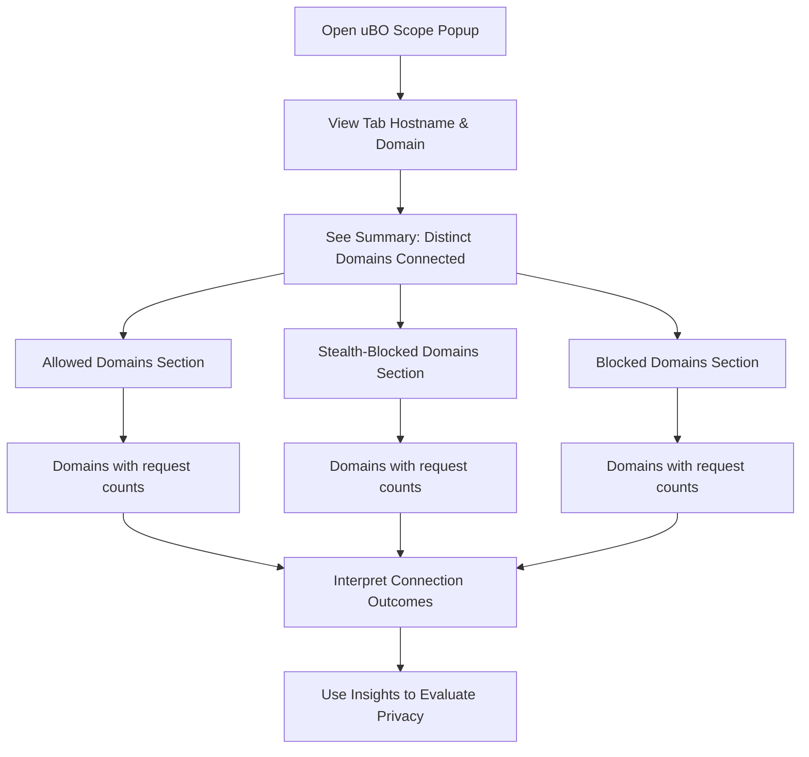

# First Look: The Popup Panel

## Overview
Explore how the uBO Scope extension popup panel provides a clear, real-time view into your browser's network connections for the active tab. This guide walks you through the panel’s layout, what each indicator means, and how to interpret connection categories and the badge count while you browse.

---

## 1. Understanding the Popup Panel

### What This Panel Does
The popup panel serves as your immediate window into the network activities of the currently active browser tab. It shows the distinct remote domains your browser has connected to, broken down by their connection status:

- **Not Blocked (Allowed)**: Domains where connection attempts succeeded
- **Stealth-Blocked**: Domains where connections were silently redirected or altered
- **Blocked**: Domains where connection attempts were explicitly blocked

This snapshot is refreshed live as you navigate, reflecting the network requests your web content makes.

### Prerequisites
- Have uBO Scope installed and enabled in your browser
- Browse any web page with network activity
- Have the popup accessed from the active tab

### What You Will Gain
- Immediate insights into which third-party servers your tab communicates with
- Understanding of how blocking and stealth blocking affects your connections
- A clearer sense of privacy exposure from network requests

### Time Commitment
Just a few minutes for guided exploration and active browsing to see the panel in action.

### Difficulty Level
Beginner-friendly; no special technical knowledge required.

---

## 2. Popup Layout and User Flow

### Panel Header: Current Tab Info
- Displays the hostname and domain of the active tab.
- If the hostname is a subdomain, it shows the subdomain part separately for clarity.

### Summary Section
- Shows the count of distinct domains connected.
- The number represents all unique domains involved in network connections from the tab.

### Connection Categories
Each category displays domains grouped by outcome, each with the number of requests:

- **Not Blocked (`allowed`)**
  - Domains successfully contacted.
  - These are servers that responded to your requests without interference.

- **Stealth-Blocked (`stealth`)**
  - Domains where connections were stealthily redirected or altered—these are often hidden from the webpage’s scripts.
  - This category helps reveal stealthy manipulations by content blockers.

- **Blocked (`blocked`)**
  - Domains where connection attempts were actively blocked.
  - Identifies remote servers that were denied connection, typically due to your content blocking rules or browser interventions.

### Domain Rows
- Each domain listed includes:
  - The domain name (converted to a user-friendly Unicode representation).
  - A badge showing the count of connection attempts.

### User Flow
1. Open the popup from the toolbar icon on the active tab.
2. Read the hostname/domain header to confirm you are viewing the correct tab.
3. View the summary for the total distinct domains connected.
4. Scan each connection category to see which remote servers were allowed, stealth-blocked, or blocked.
5. Click off the popup to resume browsing or to open on a different tab and repeat.


## 3. Step-by-Step Guide: Using the Popup Panel

<Steps>
<Step title="Open the Popup">
Click the uBO Scope icon in your browser toolbar to open the popup panel related to the active tab.
</Step>
<Step title="Verify Tab Hostname">
Check the top header to see the hostname and domain of the current tab to ensure you’re viewing the correct session.
</Step>
<Step title="Review Summary Count">
Look at the summary section showing the total number of distinct domains connected. This is a key indicator of third-party network activity.
</Step>
<Step title="Explore Allowed Domains">
Under ‘not blocked’, view all domains that your tab has successfully contacted. Each displays how many requests were made.
</Step>
<Step title="Examine Stealth-Blocked Domains">
Review the ‘stealth-blocked’ category to see domains where connections were redirected or altered stealthily, giving insight into hidden blocking.
</Step>
<Step title="Check Blocked Domains">
Observe the ‘blocked’ category to understand which domains were prevented from connecting at the network level.
</Step>
<Step title="Interpret Counts and Patterns">
Use the counts next to each domain to identify major connectors and potential privacy exposures.
</Step>
</Steps>

## 4. Practical Examples

| Scenario                                  | Expected Popup Behavior                                         |
| -----------------------------------------| -------------------------------------------------------------- |
| Browsing a news site with typical ads    | Multiple domains listed under ‘allowed’, some ‘blocked’ CDN domains, and possibly a few stealth-blocked analytics domains.
| Loading a highly privacy-conscious site  | Few domains under ‘allowed’, possibly no ‘blocked’ or ‘stealth-blocked’ domains.
| Visiting a single-origin application     | Mostly the primary domain under ‘not blocked’, minimal or no third-party domains.

### Example Domain Row Snippet
```html
<div class="row">
  <span class="domain">example.com</span>
  <span class="count badge">12</span>
</div>
```
This means `example.com` was contacted 12 times successfully.

## 5. Tips, Best Practices & Troubleshooting

<Tip>
Regularly check the popup to observe network connection changes as you interact with different pages—this highlights how different content triggers network activity.
</Tip>

<Tip>
Use the popup as a quick privacy check: a lower ‘distinct domains connected’ count usually means fewer third-party exposures.
</Tip>

<Warning>
If you see an unexpectedly high number of domains or many blocked domains, verify your content blocker configuration for over or under-blocking.
</Warning>

### Common Issues

- **No data shown or ‘NO DATA’ message:**
  - Ensure you opened the popup on the active tab.
  - Verify the extension has required permissions and the browser version meets system requirements.

- **Counts or domains seem outdated:**
  - Refresh the page or navigate to a new URL to trigger new network requests.

- **See only the domain but no counts:**
  - Connection attempts might be recent but not processed yet. Wait a moment or reopen the popup.

<Tip>
For detailed understanding of badge count meaning and connection categories, refer to the guide 'Interpreting the Toolbar Badge'.
</Tip>

---

## 6. Next Steps

- Explore the [Interpreting the Toolbar Badge](./understanding-badge) document to deepen your grasp of the badge numbers’ privacy implications.
- Learn how to [Analyze Network Connections](../using-insights/analyzing-connections) using the popup data for advanced insights.
- If you face troubles using this panel, consult [Troubleshooting and Interpreting Unusual Results](../using-insights/troubleshooting-results).

---

## Related Pages
- [What is uBO Scope?](../../overview/introduction-key-concepts/product-overview)
- [Core Concepts & Terminology](../../overview/introduction-key-concepts/core-concepts-terminology)
- [Interoperability with Content Blockers](../../overview/system-architecture-overview/integration-with-content-blockers)

---

## Summary
The popup panel is your frontline tool to observe per-tab network connections in real time. It breaks down connected domains by allowed, stealth-blocked, and blocked categories, helping you understand the impact of content blocking on your browsing privacy at a glance. By mastering this panel, you gain actionable insights into the third-party network footprint of your browsing sessions.

---

## Visualization
To better illustrate the popup structure and its workflow:



---

## Source Code Reference
- [popup.html](https://github.com/gorhill/uBO-Scope/blob/main/popup.html)
- [popup.js](https://github.com/gorhill/uBO-Scope/blob/main/js/popup.js)

---

_Last updated for version 1.0.1_
