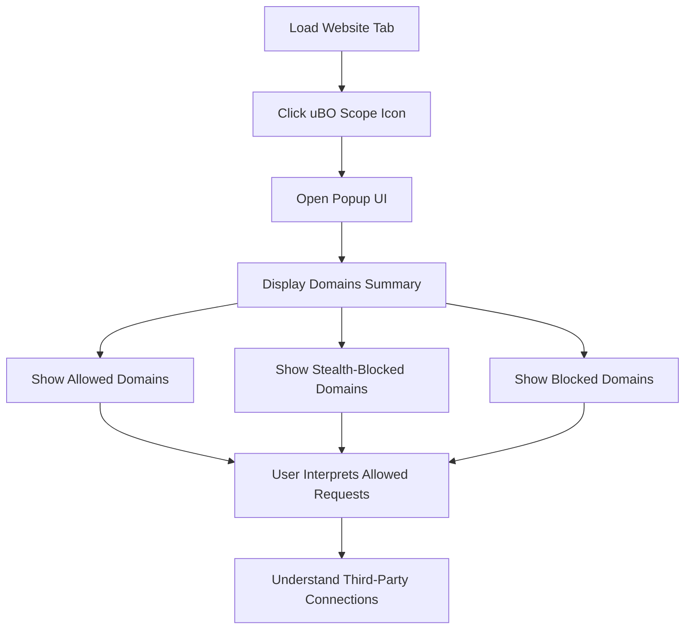

# Your First Session: Exploring Website Connections

Welcome to your first session with uBO Scope. This guide walks you through the primary workflow of loading a website, opening the popup UI, and interpreting the summary of third-party network connections. You’ll learn how to recognize which requests were allowed, stealth-blocked, or fully blocked by your content blockers or privacy protections — all through real-world examples.

---

## 1. Workflow Overview

### Task Description
Discover how to use uBO Scope to monitor and understand the network connections initiated by the websites you visit. This guide enables you to:
- Load a website and observe its remote server connections.
- Open the uBO Scope popup user interface.
- Interpret connection summaries, including allowed, stealth-blocked, and blocked domains.
- Recognize patterns in third-party connections for real-world websites.

### Prerequisites
Before you begin:
- Ensure uBO Scope is installed and activated on your browser ([See Installing on Your Browser](https://github.com/gorhill/uBO-Scope/blob/main/docs/getting_started/installation_and_setup/installing_on_your_browser.md)).
- Confirm the extension icon is visible in the toolbar.
- Open any standard webpage with network activity (e.g., news site, e-commerce site).

### Expected Outcome
After completing this guide, you will be able to:
- Open the popup UI to see a categorized summary of third-party connections for the active tab.
- Distinguish between allowed, stealth-blocked, and blocked network requests.
- Confidently interpret the badge count on the extension icon as the number of allowed distinct third-party domains connected.

### Time Estimate
Approximately 5-10 minutes.

### Difficulty Level
Beginner

---

## 2. Step-by-Step Instructions

<Steps>
<Step title="Load Your Website">
Navigate to any website in your browser that you want to inspect. Preferably choose a site with multiple external resources like ads, embedded content, or CDN usage.

- **What to expect:** The extension will start monitoring all network requests including third-party servers contacted.
</Step>

<Step title="Access the uBO Scope Popup">
Click the uBO Scope extension icon in your browser toolbar. This will open a popup panel displaying network connection details for the current tab.

- **What to expect:** You should see the hostname of the loaded website at the top.
- The summary will show the number of distinct domains connected.
</Step>

<Step title="Interpret the Summary Sections">
Within the popup, observe the three sections labeled:

- **Not Blocked (Allowed):**
  - Lists third-party domains that were contacted successfully.
  - These connections passed through your content blockers.
- **Stealth-Blocked:**
  - Domains attempted but were redirected or stealth-blocked.
- **Blocked:**
  - Domains your content blockers actively prevented network requests to.

- **Tip:** The badge count on the extension icon corresponds to the number of allowed (not blocked) third-party domains.
</Step>

<Step title="Recognize Allowed vs Blocked Requests">
Compare domains listed under each section for the site you've loaded.

- Allowed connections often include content delivery networks (CDNs), analytics servers, or embedded service domains.
- Blocked and stealth-blocked requests usually correspond to known trackers, ad servers, or unwanted third parties.

- **Decision Point:** Use this insight to evaluate whether your blocker settings meet your privacy preferences.
</Step>

<Step title="Verify Your Understanding">
Reload the page and reopen the popup to verify that domain counts update accordingly.

- The badge count will dynamically change to reflect the distinct allowed third-party domains.
- Domains' counts within the popup indicate how often network requests were made to each.
</Step>
</Steps>

---

## 3. Real-World Examples

### Example 1: News Website
- When loading a typical news website, you might see several allowed domains hosting images, scripts from CDNs, and analytics servers.
- Blocked domains often include ad servers and trackers explicitly prevented by your blocking rules.

### Example 2: E-commerce Website
- Allowed domains include payment gateways, product image hosting, or shipping APIs.
- Blocked domains may include marketing trackers or third-party affiliate networks.

### Code Snippet: Example Domain Row Structure (from popup UI)

```html
<div class="row">
  <span class="domain">example-cdn.com</span>
  <span class="count badge">5</span>
</div>
```

- This indicates `example-cdn.com` was connected 5 times during the page load.

---

## 4. Troubleshooting & Tips

<AccordionGroup title="Common Issues">
<Accordion title="Popup Shows NO DATA or Empty Sections">
- Ensure you have loaded a webpage with active third-party requests.
- Confirm the extension has necessary permissions and is properly enabled.
- Try refreshing the page to allow uBO Scope to capture new data.
</Accordion>

<Accordion title="Badge Count Does Not Update">
- Refresh the current tab and open the popup again.
- Check if other extensions interfere with network request APIs.
- Verify browser compatibility and extension version.
</Accordion>

<Accordion title="Understanding Stealth-Blocked Connections">
- Stealth-blocked domains refer to those detected via redirects but effectively prevented from loading.
- This indicates your blockers are working subtly without alerting the webpage.
</Accordion>
</AccordionGroup>

<Tip>
Reloading the webpage after changing your content blocking settings helps you observe the immediate effect on allowed and blocked connections.
</Tip>

---

## 5. Next Steps & Related Content

- Explore how to interpret the detailed counts and implications on the popup page: [Reading the Popup: What Do the Numbers Mean?](https://github.com/gorhill/uBO-Scope/blob/main/docs/guides/analyzing-traffic/interpreting-popup.md)
- Learn to install and activate uBO Scope properly in [Installing and Activating uBO Scope](https://github.com/gorhill/uBO-Scope/blob/main/docs/guides/getting-started/install-activate.md).
- For troubleshooting common problems refer to [Solving Common Installation & Setup Issues](https://github.com/gorhill/uBO-Scope/blob/main/docs/getting_started/first_use_and_troubleshooting/solving_common_issues.md).
- Understand core terms and concepts in [Key Concepts & Terminology](https://github.com/gorhill/uBO-Scope/blob/main/docs/overview/architecture-and-concepts/core-terms.md).

Start analyzing your browsing connections with confidence and take control of your privacy with clear visibility into third-party networks.

---

## Appendix: Overview of the Popup Interface

The popup panel divides third-party network connections into three distinct sections:

| Section          | Description                            | User Insight                     |
|------------------|------------------------------------|---------------------------------|
| Not Blocked      | Domains successfully connected      | Legitimate and allowed third parties |
| Stealth-Blocked  | Domains silently blocked via redirects | Hidden blocking protecting your privacy |
| Blocked          | Domains fully blocked by content blockers | Explicitly blocked unwanted domains |

Each section lists domains with a count badge indicating how many requests reached that domain during the session.

---

## Visual Flow: User Interaction with uBO Scope Popup



This flow highlights the intuitive process users follow when inspecting their browsing connections.

---

*For further assistance or advanced usage, explore the comprehensive documentation and issue tracker on the [uBO Scope GitHub repository](https://github.com/gorhill/uBO-Scope).*