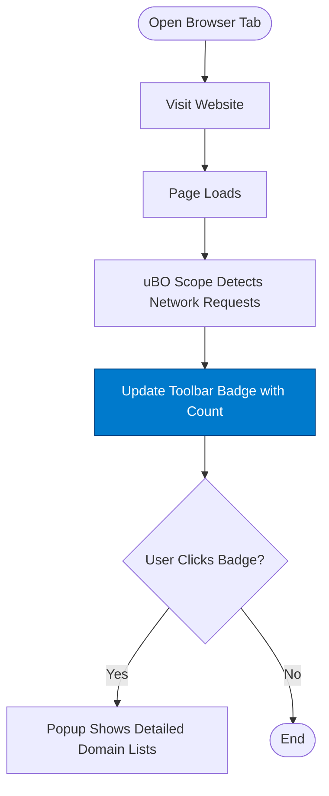

# Your First Network Scan

## Workflow Overview

When you install and activate uBO Scope, the extension immediately begins monitoring the network activity of your active browser tabs. This guide helps you understand how to conduct your first network scan by visiting websites, observing the uBO Scope toolbar badge, and interpreting the count of third-party servers detected.

### Prerequisites
- uBO Scope installed and enabled in a supported browser (Chromium, Firefox, or Safari).
- Browser version meeting minimum requirements (Chromium 122+, Firefox 128+, Safari 18.5+).
- Basic familiarity with browsing websites.

### Expected Outcome
By following this guide, you will:
- Open websites and observe how uBO Scope reports remote third-party connections.
- Understand what the toolbar badge counts represent.
- Recognize typical network behavior on common sites.

### Time Estimate
Approximately 5 to 10 minutes.

### Difficulty Level
Beginner

---

## Step-by-Step Instructions

### Step 1: Locate the uBO Scope Toolbar Badge
1. Confirm that uBO Scope is active by checking your browser's toolbar for the uBO Scope icon.
2. The badge displayed on the icon shows a number or is blank.

**What it means**: The badge number represents the count of distinct third-party domains from which your current tab has successfully fetched resources.

---

### Step 2: Open a Website to Begin Scanning
1. In your active browser tab, navigate to a familiar, content-rich website, such as a major news website (e.g., https://www.nytimes.com).

---

### Step 3: Observe the Badge Number Change
- After the page loads, look at the uBO Scope toolbar badge.
- You should see a number indicating how many unique third-party domains the site connected to.

Example:
- Opening a news site might show badge counts ranging from 5 to 15, reflecting CDNs, analytics, advertisement servers, and other external services.

---

### Step 4: View Detailed Connection Breakdown in the Popup
1. Click on the uBO Scope toolbar icon to open the popup UI.
2. Review the following sections:
   - **Domains connected (not blocked):** Lists domains from which resources were successfully fetched.
   - **Stealth-blocked:** Domains for which connection attempts were stealthily blocked (connection attempts obscured).
   - **Blocked:** Domains for which connections were actively blocked or failed.

3. Each domain entry shows how many requests were made to that domain.

**Note:** The popup displays the exact third-party domains your current tab connected with, helping you evaluate a website's privacy footprint.

---

### Step 5: Recognize Typical First-Time Scan Results
- It is common for many popular websites to connect to multiple third-party services such as Content Delivery Networks (CDNs), analytics, ad servers, and embedded content.
- A badge count of zero or blank does not indicate failure; it means no distinct third-party connections were detected or allowed by the current tab.

---

## Examples & Practical Scenarios

### Example 1: News Website
- When you visit a major news site, expect to see multiple third-party domains, including ad networks and trackers.
- The badge count might read “10”, and the popup will list domains such as `cdn.news-site.com`, `ads.tracker.com`, and `analytics.provider.net`.

### Example 2: Minimal Content Site
- Visiting a simple, personal blog might yield a badge count of 0 to 2, indicating very few or no third-party connections.

---

## Tips and Best Practices

- **Interpret the Badge Count in Context**: A higher number typically indicates more third-party services contacted by the website, which could reflect a greater privacy exposure.
- **Refreshing the Page** will update the badge count and data to show current network activity.
- **Use the Popup to Investigate Domains**: Not all connected third parties are harmful—some are legitimate CDNs or service providers.

---

## Troubleshooting Common Issues

<AccordionGroup title="Troubleshooting Your First Scan">
<Accordion title="Badge Does Not Appear or Update">
- Ensure uBO Scope is installed and enabled correctly.
- Confirm the extension has permissions to access the active tab.
- Refresh the page you are visiting and check for badge updates again.
- Try restarting the browser if the badge still does not display.
</Accordion>
<Accordion title="Popup Shows No Data or 'NO DATA'">
- This may occur if the page is still loading; wait a few seconds and reopen the popup.
- Some pages (especially local files) might not report network requests.
- Disable other content blockers temporarily to verify they aren't interfering.
</Accordion>
<Accordion title="Unusually High or Low Counts">
- Network requests vary greatly by website complexity.
- High counts can include many legitimate third parties like CDNs.
- Zero counts might indicate content loaded locally or heavily blocked connections.
</Accordion>
</AccordionGroup>

---

## What Next?

- Explore the [Understanding the Popup UI](/guides/getting-started/ui-overview) page to deepen your knowledge of interpreting domains and request outcomes.
- Conduct privacy audits by visiting various websites and comparing badge counts and popup details.
- Learn about [Conducting a Third-Party Tracker Audit](/guides/real-world-usage/privacy-audits) for advanced usage.
- If you encounter issues, consult the [Troubleshooting Common Installation and Usage Issues](/getting-started/troubleshooting-support/common-issues) guide.

---

## Summary
Your first network scan with uBO Scope offers a window into the web’s complex network connections, helping you identify how many third-party servers are contacted while browsing. By watching the toolbar badge and reviewing the popup’s detailed domain list, you gain an immediate sense of a site’s network footprint and potential privacy risks.

---

## Visual Illustration

---

## Practical Example

Let's say you visit https://www.cnn.com:
- The toolbar badge turns from blank to “12”, showing that 12 distinct third-party domains have been allowed.
- Clicking the badge opens the popup, where you see:
  - **Not blocked**: cdn.cnn.com, analytics.example.com, ads.provider.net
  - **Stealth-blocked**: trackers.hidden.com
  - **Blocked**: adserver.blocked.com

This straightforward display informs you about the external entities your browsing session is interacting with, guiding your privacy decisions.

---

## Additional Information

- The badge counts only distinct **allowed** third-party domains.
- The background service uses browser APIs to monitor requests independently of other blockers.
- Badge count updates dynamically as the page loads and connections occur.

---

## References
- [What is uBO Scope?](/overview/introduction-core-concepts/what-is-uboscope)
- [Understanding the Toolbar and Popup UI](/getting-started/first-use-configuration/basic-usage)
- [Troubleshooting Common Issues](/getting-started/troubleshooting-support/common-issues)
- [Your First Network Scan](this guide)

---

If you want to explore the inner workings and how to interpret all request outcomes, see [Interpreting Detailed Request Outcomes](/guides/advanced-and-troubleshooting/request-outcomes).

For support or reporting issues, visit the project's [GitHub repository](https://github.com/gorhill/uBO-Scope).

---