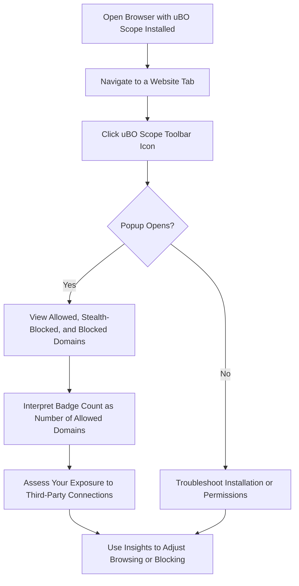

# Your First Report: Understanding the Popup

## Overview
This guide walks you through opening the uBO Scope popup user interface, interpreting the domain connection data presented, and understanding the badge counts shown on the browser toolbar. You'll learn how to quickly distinguish between allowed, stealth-blocked, and blocked third-party domains connected per active browser tab — empowering you to grasp at a glance what uBO Scope reveals about your network connections.

## What You Will Achieve
- Open and navigate the uBO Scope popup interface.
- Understand the meaning of the domains reported in each section: Allowed, Stealth-Blocked, Blocked.
- Interpret the toolbar badge count and its relationship to third-party connections.
- Recognize key connection outcomes reported by uBO Scope.

---

## 1. Opening the uBO Scope Popup

1. **Locate the uBO Scope icon** in your browser's toolbar.
   - The icon visually identifies the extension and displays a numeric badge.

2. **Click the icon to open the popup.**
   - The popup displays information specific to the currently active tab.

<Check>
If the popup does not open or is empty, ensure uBO Scope is installed and active, your browser supports the required permissions, and that you have navigated to a valid web page.
</Check>

---

## 2. Understanding the Popup UI Sections

The popup presents three main sections, each summarizing connection outcomes to third-party remote servers:

### a. Not Blocked (Allowed)
- Lists domains that were contacted and successfully loaded resources.
- Each domain is shown with a count of individual requests.
- These are connections uBO Scope detected as **allowed and completed**.

### b. Stealth-Blocked
- Lists domains where connection attempts were **redirected or stealth-blocked**.
- These are network requests that were rerouted or partially blocked silently.
- Typically reflects subtle blocking behaviors not obvious from the page.

### c. Blocked
- Lists domains where connections were **explicitly blocked or failed**.
- Indicates requests that did not complete successfully due to blocking or errors.

### Summary at the Top
- Shows the **number of distinct third-party domains successfully connected** for the active tab.
- This count matches what you see on the toolbar icon's badge.

---

## 3. Interpreting the Toolbar Badge

- The numeric badge on the uBO Scope icon reflects **the count of unique third-party domains contacted successfully (Allowed) in the current active tab.**
- A lower badge number means fewer third parties connected, which is generally preferable for privacy.
- The badge excludes stealth-blocked and blocked domains since these connections did not complete successfully.

<Tip>
Remember: Not every third-party connection is undesirable; many legitimate sites rely on CDNs and external services. Use uBO Scope to understand the extent and diversity of connections rather than just aiming for zero.
</Tip>

---

## 4. Popup Data Flow Explained

When you load or switch to a tab, uBO Scope:

- Monitors outgoing network requests via the browser’s `webRequest` API.
- Classifies requests outcome into Allowed, Stealth-blocked, or Blocked based on network events.
- Parses hostnames and domains using the Public Suffix List for accurate domain grouping.
- Updates the badge and popup automatically with fresh connection data.

This real-time reporting reflects the current browsing context, allowing you immediate insight.

---

## 5. Practical Example

Imagine you visit a news website:

- The popup shows **allowed domains** such as `cdn.example.com` and `fonts.gstatic.com` with request counts.
- The **stealth-blocked section** might show `tracker.ads.com` indicating requests that were silently redirected or stealth-blocked.
- The **blocked section** could include `malicious.site.com` if content blocking prevented a request.
- The badge number reflects how many distinct allowed domains were contacted (e.g., "3").

This instant feedback helps detect what third-party hosts are active and which ones are blocked or rerouted.

---

## 6. Best Practices

- Regularly check the popup after loading new tabs or navigating pages.
- Use the badge number and popup data in combination to assess third-party exposure.
- Understand stealth-blocked domains to identify potentially hidden network behaviors.
- Combine uBO Scope insights with your content blocker for a more complete privacy picture.

---

## 7. Common Pitfalls

- **Empty popup or no data:** This usually means either the extension hasn’t registered any network activity for the active tab yet or you are on a blank page.
- **Badge not updating:** Ensure your browser supports the `webRequest` API fully and uBO Scope permissions are granted.
- **Confusing domain names:** Domains use punycode encoding for internationalized domain names but the popup converts them back to Unicode for readability.

<Warning>
Network requests invisible to the `webRequest` API (browser internals, extensions, or certain APIs) won’t appear in the popup.
</Warning>

---

## 8. Verifying Your First Report

1. Open a well-known website (e.g., https://example.com).
2. Click the uBO Scope icon.
3. Confirm the popup lists distinct domain names under Allowed, with request counts.
4. Check the badge count matches the number of domains listed.
5. If you see entries in Stealth-Blocked or Blocked, note these domains but remember they are not included in the badge.

---

## 9. Troubleshooting Tips

- Reload the active tab if no connection data appears.
- Close and reopen the popup to refresh data.
- Check your browser permissions and make sure uBO Scope is enabled.
- Confirm your browser version supports manifest v3 and the `webRequest` permission.

If problems persist, consult the [Troubleshooting Common Installation Issues](https://docs.ubosco.pe/getting-started/validation-troubleshooting/troubleshooting-common-issues) page.

---

## 10. What Next?

After you understand how to read the popup and badge:

- Explore [Interpreting the Badge and Main UI](https://docs.ubosco.pe/guides/main-workflows/interpreting-badge) to deepen your understanding of badge counts.
- Learn about [Analyzing Third-Party Connections Per Tab](https://docs.ubosco.pe/guides/main-workflows/analyzing-network-requests) for advanced insights.
- Discover techniques for [Comparing Content Blockers and Debunking Badge Myths](https://docs.ubosco.pe/guides/main-workflows/cross-checking-blockers).

Use these guides to master uBO Scope’s practical applications and maximize your privacy awareness.

---

## Additional Resources

- [What is uBO Scope?](https://docs.ubosco.pe/overview/getting-started-core-value/product-purpose-value)
- [Key Terms & Concepts](https://docs.ubosco.pe/overview/core-concepts-architecture/core-terminology)
- [Installation and Setup](https://docs.ubosco.pe/guides/getting-started/installation-setup)

Refer to the entire Getting Started section for seamless onboarding and setup assistance.

---

## Visual Summary

This flow encapsulates your first encounter with uBO Scope's reporting interface.

---

Your first report with uBO Scope is your gateway to insightful, transparent visibility into web connections—becoming a vital tool for browsing privacy and control.