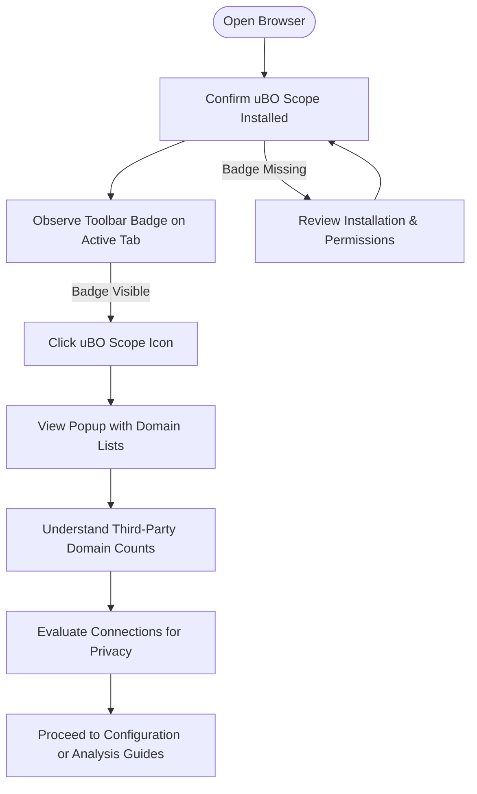

# First Steps and Basic Usage

## Overview
This guide walks you through the essential first steps to activate uBO Scope, open its user interface, and interpret the key indicator that informs your browsing privacy: the distinct third-party remote server count badge. You will gain practical insight into what the numbers mean and how to use the popup window to understand your browsing connections.

## Prerequisites
- You have uBO Scope installed on a supported browser (Chrome, Firefox, or Safari). For installation guidance, see the [Installing uBO Scope](../getting-started/installing-extension) guide.
- The extension is activated and permissions have been granted.
- You are browsing a website or web application where network connection data can be gathered.

## Expected Outcome
- Confirmed activation of uBO Scope.
- Access to the popup interface showing domain connection categories.
- Understanding of the badge count as the number of distinct third-party remote servers connected.

## Time Estimate
Approximately 5 minutes.

## Difficulty Level
Beginner — no technical knowledge required.

---

## Step-by-Step Instructions

### Step 1: Confirm Extension Activation
1. Launch your browser and ensure uBO Scope has been installed.
2. Look for the uBO Scope icon in your toolbar. It typically appears as a shield or scope icon.
3. Observe the badge (number) superimposed on the icon:
   - The number indicates how many distinct third-party remote servers your active tab has connected to.
   - No badge or zero means no third-party connections detected or all connections blocked.

**What You Should See:**
- A numeric badge on the uBO Scope toolbar icon when you visit websites.

<Tip>
If the badge is missing, verify your installation and permissions as explained in the [Activation and First Run](../getting-started/installation-and-setup/activation-and-first-run) guide.
</Tip>

---

### Step 2: Open the Popup Interface
1. Click the uBO Scope icon in the browser toolbar.
2. The popup window appears, showing a summary and detailed domain connection lists.

**Popup Layout Includes:**
- **Top Header:** Shows the current tab hostname and domain.
- **Summary Section:** Displays total connected domains count.
- **Three Domain Lists:**
  - *Not Blocked* (allowed connections)
  - *Stealth-Blocked* (connections blocked stealthily)
  - *Blocked* (connections explicitly blocked)

**What You Should See:**
- A count of domains connected by your current tab.
- Lists populated according to connection outcome.

<Tip>
The popup updates live as you browse to reflect fresh data per tab.
</Tip>

---

### Step 3: Understand the Badge Count Meaning
1. Recall the badge number represents the count of **distinct third-party domains** your tab has connected to successfully (not blocked).
2. Third parties are servers whose domains differ from the website's main domain.
3. A lower number signifies fewer external parties possibly tracking or serving content.
4. The detailed popup breaks down connections into:
   - **Not Blocked:** Domains where network connections succeeded.
   - **Stealth-Blocked:** Connections blocked silently to avoid breakage or detection by the site.
   - **Blocked:** Connections explicitly blocked by content blockers or network rules.

<Tip>
The badge count excludes first-party domains and only counts unique third-party domains.
</Tip>

---

### Step 4: Explore Connection Details
1. In the popup, review each domain listed under the three categories.
2. Each domain row shows the domain name and a count badge indicating how many requests went to that domain.
3. Use this data to identify potentially unwanted network activity.

**Example Scenario:**
- If you visit a news site and see many third-party domains under *Not Blocked*, consider whether all are necessary.
- Domains under *Blocked* reflect what your content blocker prevented.
- *Stealth-Blocked* may indicate connections hidden from the webpage but still monitored by uBO Scope.

---

## Verification & Troubleshooting

### Verify Data is Reporting
- Visit a site known to have external resources (e.g., a common news or social media site).
- Observe the extension badge updating with a numeric count.
- Open the popup and see domain entries populate.

### Common Issues
- **No badge or zero connections when expected:** Extension may be inactive or lacking permissions.
- **Empty popup even when badge shows count:** A popup refresh glitch; close and reopen the popup.
- **Badge never updates:** Browser or extension needs restart.

For detailed troubleshooting, see [Troubleshooting Common Setup Issues](../getting-started/configuration-and-validation/setup-troubleshooting).

---

## Best Practices & Tips
- Use the badge as a quick privacy metric: fewer third-party connections means less exposure.
- Review the popup domain lists to audit third-party servers.
- Understand that some legitimate sites use multiple CDNs or APIs, which appear as multiple third parties.
- Combine insights from uBO Scope with your content blocker settings for optimal safety.

---

## Next Steps
- Explore the [Basic Configuration](../getting-started/configuration-and-validation/basic-configuration) guide to learn about default settings and permissions.
- Read [Understanding Connection Data and Badge Count](../guides/analyzing-connections/understanding-data) for deep dives into interpreting results.
- For new users, proceed to [Getting Started Quick Tour](../overview/user_journeys_usecases/quickstart_overview) for a broader walkthrough.

---

## Visual Workflow Diagram

This illustrates the practical path you take from confirming uBO Scope installation through examining connection data and deciding your next steps.

---

## Summary
This guide helped you activate uBO Scope, open its popup interface, and meaningfully interpret the badge and domain connection lists. Now you can confidently use uBO Scope’s core indicators to better understand third-party connections during browsing and enhance your online privacy.

---

For additional help or deeper insights, visit these resources:
- [Installing uBO Scope](../guides/getting-started/installing-extension)
- [Activation and First Run](../getting-started/installation-and-setup/activation-and-first-run)
- [Troubleshooting Common Setup Issues](../getting-started/configuration-and-validation/setup-troubleshooting)
- [Understanding Connection Data and Badge Count](../guides/analyzing-connections/understanding-data)

----

