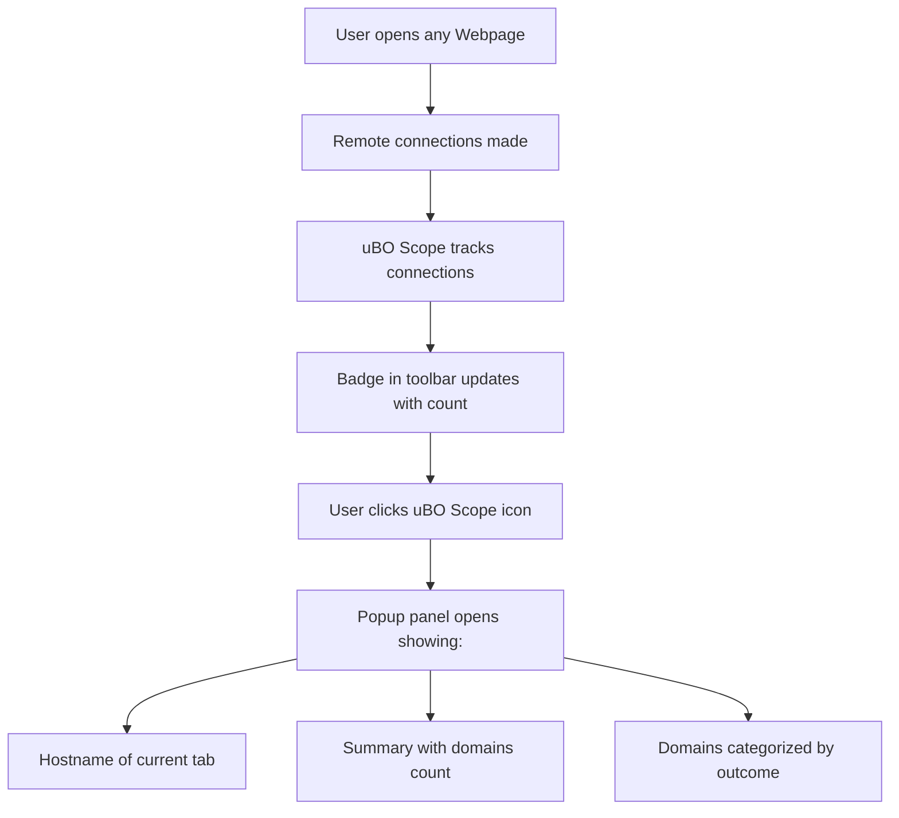

# Your First Five Minutes with uBO Scope

Welcome to your first interaction with uBO Scope! This guide walks you through the immediate steps to use the extension after installation, focusing exclusively on the popup panel you’ll interact with in your browser’s toolbar. You'll learn how to open the popup, understand what the badge count means, and interpret the connection data displayed.

---

## 1. Workflow Overview

### Task Description
This guide helps you start using uBO Scope by opening a webpage, activating the extension popup, and reading the initial connection data it reports. It orients you to the badge indicator on the toolbar and the contents of the popup UI.

### Prerequisites
- uBO Scope must be successfully installed in your browser.
- Your browser should be updated to a supported version (Chrome 122+, Firefox 128+, Safari 18.5+).
- You should have visited at least one webpage after installing the extension.

### Expected Outcome
- You will successfully open uBO Scope’s popup panel.
- You will understand the significance of the badge count on the toolbar icon.
- You will be able to quickly interpret the categorized domain connection lists shown in the popup.

### Time Estimate
Approximately 3-5 minutes to complete all steps and familiarize yourself.

### Difficulty Level
Beginner

---

## 2. Step-by-Step Instructions

### Step 1: Open a Webpage to Monitor

1. Launch your browser and navigate to any website you want to analyze.
2. During browsing, uBO Scope automatically tracks remote server connections associated with the active tab.

<Check>
If you don’t see any badge count after opening a site, try refreshing the page or visiting another website.
</Check>

### Step 2: Activate the uBO Scope Popup

1. Locate the uBO Scope icon on your browser’s toolbar. This icon represents the extension.
2. Click on the icon to open the popup panel (`popup.html`).

<Info>
The popup is a lightweight panel providing real-time details about remote server connections for the current tab.
</Info>

### Step 3: Understand the Badge Count

- The badge on the toolbar icon shows a number representing the distinct third-party domains with allowed connections on the current tab.
- A lower badge count indicates fewer third-party connections, generally better for privacy.

<Note>
The badge does NOT count blocked or stealth-blocked domains. It counts only domains from which connections were successful and allowed.
</Note>

### Step 4: Read the Popup Data

The popup UI is organized into three outcome sections, each listing domains by their connection status:

- **Not Blocked:** Domains with allowed connections
- **Stealth-Blocked:** Domains where connections were stealthily blocked (silent blocking by the browser or other blockers)
- **Blocked:** Domains from which connections were actively blocked

Each section shows:
- A header with the outcome category
- A list of domains relevant to that outcome
- A smaller badge next to each domain showing how many connections or requests involved that domain

#### Interpreting the UI Elements

- The top header shows the hostname of the current tab or 'NO DATA' if none is available.
- The summary section displays the total number of connected domains.
- Domains appear sorted in categories, highlighting the network behavior for your current browsing session.

---

## 3. Examples

### Example Scenario

You visit ``https://example.com``. The extension badge shows "3". Clicking the popup icon opens the panel:

- The header displays `example.com`.
- Summary shows "domains connected: 5".
- The 'not blocked' section lists three domains with green badges next to each count.
- The 'blocked' section lists one domain indicating a blocked connection.
- The 'stealth-blocked' section might be empty if none detected.

This instantly informs you about how many third-party domains interacted with the page and their blocking status.

---

## 4. Troubleshooting & Tips

### Common Issues

- **Popup shows NO DATA or is empty:** Refresh the web page and reopen the popup. Some pages do not initiate network connections immediately.
- **Badge count is blank:** This means no allowed third-party domains have been detected yet for the current tab.
- **No popup panel on clicking the icon:** Verify that the extension is enabled and permissions are granted.

### Best Practices

- Regularly refresh pages to see updated connection data.
- Use the badge count as a quick privacy metric—fewer is better.
- Remember that some legitimate third-party domains (such as CDN providers) may appear, which is generally normal.

### Performance Considerations

- The popup interface is designed to be fast and lightweight; avoid opening it repeatedly in rapid succession.
- The extension updates the badge and popup data approximately every second, reflecting recent network events.

---

## 5. Next Steps & Related Content

- Visit [Understanding the Popup Panel and Connection Lists](/guides/analyzing-network-connections/understanding-popup-ui) for in-depth details on interpreting connection lists.
- Learn more about the badge’s privacy significance in [Interpreting Badge Counts and What They Mean for Privacy](/guides/analyzing-network-connections/interpreting-badge-counts).
- If you face issues, see [Troubleshooting Installation & Setup](/getting-started/first-run-success/troubleshooting-setup-issues).

---

## Summary of Key UI Elements

| UI Element | Description | Visual Cue |
| ---------- | ----------- | ---------- |
| Badge Count on Toolbar | Number of distinct allowed third-party domains connected on the current tab | Badge number on toolbar icon |
| Tab Hostname Header | Shows the hostname of the active tab; "NO DATA" if unavailable | Large heading at top of popup |
| Summary Section | Total count of connected domains displayed centrally | Centered text at top body |
| Outcome Sections | Lists domains grouped by connection outcome: allowed, stealth-blocked, blocked | Colored headers (green for allowed, red for blocked/stealth) |
| Domain Rows | Domains with connection request counts, displayed as badges | Rows with domain names and count badges |

---

By completing these initial steps, you gain immediate visibility into your browsing network connections, empowering you to better understand and monitor your privacy exposure through uBO Scope.

---

### Visual Reference

Below is a simplified diagram of the initial usage flow for uBO Scope popup interaction:

---

For full source and additional information, visit the [uBO Scope GitHub repository](https://github.com/gorhill/uBO-Scope).

