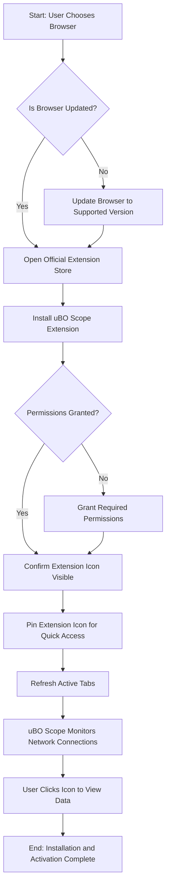

# Installing and Activating uBO Scope

Unlock the full potential of uBO Scope by acquiring, installing, and activating the extension in your preferred supported browser—Chromium-based browsers (e.g., Google Chrome), Firefox, or Safari. This guide walks you through each necessary step to get uBO Scope up and running smoothly, ensuring you can start monitoring third-party network connections without delay.

---

## 1. Workflow Overview

### What This Guide Covers
This guide empowers you to:
- Locate the official uBO Scope extension for your browser.
- Install the extension safely and correctly.
- Activate and pin the extension for easy access.
- Verify successful installation to start monitoring network connections immediately.

### Prerequisites
- Access to a supported browser (Chromium 122.0+, Firefox 128.0+, or Safari 18.5+).
- A stable internet connection to download the extension from official stores.
- Basic familiarity with browser extensions and your browser’s extension management interface.

### Expected Outcome
By following this guide, you will have:
- Successfully installed uBO Scope.
- Activated and pinned the extension icon in your browser toolbar.
- Verified that uBO Scope is ready and correctly monitoring your active browsing tab.

### Time Estimate
- Approximately 5 to 10 minutes for a full install and setup.

### Difficulty Level
- Beginner-friendly with clear, actionable steps.

---

## 2. Step-by-Step Installation and Activation

### Step 1: Choose Your Browser
uBO Scope supports the latest versions of these browsers:
- **Chromium:** Minimum version 122.0
- **Firefox:** Minimum version 128.0
- **Safari:** Minimum version 18.5

Ensure your browser is updated to meet these requirements. If not, update your browser before proceeding.

### Step 2: Access the Official Extension Page
To maintain security and version integrity, always install uBO Scope from the official browser extension store:
- **Chromium:** Access the [Chrome Web Store - uBO Scope](https://chromewebstore.google.com/detail/ubo-scope/bbdpgcaljkaaigfcomhidmneffjjjfgp)
- **Firefox:** Visit [Firefox Add-ons - uBO Scope](https://addons.mozilla.org/firefox/addon/ubo-scope/)
- **Safari:** Available via the official Apple Extensions Gallery (search for uBO Scope) or through your Safari Extensions preferences.

<Tip>
Installing from official stores guarantees automatic updates and reduces security risks.
</Tip>

### Step 3: Install the Extension
1. Click the **Add to Browser** or **Install** button on the extension page.
2. Confirm any permission dialogs that appear. uBO Scope requires permissions to access web requests and tabs to monitor network connections accurately.
3. Wait for the installation to complete.

<Tip>
Browser permissions required:
- Access to active tabs
- Storage management
- WebRequest monitoring of HTTP and WebSocket traffic
Ensure you accept these to enable full functionality.
</Tip>

### Step 4: Verify Extension Installation
Check that uBO Scope’s icon appears in your browser’s toolbar near the address bar.

- If the icon is not visible:
  - Click your browser’s extension menu (often a puzzle piece icon).
  - Pin or enable the uBO Scope extension for quick access.

### Step 5: Activate and Pin the Extension Icon
For frequent access, pinning the icon keeps it always visible:
- **Chromium & Firefox:** Click the puzzle piece icon → find uBO Scope → click the pin icon.
- **Safari:** Open Safari Preferences → Extensions → locate uBO Scope → check the box to enable and show toolbar icon.

### Step 6: Confirm Extension Is Working
1. Navigate to any website.
2. Click the uBO Scope icon.
3. The popup should display network connection data for the active tab (domain names and counts).

<Tip>
If the popup shows "NO DATA" or no connections, try refreshing the page or checking that the extension is permitted to run on the site.
</Tip>

---

## 3. Practical Tips for Installation Success

- **Keep Your Browser Updated:** Older versions may lack required APIs, causing incomplete or failed data reporting.
- **Check Extension Conflicts:** Disable other extensions that might interfere with network request monitoring.
- **Ensure Permissions Are Granted:** Without permission to monitor webRequest events, uBO Scope cannot track connections.
- **Refresh Tabs on Activation:** After installing or enabling the extension, refresh open tabs to trigger data collection.

---

## 4. Troubleshooting Common Installation Issues

<AccordionGroup title="Troubleshooting Installation Issues">
<Accordion title="Extension Icon Not Visible">
- Ensure the extension is installed.
- Pin the icon via your browser’s extension menu.
- Restart the browser if needed.
</Accordion>
<Accordion title="No Network Data in Popup">
- Refresh the active tab.
- Confirm permissions are granted.
- Verify you are on a valid web page and not a browser internal page.
</Accordion>
<Accordion title="Extension Store Access Problems">
- Check internet connectivity.
- Use an alternate official store link.
- For Safari, verify system and browser versions meet minimum requirements.
</Accordion>
</AccordionGroup>

For more detailed troubleshooting and verification steps, see the [Troubleshooting Common Installation Issues](/getting-started/usage-validation-troubleshooting/troubleshooting-install) and [Validating uBO Scope Is Working](/getting-started/usage-validation-troubleshooting/validation-steps) guides.

---

## 5. Next Steps & Related Documentation

- After installing and activating uBO Scope, explore the [Navigating the Popup Interface](/guides/getting-started/popup-tour) guide to understand what the data means.
- Learn how to interpret connection badges and domain lists in [Making Sense of Badge Counts and Domain Listings](/guides/getting-started/understanding-badge).
- For those with installation issues, consult [Troubleshooting Common Installation Issues](/getting-started/usage-validation-troubleshooting/troubleshooting-install).

---

## Summary
By following this guide, you will have installed uBO Scope in your browser, activated its icon for easy access, and confirmed the extension’s ability to monitor network connections. You’re now ready to leverage uBO Scope’s insights to understand third-party server connections during your browsing sessions.

## Visual Summary of Installation Flow

---

## Additional Resources
- [Supported Browsers & Prerequisites](/getting-started/setup-installation/system-requirements) — Check detailed compatibility and requirements.
- [Installing uBO Scope](/getting-started/setup-installation/installation-instructions) — Official installation step instructions.
- [First Launch & Configuration](/getting-started/setup-installation/first-run-setup) — Guide for initial configuration after installation.
- [uBO Scope GitHub Repository](https://github.com/gorhill/uBO-Scope) — Access source code and release details.

---

<Check>
Following this guide ensures a seamless installation and activation process of uBO Scope, setting you up to effectively monitor third-party connections in your browser.
</Check>