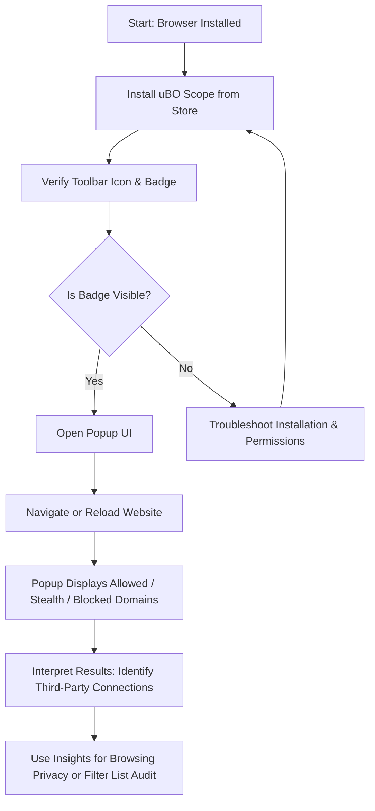

# Installing uBO Scope and Your First Analysis

## Introduction
Welcome to your first step with **uBO Scope**, the browser extension that reveals all remote server connections made by web pages you visit. This guide walks you through installing uBO Scope, recognizing its interface elements—including the toolbar badge and popup UI—and running your first network connection scan to understand your browsing session's remote connections.

<u>By the end of this guide, you will confidently have uBO Scope installed, understand the basic interface, and be able to perform your initial scan to see network request outcomes categorized clearly.</u>

---

## 1. Workflow Overview

### What This Guide Helps You Accomplish
This guide provides a straightforward sequence to:
- Install the uBO Scope extension on your browser
- Identify and interpret the badge icon on your toolbar
- Access and navigate the popup user interface (UI)
- Run your first network analysis to see allowed, blocked, and stealth-blocked third-party connections

### Prerequisites
- Have a supported browser installed:
  - **Chrome 122+** (Chromium-based browsers)
  - **Firefox 128+**
  - **Safari 18.5+**
- Basic familiarity with installing browser extensions from official stores or manually
- Internet connection to download and install the extension

### Expected Outcome
After completing this guide, you will:
- Have uBO Scope successfully installed and active in your browser
- Understand how to interpret the toolbar badge count as a third-party connection indicator
- Be able to open the popup UI to classify and review network connections from your current active tab
- Know how to initiate a scan and understand what the immediate results mean

### Time Estimate
Approximately 10-15 minutes

### Difficulty Level
Beginner-friendly

---

## 2. Step-by-Step Installation and Initial Use

### Step 1: Install uBO Scope into Your Browser
1. Open your browser’s extension/add-ons store:
   - For Chrome/Chromium: Visit the [Chrome Web Store](https://chrome.google.com/webstore/category/extensions).
   - For Firefox: Visit the [Mozilla Add-ons site](https://addons.mozilla.org/firefox/).
   - For Safari: Use the Safari Extensions Gallery or App Store.
2. Search for **uBO Scope** or directly use the links in the **Summary** section below.
3. Click **Add to Browser** and confirm installation.

✅ _Tip:_ Installation permissions include access to monitor web requests via the `webRequest` API, which is essential for uBO Scope to operate.

### Step 2: Verify Successful Installation
- Look for the uBO Scope icon in your browser toolbar. It usually resembles a shield or a badge with numbers.
- If the icon is not visible:
  - Make sure to pin or enable it through your browser’s extension management panel.

### Step 3: Understand the Toolbar Badge
- After installation, load or reload any webpage.
- The badge on the toolbar icon displays a **number** representing the count of distinct third-party remote servers connected by the page.
- **Lower badge numbers indicate fewer external connections, which is generally desirable** from a privacy perspective.

<Info>
The badge shows third-party domains that the current page connects to, counting only unique domains regardless of how many requests are made to the same domain.
</Info>

### Step 4: Open the Popup UI
1. Click the uBO Scope toolbar icon.
2. The popup panel appears, showing detailed information about the remote connections made by the current tab.

### Step 5: Interpreting the Popup Panel
The popup UI is divided into three main sections:
- **Not Blocked (Allowed):** Domains your browser successfully connected to.
- **Stealth-Blocked:** Domains that were redirected or modified in a stealthy way, typically by other content blockers.
- **Blocked:** Domains where connection attempts were blocked.

Each section lists domains along with a count of requests associated with them.

### Step 6: Running Your First Network Connection Scan
- With the popup open, navigate to any website that you want to analyze.
- Reload the page to ensure that uBO Scope captures all network requests.
- The popup will automatically update after a short processing delay (around 1 second) to display classification results of network requests.

<Check>
You should see different domains under allowed, stealth, or blocked categories, with counts reflecting the number of requests to each domain.
</Check>

### Step 7: Confirm Results and Badge Count Consistency
- Confirm that the number shown on the badge matches the count of total distinct allowed third-party domains displayed in the popup.
- This consistency verifies uBO Scope's correct operation for the active tab.

---

## 3. Practical Example

Imagine visiting "example-news-site.com"

1. Install uBO Scope and ensure it is active.
2. Visit the site, and observe the badge count shows "5".
3. Click the toolbar icon to open the popup.
4. In the popup, you see:
   - Not Blocked: `cdn.example-news-site.com (10 requests)`, `analytics.tracker.net (3)`
   - Stealth-Blocked: `ads.fakeadnetwork.com (7)`
   - Blocked: `malicious.server.com (1)`
5. This means your browser fetched resources from 5 unique third-party servers.

This insight helps you understand which domains your browsing session connects to, helping with privacy audits or filter list maintenance.

---

## 4. Troubleshooting & Tips

### Common Issues

**Issue:** No badge or popup data appears after installation.

- Confirm the extension is enabled and pinned.
- Reload the active tab.
- Check browser version compatibility.
- For Chromium, minimum version 122; for Firefox 128; for Safari 18.5.

**Issue:** Popup shows 'NO DATA' or empty domain lists.

- Ensure you have reloaded the tab after installing uBO Scope to allow it to collect data.
- Confirm network requests happen on the page (try navigating to a different site).

<Warning>
uBO Scope relies on the browser's `webRequest` API. Network requests made outside this API's visibility (such as some WebSocket connections or browser cache hits) may not always appear.
</Warning>

### Best Practices

- Regularly monitor badge counts when visiting new or suspicious sites to track unusual connections.
- Use the popup UI as a quick audit tool before entering any sensitive information.
- Combine uBO Scope with content blockers for better privacy insights.

---

## 5. Next Steps & Related Documentation

- After familiarizing yourself with installation and the first analysis, explore **"How uBO Scope Monitors Network Requests"** to learn about the extension's network tracking capabilities.
- For deeper understanding of badges and popup interpretation, consult **"Understanding the Badge Count and Popup Panel"**.
- Troubleshoot setup issues with **"Troubleshooting Common Setup Issues"** if you encounter problems.

By building on these resources, you gain comprehensive mastery over using uBO Scope for privacy auditing and network connection monitoring.

---

## Additional Resources
- [uBO Scope GitHub Repository](https://github.com/gorhill/uBO-Scope)
- Installation overview: [Installing uBO Scope](https://github.com/gorhill/uBO-Scope#installation)

---

# Visual Summary of Workflow

This flowchart illustrates your path from installation through your first successful analysis.

---

Congratulations! You are now equipped to install uBO Scope and confidently perform your first network connection scan. This foundational knowledge sets you up for advanced interpretation and privacy-enhancing practices.

