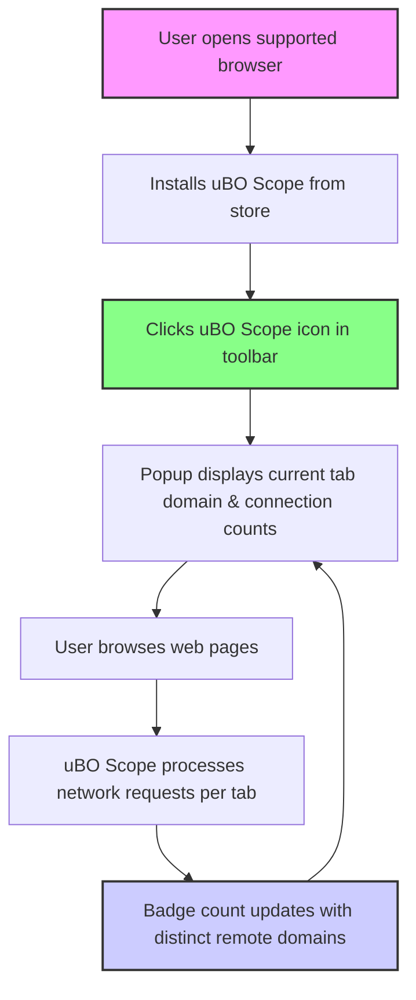

# Installing and Setting Up uBO Scope

## Overview
This guide walks you through installing uBO Scope on supported browsers (Chrome, Firefox, Safari), launching the extension for the first time, and verifying it is actively tracking network activity for your current browser tabs. By following these steps, you will gain immediate insight into third-party remote server connections on any webpage you visit.

---

## 1. Installation
### Supported Browsers
- **Chrome:** Minimum version 122 with Manifest V3 support
- **Firefox:** Minimum version 128
- **Safari:** Minimum version 18.5

<u>**Note:**</u> Later versions of these browsers provide the best compatibility and security.

### Step-by-Step Installation

1. **Open your browser's extension/add-ons store:**
   - Chrome: [Chrome Web Store for uBO Scope](https://chromewebstore.google.com/detail/ubo-scope/bbdpgcaljkaaigfcomhidmneffjjjfgp)
   - Firefox: [Firefox Add-ons for uBO Scope](https://addons.mozilla.org/firefox/addon/ubo-scope/)
   - Safari: Install from the official Safari Extensions Gallery or your sudo equivalent store supporting Manifest V3 extensions.

2. **Search for ‘uBO Scope’** or directly navigate using the above links.

3. **Click Install/Add to Browser**.

4. **Confirm required permissions:**
   - Access to active tab information
   - Network request monitoring (`webRequest` API)
   - Local storage for session data

5. **Wait until installation completes and the uBO Scope icon appears in your toolbar.**

<Tip>
If the extension icon does not appear immediately, check your browser’s extension settings to enable visibility or pin the icon to the toolbar.
</Tip>

---

## 2. Initial Setup and First Launch

Once installed, you can start using uBO Scope immediately without further configuration.

### Opening the uBO Scope Popup

1. **Click the uBO Scope icon** in your browser toolbar.

2. The popup window will show:
   - The domain and hostname of the active tab.
   - A summary count of distinct third-party domains connected.
   - Three sections categorizing domains as:
     - Allowed (network requests succeeded)
     - Stealth-blocked (redirects that started but hid their presence)
     - Blocked (requests that failed due to content blocking or errors)

3. The badge number on the toolbar icon shows the number of distinct allowed third-party domains. A lower number generally indicates fewer external connections, contributing to greater privacy.

### What You Should See

- The hostname and domain of your current tab at the top.
- A numeric count below labeled **"domains connected"**.
- Lists under each category showing domain names and the number of connections.

<Info>
If the popup shows "NO DATA" or zero domains connected, it means uBO Scope has not yet received network request data for that tab. Reload the tab or visit a new webpage to generate network activity.
</Info>

---

## 3. Verifying Network Activity Tracking

Ensure uBO Scope is actively recording network connections by following these steps:

1. **Open a webpage with multiple third-party resources**, such as a news site or online store.

2. **Observe the uBO Scope badge count:** It should show a number representing distinct third-party domains contacted.

3. **Open the popup UI:** Confirm the domains are categorized into Allowed, Stealth-blocked, and Blocked with counts per domain.

4. **Reload or switch tabs:** Data should update dynamically.

5. **Confirm blocked domains appear if you have content blockers enabled.**

<Note>
For best results, allow some time for uBO Scope to process network requests after page load. The extension batches network events and updates every second.
</Note>

---

## 4. Troubleshooting Common Installation Issues

- **Extension icon missing:**
  - Check your browser’s extension management page.
  - Pin the uBO Scope icon to the toolbar.

- **Badge count not updating:**
  - Reload active tabs.
  - Confirm uBO Scope has ‘webRequest’ permission.
  - Verify no conflicts with other privacy extensions.

- **Popup shows no data:**
  - Reload the current tab.
  - Try navigating to a different website with third-party content.

- **Incompatible browser or outdated version:**
  - Update your browser to meet minimum requirements.

<Tip>
If issues persist, consult the related troubleshooting documentation or reinstall the extension.
</Tip>

---

## 5. Best Practices and Tips

- Use uBO Scope alongside your preferred content blocker to audit actual third-party connections.
- Focus on lowering the badge count by adjusting content blocker settings if desired.
- Remember the badge count represents distinct third-party domains connected, not just blocked requests.
- Use uBO Scope to verify if stealth-blocking techniques by your content blocker are active.

---

## 6. Next Steps

- Explore the [Understanding the Popup UI and Badge](https://yourdocsite.com/guides/getting-started/understanding-the-popup) guide to become adept at interpreting uBO Scope data.
- Review [Troubleshooting Common Installation Issues](https://yourdocsite.com/getting-started/setup-and-validation/troubleshooting-common-issues) if you face persistent problems.
- Learn about [Auditing Third-Party Network Requests](https://yourdocsite.com/guides/core-workflows/audit-third-party-requests) for advanced use of uBO Scope.

---

## Additional Resources

- [Official uBO Scope Repository](https://github.com/gorhill/uBO-Scope)
- [uBO Scope on Chrome Web Store](https://chromewebstore.google.com/detail/ubo-scope/bbdpgcaljkaaigfcomhidmneffjjjfgp)
- [uBO Scope on Firefox Add-ons](https://addons.mozilla.org/firefox/addon/ubo-scope/)

---

## Visual: Installation and Basic Workflow

This flow illustrates basic installation followed by active monitoring and dynamic badge updates as you browse.

---

_For a seamless onboarding experience, start with installation, verify your badge and popup data, then explore further guides to deepen your understanding and control over third-party connections._

---

## Frequently Asked Questions

<AccordionGroup title="Common Questions About Installing and Setting Up uBO Scope">
<Accordion title="Is any configuration needed after installation?">
No. uBO Scope works with default settings immediately after installation with no user setup required.
</Accordion>

<Accordion title="Can I install uBO Scope alongside other content blockers?">
Yes. uBO Scope monitors network requests independently and provides complementary insights.
</Accordion>

<Accordion title="Why does the badge number sometimes vary?">
The badge updates dynamically based on active tab network connections and network request outcomes; it may change as you navigate or reload pages.
</Accordion>

<Accordion title="What permissions does uBO Scope require?">
Access to tabs, storage, and the webRequest API to monitor network activity.
</Accordion>
</AccordionGroup>

---

## Summary
By installing uBO Scope as described, you activate a powerful companion to your browser that reveals third-party network activity transparently and in real time, helping you make informed privacy decisions.

---

_Last updated: June 2024_
