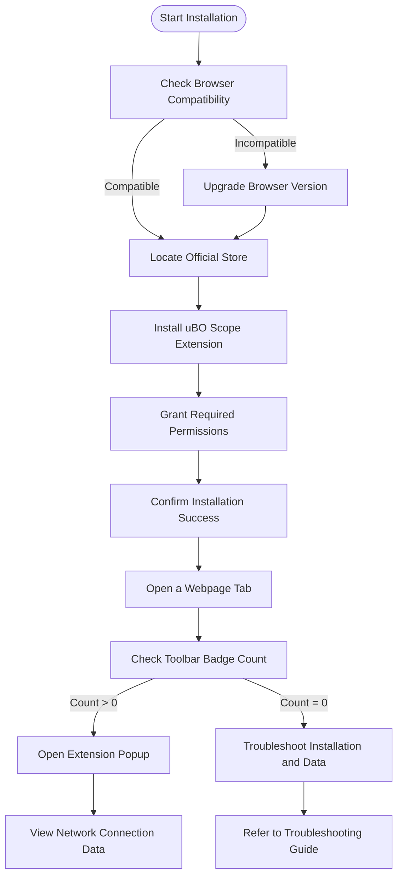

# Installation and First Steps

## Overview
This guide walks you through installing uBO Scope in your browser and verifying that it is functioning correctly. uBO Scope is a privacy-focused browser extension designed to reveal all remote server connections initiated by webpages, giving you a real-time view of third-party domains communicating with your browser.

By following this guide, you'll securely obtain the official extension from your browser's store, complete the installation, and perform basic verification to ensure uBO Scope is actively monitoring network connections as intended.

---

## Prerequisites
Before you start, confirm the following:

- **Supported Browsers and Versions:**
  - Chromium browsers (Google Chrome, Microsoft Edge, Brave, etc.) version **122** or later
  - Mozilla Firefox version **128** or later
  - Apple Safari version **18.5** or later
- **Internet Connection:** Access to the official browser web stores
- **Permissions:** Ability to install extensions and grant requested permissions during installation

If your environment meets these requirements, proceed to the installation steps.

---

## Step 1: Installing uBO Scope

### 1.1 Locate the Official Extension

Use the trusted browser store links below to avoid unofficial or fraudulent versions:

- **Chromium Browsers:** [Chrome Web Store - uBO Scope](https://chromewebstore.google.com/detail/ubo-scope/bbdpgcaljkaaigfcomhidmneffjjjfgp)
- **Firefox:** [Firefox Add-ons - uBO Scope](https://addons.mozilla.org/firefox/addon/ubo-scope/)

Safari users must install via the App Store or official Apple platforms following Safari’s extension mechanisms.

### 1.2 Install the Extension

1. Click the appropriate link for your browser.
2. Select **Add to Browser** or **Install**.
3. Review the requested permissions, which include:
   - Monitoring active tabs
   - Accessing storage for session data
   - Intercepting network requests to analyze connections
4. Confirm and complete the installation.

<Tip>
Always install extensions from official browser platforms to ensure security and get updates.
</Tip>

---

## Step 2: Initial Activation and Interface Familiarization

Once installed, look for the uBO Scope icon in your browser's toolbar:

- The icon displays a **badge count** — this number represents the count of distinct third-party remote servers contacted by the active webpage.
- Clicking the icon opens the **popup interface** that shows detailed lists of domains categorized into:
  - `not blocked` (allowed connections)
  - `stealth-blocked` (connections blocked in a way that webpages cannot detect)
  - `blocked` (connections stopped completely)

This immediate visual feedback helps you understand the network activity of the webpage you're on.

---

## Step 3: Verifying uBO Scope is Working

### 3.1 Open a Webpage
Navigate to any commonly used website to generate network traffic.

### 3.2 Observe the Badge Count
Check the toolbar icon; a non-empty number indicates uBO Scope is tracking third-party remote servers.

### 3.3 Open the Popup
Click the uBO Scope icon to reveal detailed connection information:

- The popup's header shows the **top-level domain** of the tab.
- Below, three sections display:
  - Domains with allowed connections
  - Domains with stealth-blocked connections
  - Domains with blocked connections
- Each domain row shows a **count badge** indicating the number of connections to that domain.

### 3.4 Confirm Data Visibility
Seeing domains populate the sections confirms that uBO Scope is actively monitoring network requests and correctly categorizing outcomes.

<Check>
If the popup shows "NO DATA" or the badge remains empty after multiple page loads, verify:
- The extension permissions are granted
- Your browser version meets requirements
- No conflicting extensions or security software block network monitoring
- See the Troubleshooting section below for next steps.
</Check>

---

## Practical Tips and Best Practices

- Keep your browser and uBO Scope up to date to benefit from security patches and feature enhancements.
- Visit well-known and network-rich websites to observe a fuller range of domain connections.
- Use uBO Scope alongside your content blocker to understand what external servers are contacted even when resources are blocked.
- Remember, a **lower badge count** is better, indicating fewer third-party connections.

---

## Troubleshooting Common Issues

<AccordionGroup title="Troubleshooting uBO Scope Installation and Activation">
<Accordion title="The uBO Scope icon does not appear in the toolbar">
- Verify the extension installed successfully. Check your browser’s extension management page.
- Ensure the icon isn’t hidden behind the overflow menu.
- Restart the browser if necessary.
</Accordion>
<Accordion title="The badge count stays empty despite network activity">
- Confirm the page you are visiting is not blocked from being monitored by your browser or security software.
- Disable other extensions temporarily to check for conflicts.
- Verify that uBO Scope has necessary permissions, especially activeTab and webRequest.
</Accordion>
<Accordion title="The popup shows 'NO DATA' or is empty">
- Refresh the active tab to generate network activity.
- Ensure you have navigated to a proper top-level page (not a blank or internal browser page).
- Check browser console for errors in extension scripts (advanced users).
</Accordion>
<Accordion title="Installation fails or is blocked">
- Confirm your browser meets the minimum version requirement.
- Check firewall or antivirus settings that might prevent extension installation.
- Review troubleshooting guides in Getting Started / Onboarding sections.
</Accordion>
</AccordionGroup>

---

## Next Steps

After verifying installation and activation:

- Explore the **Getting Started / First Run & Quick Tour** guide to learn about the badge, UI layout, and interpreting data.
- Consult the **Core Concepts and Terminology** documentation to understand terms like stealth-blocking and how counts reflect privacy.
- Follow workflow guides to analyze network connections on real-world webpages.

---

## Additional References

- [Prerequisites & Supported Browsers](/getting-started/essentials-setup/prerequisites-system-compatibility) — Confirm compatibility before installation
- [Installation Methods by Browser](/getting-started/essentials-setup/installation-methods) — Detailed browser-specific install steps
- [First Run & Quick Tour](/getting-started/essentials-setup/first-run-experience) — Understanding the initial interface
- [Troubleshooting Common Installation Problems](/getting-started/onboarding-validation-troubleshooting/troubleshooting-common-issues) — Dealing with issues
- Official uBO Scope GitHub: https://github.com/gorhill/uBO-Scope

---

## Summary Diagram: Installation and Verification Flow

This flow ensures you proceed methodically through installation, verification, and troubleshooting to successfully get uBO Scope up and running.

---

By completing these steps, you'll be empowered to harness uBO Scope's capabilities to monitor and analyze real-time network connections effectively, enhancing your web privacy awareness.
