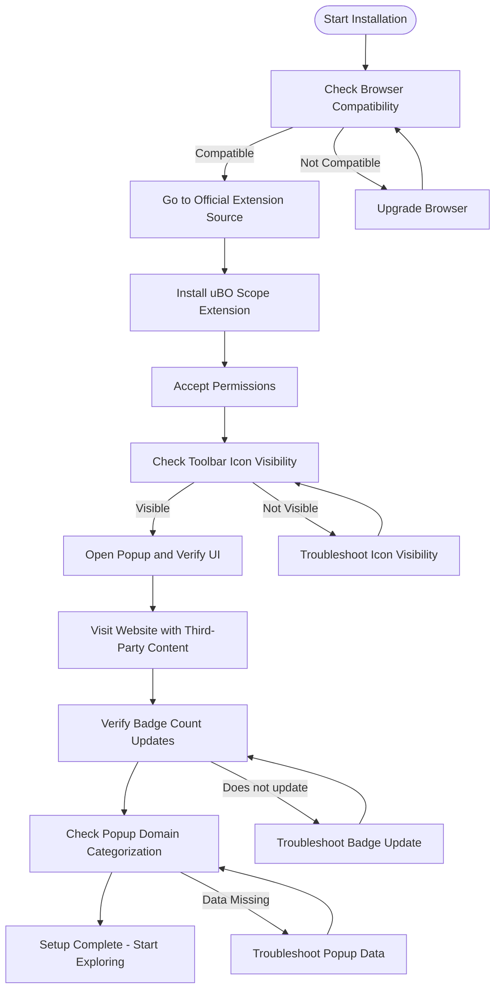

# Installing and Setting Up uBO Scope

This guide provides a practical, hands-on workflow to install uBO Scope on supported browsers, configure essential preferences, and verify that the extension is fully operational to monitor your browser's network activity. By following this step-by-step process, you'll be ready to use uBO Scope for revealing all third-party connections during browsing.

---

## 1. Installation Workflow Overview

### What This Guide Helps You Achieve
- Get uBO Scope installed on your browser (Chromium-based, Firefox, or Safari).
- Confirm your browser meets the necessary compatibility requirements.
- Configure any initial key preferences needed for smooth operation.
- Verify the extension is actively capturing network requests.

### Prerequisites
- A supported browser at or above the minimum version:
  - **Chromium-based browsers:** Version 122.0 or higher
  - **Firefox:** Version 128.0 or higher
  - **Safari:** Version 18.5 or higher
- Internet connection for downloading the extension.
- Basic familiarity with installing and managing browser extensions.

### Expected Outcome
- uBO Scope installed and visible on your browser toolbar.
- Toolbar badge appears and updates correctly with third-party counts.
- Popup UI opens and displays live network requests categorized by outcome.
- No permission or configuration issues preventing extension operation.

### Time Estimate
- Approximately 5 to 10 minutes depending on browser and internet speed.

### Difficulty Level
- Beginner to Intermediate — straightforward installation and verification.

---

## 2. Step-by-Step Installation and Setup

### Step 1: Verify Browser Compatibility

Ensure your browser is supported and up to date:
- Chromium-based browsers require version 122.0 or newer.
- Firefox requires version 128.0 or newer.
- Safari requires version 18.5 or newer.

You can check your browser's version in its settings/about page.

### Step 2: Install uBO Scope Extension

Use official sources for security and reliability:

- **For Chromium-based browsers (e.g., Chrome, Edge):**
  1. Visit the [Chrome Web Store - uBO Scope](https://chromewebstore.google.com/detail/ubo-scope/bbdpgcaljkaaigfcomhidmneffjjjfgp).
  2. Click `Add to Chrome` and confirm the installation.

- **For Firefox:**
  1. Visit the [Firefox Add-ons - uBO Scope](https://addons.mozilla.org/firefox/addon/ubo-scope/).
  2. Click `Add to Firefox` then `Add` to install.

- **For Safari:**
  1. Starting with Safari 18.5, the extension is available via the App Store or trusted distributor.
  2. Follow Safari’s extension installation instructions using the appropriate package.

### Step 3: Confirm Permission Requests

During installation, uBO Scope will request the following permissions:
- **webRequest:** To listen to and report network requests.
- **storage:** To save session data and user preferences.
- **activeTab:** To associate data with the currently active browser tab.

Accept all permissions to ensure full functionality.

### Step 4: Verify Toolbar Icon and Badge Visibility

After installation:
- Locate the uBO Scope icon on the browser toolbar. It should appear as the uBO Scope logo.
- The badge (a numeric overlay) will initially be empty or zero.
- If you do not see the icon:
  - Check your browser’s extensions management page.
  - Pin / enable the extension icon if your browser supports pinning.

### Step 5: Initial Launch and Popup Inspection

- Click the uBO Scope toolbar icon to open the popup panel.
- The popup should display:
  - The hostname of the active tab.
  - A count of connected third-party domains.
  - Three domain connection categories: "not blocked", "stealth-blocked", and "blocked".
- Initially, you might see "NO DATA" or zero counts if no network activity has been detected yet.

### Step 6: Confirm Real-Time Network Activity Capture

- Navigate to a known website with third-party content (e.g., news site, ecommerce platform).
- Observe the toolbar badge updating with a count reflecting third-party connections.
- Refresh the page if necessary to trigger new network requests.
- Open the popup again and verify domain counts populate under each connection outcome.

### Step 7: Basic Configuration Check (Optional)

- uBO Scope operates effectively with zero configuration.
- If needed, confirm the extension is allowed to run on all sites by checking browser extension settings.

---

## 3. Practical Examples

### Example: Installing on Chrome
```plaintext
1. Open Chrome.
2. Go to the Chrome Web Store link above.
3. Click 'Add to Chrome'.
4. When prompted, click 'Add Extension'.
5. Wait for the icon to appear in your toolbar.
6. Navigate to https://example.com.
7. Observe the badge increment.
8. Click icon to view detailed connection info.
```

### Example: Verification on Firefox
```plaintext
1. Open Firefox.
2. Visit the Firefox Add-ons page.
3. Click 'Add to Firefox' and confirm.
4. Make sure the icon is visible and pinned.
5. Browse to a page with ads or third-party content.
6. Click the popup icon to see network connection details.
```

---

## 4. Troubleshooting and Tips

### Common Issues

- **Toolbar icon not visible:**
  - Pin the extension from the extensions dropdown.
  - Restart the browser if needed.

- **Badge count not updating:**
  - Verify that the extension has proper permissions.
  - Ensure the browser version meets minimum requirements.
  - Refresh the webpage to generate new network requests.

- **Popup shows "NO DATA" or empty:**
  - Wait a few seconds after page load.
  - Try visiting a site known to load third-party content.
  - Check for conflicting extensions disabling webRequest API.

### Best Practices

- Keep your browser up to date for security and compatibility.
- Use uBO Scope alongside your chosen content blockers to reveal network activity.
- Regularly check the popup UI to understand your browsing exposure.

### Performance Considerations

- uBO Scope uses minimal resources by batching request data every second.
- No special configuration is required to optimize performance.

### Alternative Installation

If you prefer manual installation:
- Download extension files from the [GitHub repository](https://github.com/gorhill/uBO-Scope).
- Use Developer Mode in your browser's extension page to load the unpacked extension.
- Refer to README.md in the repo for packaging details.

---

## 5. Next Steps and Related Resources

- After installation, see [Basic Configuration](https://docs.uboscope.org/getting-started/usage-and-troubleshooting/basic-configuration) to maximize usability.
- Use [Quick Validation Steps](https://docs.uboscope.org/getting-started/usage-and-troubleshooting/quick-validation-steps) to confirm real-time monitoring.
- For troubleshooting, consult [Common Issues](https://docs.uboscope.org/getting-started/usage-and-troubleshooting/troubleshooting-common-issues).
- Understand core concepts by visiting [Core Concepts and Terminology](https://docs.uboscope.org/overview/foundations/core-concepts).

---

## Appendix: Supported Browsers and Permissions Summary

| Browser Type        | Minimum Version | Permissions Requested             | Notes                               |
|--------------------|-----------------|---------------------------------|-----------------------------------|
| Chromium-based      | 122.0+          | activeTab, storage, webRequest   | Supports ws:// and wss:// URLs    |
| Firefox            | 128.0+          | activeTab, storage, webRequest   | Supports ws:// and wss:// URLs    |
| Safari             | 18.5+           | activeTab, storage, webRequest   | Only http and https URLs supported|

---

<Tip>
If you encounter installation issues, ensure that your browser isn't restricting extension permissions or blocking webRequest API usage due to security policies or other installed extensions.
</Tip>

---

# Visual Workflow Diagram



---

# Summary

You have successfully installed and configured uBO Scope, enabling the extension to reveal all third-party network activity within your browser. You know how to verify the extension’s presence, badge updates, and popup visualization after browsing third-party content websites.

Continue with configuration and troubleshooting guides to maximize your insight into browsing privacy and extension performance.

---