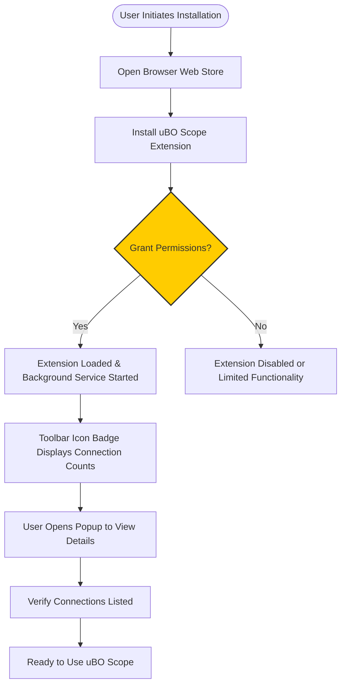

# Installing and Configuring uBO Scope

## Introduction
This guide walks you through the essential steps to install uBO Scope in your preferred browser, configure the necessary permissions, and perform the initial setup that allows you to start monitoring remote server connections immediately.

uBO Scope is a lightweight extension designed to provide transparency into third-party server connections initiated by your browser, making it invaluable for privacy-conscious users and filter list maintainers.

---

## 1. Installation Overview

### Supported Browsers
- **Chromium-based browsers:** Chrome, Edge, Brave, and others with Chromium engine
- **Firefox (version 128.0 or higher)**
- **Safari (version 18.5 or higher)**

### Installation Sources
- For **Chrome and Chromium browsers**, install from the [Chrome Web Store](https://chrome.google.com/webstore/detail/ubo-scope/bbdpgcaljkaaigfcomhidmneffjjjfgp).
- For **Firefox**, install from [Firefox Add-ons](https://addons.mozilla.org/firefox/addon/ubo-scope/).
- For **Safari**, install via the official Safari Extensions Gallery or as per browser instructions.

### Permissions Required
Upon installation, the extension requires permission to:
- Access tabs (`activeTab`)
- Use storage API (`storage`)
- Observe and intercept network requests (`webRequest`)

These permissions enable uBO Scope to monitor, record, and report network requests during your browsing sessions.

---

## 2. Step-by-Step Installation Instructions

### Step 1: Locate the Extension in Browser Web Store
1. Open your browser’s extension/add-ons store.
2. Search for "uBO Scope".
3. Select the extension authored by Raymond Hill.

### Step 2: Install the Extension
1. Click the **Install** or **Add to Browser** button.
2. Review requested permissions and confirm.
3. Wait for the extension to install; a toolbar icon should appear.

### Step 3: Verify Extension Installation
- The uBO Scope icon (a magnifying glass or logo) should appear in the browser’s toolbar.
- If you do not see the icon, check your browser’s extension management page and ensure the extension is enabled.

### Step 4: First-Time Permission Granting
- When uBO Scope runs for the first time, it will request your confirmation for permissions.
- Approve all required permissions to ensure the extension can monitor network requests properly.

<Tip>
Without the necessary permissions, uBO Scope cannot report network connections correctly, resulting in empty data or no badge count.
</Tip>

### Step 5: Open uBO Scope Popup
1. Click on the uBO Scope icon in the toolbar.
2. The popup window will open, displaying connection data for the current active tab.

---

## 3. Initial Configuration and Setup

uBO Scope requires minimal user configuration to begin functioning, but proper setup ensures accurate monitoring and reporting.

### Understanding Permissions and Data Access
- **Host Permissions:** The extension automatically obtains the right to observe network traffic for HTTP(s) and WebSocket URLs.
- **Storage Permissions:** Required to save your browsing sessions’ connection data temporarily.

### What Happens After Installation?
- uBO Scope launches a background service worker (`background.js`), which listens to network events.
- It tracks network requests from tabs, categorizing them into allowed, stealth-blocked, and blocked connections.
- This data is saved in session storage and updated live.

### Browser Badge Setup
- The toolbar icon displays a badge reflecting the count of **distinct allowed third-party domains** connected by the active tab.
- A visible badge number means uBO Scope is actively monitoring network connections.

### First Popup Use
- The popup categorizes connections in three sections:
  - **Not Blocked (Allowed):** Connections that succeeded.
  - **Stealth-Blocked:** Connections intercepted and stealthily blocked by other content blockers.
  - **Blocked:** Connections that were visibly blocked or failed.

---

## 4. Practical Tips for Smooth Setup

- **Ensure your browser is up to date** to support Manifest V3 extensions and the required permissions.
- **Grant all requested permissions at once** to avoid inconsistent data reporting.
- If you use other content blockers, understand that uBO Scope monitors all network requests regardless of other blockers’ presence.

<Warning>
On some browsers or configurations, insufficient permissions may cause the popup to display 'NO DATA'. Always verify extension permissions if data does not appear after installation.
</Warning>

---

## 5. Verification: Confirming uBO Scope Is Working

Follow these quick checks to verify a successful setup:

1. Visit a website with multiple third-party resources (e.g., news site with ads/CDNs).
2. Check the uBO Scope toolbar badge:
  - The badge number should reflect the count of distinct third-party remote domains.
3. Open the popup via toolbar icon:
  - Confirm connection entries under 'not blocked' or other categories.
4. If the badge is empty (no number) or the popup shows 'NO DATA':
  - Check that permissions were accepted.
  - Reload the browser or extension.

<Check>
A working installation shows a non-empty badge count and the popup lists connection domains for the active tab.
</Check>

---

## 6. Troubleshooting Common Installation Issues

### No Toolbar Icon / Missing Extension
- Confirm the extension was installed from the appropriate store.
- Check the browser’s extensions page to enable uBO Scope.

### Permissions Not Granted
- Revisit the extension details page.
- Reset and re-grant permissions.

### Popup Displays NO DATA
- Ensure you have visited HTTPS or HTTP websites.
- Reload or restart your browser.
- Verify that the extension is enabled and the background script is active.

### Conflicts with Other Extensions
- Temporarily disable other security or content blocking extensions and verify uBO Scope functionality.

See the [Common Installation & Startup Issues](../../getting-started/troubleshooting/common-setup-issues) guide for detailed troubleshooting.

---

## 7. Additional Configuration Options

Currently, uBO Scope does not require or provide advanced user configuration during installation. Future versions may include enhanced settings.

As a first-time user, focus on the installation and permissions completeness to fully leverage the extension’s monitoring capabilities.

---

## 8. Summary

Installing and configuring uBO Scope is designed to be straightforward and fast:
- Install from your browser’s official web store.
- Confirm and grant permissions fully.
- Use the toolbar icon and popup to verify connection monitoring.

With this setup complete, you gain immediate visibility into your browsing network connections through a simple and practical interface.

---

## 9. Resources and Next Steps

- [How uBO Scope Works: Architectural Overview](../../overview/core-concepts-architecture/how-it-works-architecture)
- [Explore the uBO Scope Popup Interface](../getting-started/exploring-popup-ui)
- [Understanding Badge Counts and Connection Outcomes](../core-workflows/understanding-badge-and-outcomes)
- [Common Installation & Startup Issues](../../getting-started/troubleshooting/common-setup-issues)

For ongoing help and deeper usage, explore these guides after installation.

---

## Appendix: Supported Browsers Manifest Snapshots

You can confirm your browser version compatibility by referencing our platform manifest files supporting the following:

- Chromium-based browsers minimum version: 122.0
- Firefox minimum version: 128.0
- Safari minimum version: 18.5

These manifests define required permissions and webRequest host access:

```json
"permissions": ["activeTab", "storage", "webRequest"],
"host_permissions": ["https://*/*", "http://*/*", "wss://*/*", "ws://*/*"]
```

---

## Appendix: Example - Verifying Active Permissions in Chromium

1. Navigate to `chrome://extensions/`
2. Locate uBO Scope
3. Click `Details`
4. Confirm 'Site access' includes `On all sites`
5. Ensure 'Permissions' include `Read and change all your data on the websites you visit` and `Read your browsing history`

If any permissions are missing, use the toggle to enable site access.

---

## Appendix: Understanding Permission Necessity

- **`activeTab`**: Grants the extension temporary access to data on the active tab, enabling request tracking.
- **`webRequest`**: Allows intercepting and observing network requests.
- **`storage`**: Used to persist session data about tab connections.

Lack of any permission will hinder accurate reporting.

---

## Diagram: Simplified uBO Scope Installation and Setup Flow



---

This completes your installation and configuration of uBO Scope, setting the stage for immediate visibility into your web connection landscape.