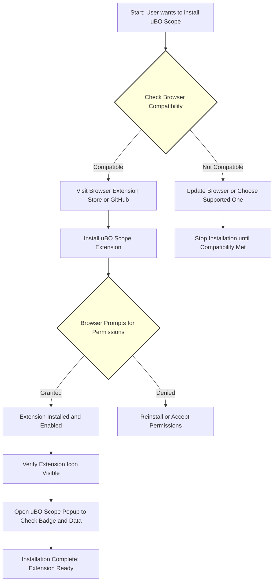

# Installing and Enabling uBO Scope

This guide provides a clear, step-by-step walkthrough to help you install uBO Scope, a powerful browser extension that reveals all attempted and successful remote server connections from your browser. Whether you use Chromium-based browsers, Firefox, or Safari, these instructions will ensure you install the correct version, verify the installation, and enable uBO Scope for immediate use.

---

## 1. Workflow Overview

### What You Will Achieve
By following this guide, you will successfully install and enable uBO Scope in your preferred browser with minimal effort. You will confirm the extension is active and ready to monitor network connections transparently.

### Prerequisites
- You have one of the following browsers installed:
  - Chromium-based browsers (Chrome, Edge, Brave) version 122 or newer
  - Firefox version 128 or newer
  - Safari version 18.5 or newer
- Internet access to download the extension from official stores or GitHub
- Basic familiarity with browser extension installation

### Expected Outcome
- uBO Scope installed and visible as an extension icon in your browser toolbar
- Extension enabled and ready to record network requests across browser tabs
- Badge counter on the extension icon displaying distinct third-party connections

### Time Estimate
5 to 10 minutes depending on your browser and familiarity with extension installation

### Difficulty Level
Beginner — no technical skills beyond basic browser use required

---

## 2. Step-by-Step Instructions

### Step 1: Verify Browser Compatibility
Ensure your browser meets minimum version requirements:

| Browser                 | Minimum Version           |
|-------------------------|--------------------------|
| Chromium-based browsers | 122+                     |
| Firefox                 | 128+                     |
| Safari                  | 18.5+                    |

If your browser is below these versions, update it before proceeding.

---

### Step 2: Install uBO Scope Extension

#### For Chromium-based Browsers
1. Open the Chrome Web Store link: [uBO Scope on Chrome Web Store](https://chromewebstore.google.com/detail/ubo-scope/bbdpgcaljkaaigfcomhidmneffjjjfgp)
2. Click **Add to Chrome**.
3. Confirm any permission prompts.

#### For Firefox
1. Navigate to: [uBO Scope on Firefox Add-ons](https://addons.mozilla.org/firefox/addon/ubo-scope/)
2. Click **Add to Firefox**.
3. Approve permissions and confirm installation.

#### For Safari
1. Visit the Safari Extensions Gallery or the developer's GitHub release page to get the latest compatible version.
2. Follow Safari's instructions for extension installation.
3. Enable the extension in Safari's Preferences under the Extensions tab.

---

### Step 3: Enable and Activate uBO Scope

Once installed, make sure uBO Scope is enabled:
1. Locate the extension icon in the browser toolbar (looks like the uBO Scope logo).
2. If not immediately visible, access your browser’s extensions menu:
   - **Chrome/Edge**: Go to Menu > Extensions
   - **Firefox**: Menu > Add-ons and Themes > Extensions
   - **Safari**: Safari > Preferences > Extensions
3. Verify that uBO Scope is enabled (toggle switch is on).

---

### Step 4: Confirm Installation and Basic Functionality

To verify uBO Scope is correctly installed and running:
1. Visit any webpage that makes third-party connections (e.g., news sites, social media).
2. Click the uBO Scope extension icon to open its popup.
3. Observe the badge count on the icon indicating the number of distinct third-party domains contacted.
4. In the popup, review the categorized lists of connected domains showing "not blocked," "stealth-blocked," and "blocked" outcomes.

If you see meaningful data reflecting active connections, installation is successful.

---

## 3. Verification Checkpoints

| Checkpoint                              | Verification Method                         |
|---------------------------------------|--------------------------------------------|
| Extension icon visible in toolbar     | Icon appears after installation            |
| Extension enabled                     | Extensions menu shows uBO Scope toggled on |
| Badge count updates                    | Number fluctuates based on webpage activity|
| Popup displays domain connection data | Popup shows domain lists categorized correctly |

---

## 4. Troubleshooting Common Installation Issues

<AccordionGroup title="Troubleshooting Installation Issues">
<Accordion title="Extension Icon Missing After Installation">
- Ensure your browser version is supported.
- Restart the browser.
- Check if the extension is hidden by the browser’s extension toolbar options.
- For Chromium: pin the extension via the puzzle icon menu.
</Accordion>
<Accordion title="Installation Blocked By Browser Policies">
- Some corporate or managed browsers restrict extension installation.
- Verify with system administrator if restrictions apply.
- Try installing in a personal or unrestricted profile if possible.
</Accordion>
<Accordion title="Permissions Prompt Not Appearing Or Declined">
- Accept all necessary permissions for uBO Scope to function.
- Remove and reinstall the extension if permissions were declined by mistake.
</Accordion>
<Accordion title="Empty Popup Or No Network Data Displayed">
- Refresh the active tab or open a new tab.
- Ensure you have navigated to a page that initiates network requests.
- Check other related documentation on troubleshooting: the "Troubleshooting & Validation" guide.
</Accordion>
</AccordionGroup>

---

## 5. Best Practices for Installation and Initial Setup

- Always install uBO Scope from official browser stores or the verified GitHub repository to avoid counterfeit versions.
- Regularly update your browser to maintain compatibility with the latest uBO Scope releases.
- After installation, allow some browsing activity so that request monitoring data can populate.
- Keep uBO Scope enabled alongside your existing content blockers.
- Use the popup interface to get immediate insights into your browser’s network connections.

---

## 6. Next Steps and Related Information

After successfully installing and enabling uBO Scope, you can:

- Visit the **"Set Up & Open the Extension"** guide for managing permissions and understanding the UI.
- Proceed to **"Run Your First Network Analysis"** to interpret badge counts and network data.
- Explore **"Interpreting the uBO Scope Popup"** for detailed guidance on understanding the connection data displayed.
- Consult **"Troubleshooting & Validation"** if you experience any issues post-installation.

---

For more detailed platform-specific installation instructions, see the [Installation Instructions](https://github.com/gorhill/uBO-Scope/blob/main/getting-started/installation-essentials/installation-instructions.mdx) in the official documentation.

---

## Summary
This guide walked you through installing and enabling uBO Scope across major browsers, including verifying compatibility, completing installation, activating the extension, and confirming its operation. By following these steps, you establish a solid foundation to discover and analyze all third-party network connections your browser makes in real-time.

---

<Check>
Remember, the badge number on the toolbar icon reports the count of distinct third-party servers your browser connected to. A lower number indicates fewer third-party requests, helping you assess extensions and privacy.
</Check>

---

## Appendix: Browser-Specific Quick Reference

| Browser           | Minimum Version | Install Source                                                      | Permissions Highlight                        |
|-------------------|-----------------|-------------------------------------------------------------------|----------------------------------------------|
| Chromium-based    | 122+            | Chrome Web Store: https://chromewebstore.google.com/detail/ubo-scope/bbdpgcaljkaaigfcomhidmneffjjjfgp | Requires activeTab, storage, webRequest permissions |
| Firefox           | 128+            | Firefox Add-ons: https://addons.mozilla.org/firefox/addon/ubo-scope/ | Requires same permissions as Chromium           |
| Safari            | 18.5+           | Safari Extensions Gallery or GitHub                               | Requires enabling and permissions via Safari Preferences |

---

# Frequently Asked Questions

**Q:** Can I install uBO Scope alongside other content blockers?

**A:** Yes. uBO Scope is designed to be independent and can run alongside other blockers to provide transparent network insights.

**Q:** Does uBO Scope work on all browsers?

**A:** It currently supports Chromium-based browsers (v122+), Firefox (v128+), and Safari (v18.5+).

**Q:** How do I update uBO Scope?

**A:** When installed from your browser’s official extension store, updates occur automatically. For manual installs or Safari, follow platform procedures.

---

For a comprehensive understanding of uBO Scope and its core concepts, visit the [Core Concepts & Architecture](#/overview/core-concepts-architecture/feature-overview) section, and start exploring how it revolutionizes transparency on the web.

---

---

# Visual Diagram: Installation Flow

