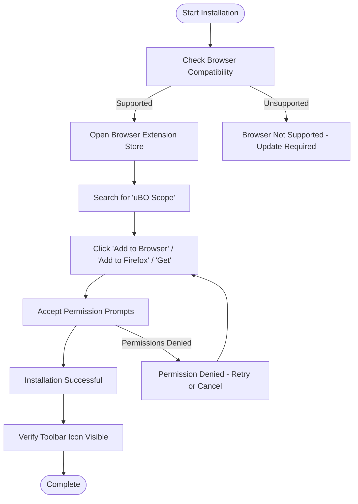

# Installing uBO Scope

Step-by-step guide to installing uBO Scope on supported browsers. Learn where to find the extension, how to add it to your browser, and key permissions it uses—ensuring a secure and smooth setup.

---

## 1. Overview

**What this guide achieves:**

This guide walks you through installing the uBO Scope extension on supported browsers (Chromium-based, Firefox, and Safari). You'll learn where to locate the extension in official stores, how to add it safely, and what permissions it requires to function correctly.

**Expected Outcome:**

By the end, uBO Scope will be installed and enabled in your browser, ready to transparently report third-party network connections.

**Time Estimate:** Approximately 5 minutes

**Difficulty Level:** Beginner

---

## 2. Prerequisites

Before starting the installation:

- **Verify your browser version** meets minimum requirements:
  - Chromium (Google Chrome, Edge, etc.): Version 122 or newer
  - Firefox (desktop/mobile): Version 128 or newer
  - Safari: Version 18.5 or newer

- Have a working internet connection to access the browser's extension stores.

- Basic familiarity with installing browser extensions.

For detailed system requirements, refer to the [System Requirements](/getting-started/installation-setup/system-requirements) page.

---

## 3. Supported Browsers and Official Installation Sources

uBO Scope is available for installation from official stores for major browsers:

| Browser            | Official Store Link                                                   |
|--------------------|----------------------------------------------------------------------|
| Chromium browsers   | [Chrome Web Store](https://chromewebstore.google.com/detail/ubo-scope/bbdpgcaljkaaigfcomhidmneffjjjfgp)  |
| Firefox            | [Firefox Add-ons](https://addons.mozilla.org/firefox/addon/ubo-scope/) |
| Safari             | Available on Mac App Store or via Safari Extensions (minimum version 18.5 required) |

---

## 4. Installation Steps

Follow these steps according to your browser.

### Step 1: Navigate to the Extension Store

- **Chromium:** Open the Chrome Web Store link provided above.
- **Firefox:** Open the Firefox Add-ons link.
- **Safari:** Visit the Safari Extensions section in the Mac App Store or enable via Safari’s Preferences if available.

### Step 2: Add uBO Scope to Your Browser

- Click the **Add to browser / Add to Firefox / Get** button.
- Confirm any prompts asking to add the extension.

### Step 3: Confirm Permissions

uBO Scope requests the following permissions to function properly:

- Access to websites and web socket URLs (`http://*/*`, `https://*/*`, `ws://*/*`, `wss://*/*`). This allows it to monitor all network connections.
- Permission to use the `webRequest` API to listen to network events.
- Permissions to access active browser tabs and local storage.

Accept these permissions when prompted to enable full functionality.

<Tip>
These permissions are essential for uBO Scope to detect and display third-party remote server connections accurately. Without them, the extension cannot monitor network requests correctly.
</Tip>

### Step 4: Verify Installation Success

- After installation, you should see the uBO Scope icon in your browser's toolbar.
- Clicking this icon opens the popup panel showing connection data for your current tab (initially may display 'NO DATA' until browsing activity occurs).
- The toolbar badge will display a count representing distinct third-party servers connected.

<Tip>
If you don’t see the icon immediately, check your browser extension settings to ensure uBO Scope is enabled and visible in the toolbar.
</Tip>

---

## 5. After Installation

Once installed:

- Browse websites as usual.
- Click the uBO Scope toolbar icon to view the domains connected per tab.
- The badge count gives you a quick indicator of the number of distinct third-party remote servers contacted.

For deeper understanding of the badge and popup interface, visit [Understanding the Popup & Badge](/getting-started/first-steps-usage/interpreting-the-popup).

---

## 6. Troubleshooting Common Installation Issues

<AccordionGroup title="Troubleshooting Installation Problems">
<Accordion title="The uBO Scope icon does not appear after installation">
- Verify the extension is enabled in your browser’s extensions or add-ons page.
- Check if your browser version meets the minimum requirement.
- Restart the browser.
</Accordion>
<Accordion title="Permission prompt does not appear or is denied">
- uBO Scope requires network permissions to work correctly.
- Reinstall the extension and accept all permission prompts.
- Check browser settings to manage extension permissions manually.
</Accordion>
<Accordion title="Installation fails or extension is blocked">
- This may occur due to browser policies or security software.
- Try installing from the official links directly.
- Refer to your browser's support for extension installation issues.
</Accordion>
</AccordionGroup>

---

## 7. Best Practices and Tips

- Always install from official browser extension stores to ensure you get authentic updates.
- Keep your browser up to date to maintain compatibility with uBO Scope.
- Review extension permissions periodically to stay informed about access.
- Combine uBO Scope with your preferred content blocker to gain insights without interference.

---

## 8. Next Steps

After installing uBO Scope, enhance your usage by exploring:

- [Initial Configuration](/getting-started/installation-setup/initial-configuration) — Learn about first-run settings and permission prompts.
- [Your First Run: What to Expect](/getting-started/first-steps-usage/first-run-overview) — Understand the experience after installation.
- [Analyzing Network Connections](/guides/using-insights/analyzing-connections) — Dive into interpreting the data uBO Scope collects.

---

## 9. Summary

Installing uBO Scope is straightforward and quick when following supported browser requirements and official store links. After granting the necessary permissions, the extension immediately begins to reveal third-party connections to enhance your browsing transparency. For ongoing use and troubleshooting, refer to the related setup and usage guides.

---

## Appendix: Summary of Key Permissions

| Permission Name | Purpose                                       |
|-----------------|-----------------------------------------------|
| `webRequest`    | Intercept and analyze browser network requests|
| `activeTab`     | Access details of the active tab for accurate data display|
| `storage`       | Save session and configuration data locally  |
| `host_permissions` | Monitor network requests on all URLs (http, https, ws, wss)|

---

## Visual Flow of the Installation Process

---

## References

- [System Requirements](/getting-started/installation-setup/system-requirements)
- [Initial Configuration](/getting-started/installation-setup/initial-configuration)
- [Your First Run Overview](/getting-started/first-steps-usage/first-run-overview)
- Official Chrome Web Store: https://chromewebstore.google.com/detail/ubo-scope/bbdpgcaljkaaigfcomhidmneffjjjfgp
- Official Firefox Add-ons: https://addons.mozilla.org/firefox/addon/ubo-scope/

---

<Card title="Helpful Tip">
Installation from official stores ensures automatic updates and trusted code, protecting your security and privacy.
</Card>