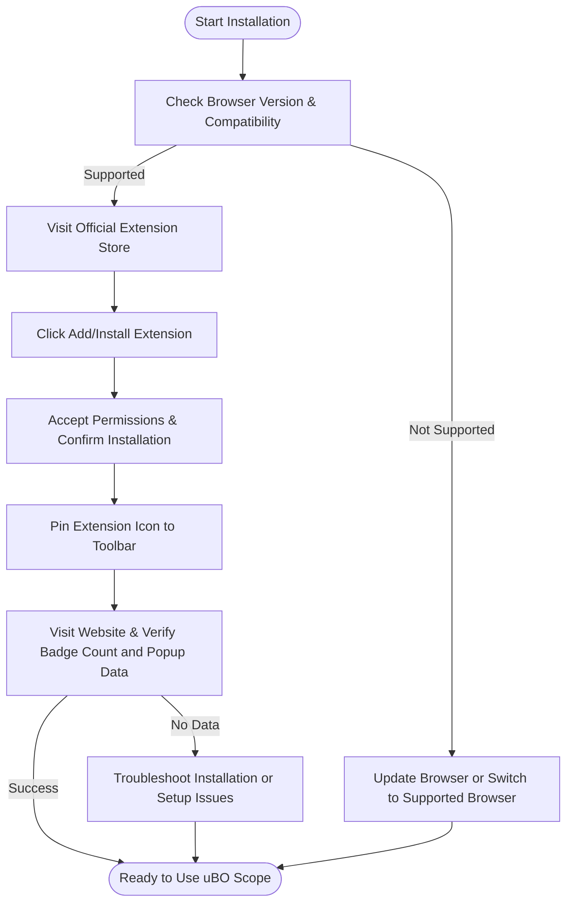

# Installing and Setting Up uBO Scope

## Overview
This guide walks you through acquiring and installing the uBO Scope extension from official browser stores, followed by simple post-installation setup tips. You will learn how to obtain uBO Scope on your preferred browser (Chrome, Firefox, or Safari), enable it correctly, and confirm it's working seamlessly, ensuring you can start monitoring third-party connections immediately.

---

## 1. What is uBO Scope?

Before you install, it's important to understand that uBO Scope is a lightweight browser extension designed to reveal and count all distinct third-party remote server connections made by webpages. Unlike traditional blockers, it gives you clear insight into real network requests, enhancing your browsing privacy awareness.

---

## 2. Prerequisites

Ensure your system meets the following prerequisites before installing uBO Scope:

- A supported browser version:
  - **Google Chrome (Chromium-based browsers)**: Version 122 or later
  - **Mozilla Firefox**: Version 128 or later
  - **Safari**: Version 18.5 or later
- Browser permissions to install extensions and allow uBO Scope to monitor web requests (`webRequest` permission).
- An active internet connection to download the extension from the web store.

> Check your browser version by going to the About page in your browser to verify compatibility.

---

## 3. Installation Steps

### 3.1 Install uBO Scope on Chrome (Chromium Browsers)

1. Open the [Chrome Web Store uBO Scope page](https://chromewebstore.google.com/detail/ubo-scope/bbdpgcaljkaaigfcomhidmneffjjjfgp).
2. Click **Add to Chrome**.
3. Confirm by selecting **Add Extension** in the popup.
4. Wait for the extension to download and install.
5. The uBO Scope icon (a badge) will appear on your browser toolbar.

### 3.2 Install uBO Scope on Firefox

1. Visit the [Firefox Add-ons uBO Scope page](https://addons.mozilla.org/firefox/addon/ubo-scope/).
2. Click **Add to Firefox**.
3. Accept permissions by selecting **Add**.
4. Once installed, the uBO Scope icon will show up in the toolbar.

### 3.3 Install uBO Scope on Safari

1. Open the Mac App Store or Safari Extensions gallery.
2. Search for "uBO Scope".
3. Install the extension.
4. Enable it in Safari Preferences under **Extensions**.

---

## 4. Post-Installation Setup

### 4.1 Pinning the uBO Scope Icon

- Pin the extension icon to your browser toolbar for quick and constant access.
  - In Chrome: Right-click the icon and select "Pin".
  - In Firefox: Open the addon menu and drag the icon to the toolbar.
  - In Safari: Enable the toolbar icon in extension settings.

### 4.2 Verify the Badge Count

- The badge count on the toolbar icon shows the number of distinct third-party remote servers your current tab is connected to. A lower count indicates fewer external connections.
- The badge will be empty if no third-party connections are detected on the active tab.

### 4.3 Open the uBO Scope Popup

- Click the extension icon to open the popup.
- The popup displays:
  - The total number of connected domains in the current tab.
  - Domains categorized by connection outcome:
    - **Not Blocked** (allowed connections)
    - **Stealth Blocked** (redirected or stealth blocked connections)
    - **Blocked** (failed or explicitly blocked connections)

---

## 5. Confirming uBO Scope is Working

Follow these steps to validate that uBO Scope is active and functioning:

1. Open a new browser tab and load a website with external content (e.g., news or social media).
2. Observe the toolbar badge number change, reflecting third-party connections.
3. Click the icon to see detailed per-domain connection data.
4. Test with different websites to see varying badge counts and outcomes.

<Tip>
If the badge number is always empty or the popup shows no data despite browsing sites with third-party content, verify permissions and reload the extension.
</Tip>

---

## 6. Troubleshooting Common Installation Issues

### 6.1 Toolbar Icon Not Visible
- Ensure you've pinned the extension icon using your browser's UI.
- Restart the browser and check again.

### 6.2 Empty Popup or No Data
- Refresh active tabs and wait a few seconds for data capture.
- Verify `webRequest` permission is granted during installation.
- Disable conflicting browser extensions that may block access.

### 6.3 Extension Fails to Install
- Confirm your browser version supports uBO Scope.
- Install from the official web store only.
- Check internet connectivity.

<Warning>
Do not attempt to install the extension from unverified third-party sources.
</Warning>

Refer to the "Troubleshooting Installation & Setup Issues" guide for detailed solutions.

---

## 7. Best Practices

- Keep your browser updated to ensure compatibility and security.
- Regularly check the badge and popup to monitor live third-party connections.
- Use uBO Scope alongside your preferred content blocker to gain deeper insight.

---

## 8. What’s Next?

After installing and confirming uBO Scope works correctly, explore these next steps:

- Read the [First Look: The uBO Scope Popup Explained](../first-look) guide to understand the popup interface fully.
- Learn how to interpret badge counts effectively in the [Understanding the Badge Count and Its Implications](../interpreting-badge-count) guide.
- For persistent issues, consult [Troubleshooting Installation & Setup Issues](../../getting-started/first-use-validation/common-setup-troubleshooting).

---

## Additional Resources

- [Official uBO Scope GitHub Repository](https://github.com/gorhill/uBO-Scope) 
- [Prerequisites & System Requirements](../../getting-started/setup-installation/prerequisites-system-requirements)
- [Extension Activation and Configuration](../../getting-started/setup-installation/extension-activation-configuration)

---

## Summary
| Browser | Installation Link |
| ------- | ----------------- |
| Chrome / Chromium | [Chrome Web Store](https://chromewebstore.google.com/detail/ubo-scope/bbdpgcaljkaaigfcomhidmneffjjjfgp) |
| Firefox | [Firefox Add-ons](https://addons.mozilla.org/firefox/addon/ubo-scope/) |

---

## Visual: User Installation Flow

---

# Callouts

<Check>
Before installing, verify your browser version meets the minimum required version to avoid issues.
</Check>

<Tip>
Pinning the toolbar icon immediately after installation ensures you can quickly access connection data anytime.
</Tip>

<Warning>
If uBO Scope shows no data or zero badge counts persistently, check permissions and conflicts with other privacy extensions.
</Warning>

<Info>
Supports Chrome, Firefox, and Safari browsers with seamless integration using browser `webRequest` API.
</Info>
