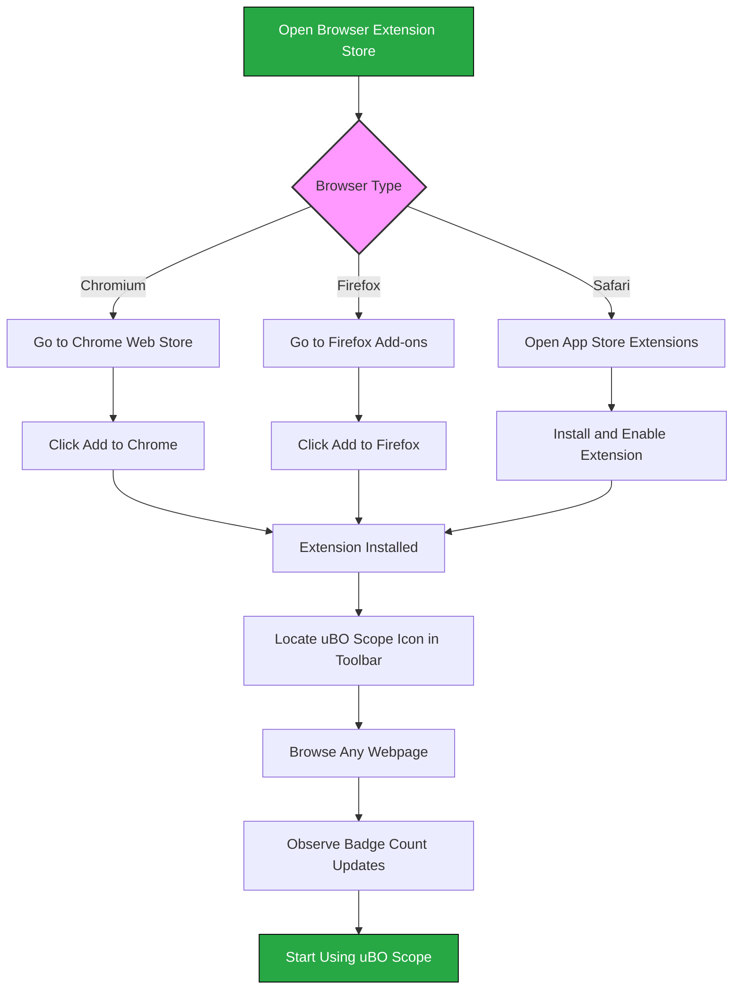

# Installing uBO Scope on Your Browser

## Introduction
This guide walks you through installing the uBO Scope browser extension on supported browsers, including Chrome, Firefox, and Safari. By following these steps, you'll set up uBO Scope to start monitoring third-party network connections, giving you precise insight into your web privacy footprint.

---

## What You Will Achieve
- Install uBO Scope safely and correctly on your browser.
- Verify that the extension is enabled and functioning.
- Prepare your environment to immediately start monitoring third-party connections.

## Prerequisites
- You must have one of the supported browsers installed with the minimum required version:
  - Google Chrome or any Chromium-based browser: version 122.0 or later.
  - Mozilla Firefox: version 128.0 or later.
  - Safari: version 18.5 or later.
- Basic knowledge of how to install browser extensions from the official stores.
- Internet connection to download the extension.

For detailed system requirements, please refer to the [Supported Browsers & System Requirements](../installation-and-prerequisites/system-requirements) guide.

---

## Step-by-Step Installation

### 1. Installing uBO Scope on Chromium Browsers (e.g., Google Chrome, Edge)

1. Open the Chrome Web Store uBO Scope page: [uBO Scope on Chrome Web Store](https://chrome.google.com/webstore/detail/ubo-scope/bbdpgcaljkaaigfcomhidmneffjjjfgp).
2. Click the **Add to Chrome** button.
3. Confirm any prompts to add the extension.
4. Wait for the extension to download and install; the uBO Scope icon will appear in your browser's toolbar.

### 2. Installing uBO Scope on Mozilla Firefox

1. Navigate to the Firefox Add-ons page: [uBO Scope on Firefox Add-ons](https://addons.mozilla.org/firefox/addon/ubo-scope/).
2. Click the **Add to Firefox** button.
3. Review extension permissions and click **Add** to confirm.
4. Once installed, the uBO Scope icon will appear in the toolbar.

### 3. Installing uBO Scope on Safari

1. Open the Safari Extensions section in the App Store.
2. Search for **uBO Scope**.
3. Install the extension following the App Store instructions.
4. Enable uBO Scope in Safari’s Preferences under the Extensions tab.

> <Tip>
> Safari users must enable the extension manually upon installation via the Safari Preferences.
> </Tip>

### 4. Manual Installation (For Advanced Users)

If you prefer manual installation or use a less common Chromium-based browser:

1. Download the extension package from the GitHub repository releases or build it locally following platform-specific instructions.
2. Open your browser's extensions page (e.g., `chrome://extensions/` in Chromium browsers).
3. Enable **Developer mode**.
4. Load the unpacked extension by selecting the local folder.

Refer to the project’s repository for advanced installation details: [uBO-Scope GitHub](https://github.com/gorhill/uBO-Scope).

---

## Verifying Successful Installation

### Confirm Extension is Enabled
- Look for the uBO Scope icon in your browser toolbar.
- Click the icon to open the popup interface.

### Validate Extension Activity
- Browse to any website and watch the badge count update, showing the number of distinct third-party servers connected.
- If the badge shows a number, the extension is actively tracking network requests.

For detailed validation steps and troubleshooting, see [Quick Validation & Troubleshooting](../setup-and-first-use/verifying-functionality).

---

## Best Practices

- Use official extension stores whenever possible for installed extensions.
- Keep your browser updated to ensure compatibility.
- After installation, familiarize yourself with the toolbar badge and popup interface to interpret results effectively.

---

## Troubleshooting Common Issues

<AccordionGroup title="Installation Troubleshooting">
<Accordion title="uBO Scope Icon Not Visible After Installation">
- Ensure the extension is enabled in your browser’s extension or add-on manager.
- In Chrome, pin the extension to the toolbar via the extensions menu.
- Restart the browser if necessary.
- For Safari, verify manual enablement in Preferences > Extensions.
</Accordion>
<Accordion title="Unable to Install Extension from Store">
- Confirm your browser version meets minimum requirements.
- Check internet connectivity.
- Review permissions requested by the extension for blocking issues.
- If persistent, consider manual installation.
</Accordion>
</AccordionGroup>

---

## Additional Notes

- uBO Scope functions by using the browser's `webRequest` API, so network requests invisible to this API (e.g., some DNS-based blocking) will not be reported.
- Installation across different browsers behaves similarly but always verify version compatibility.

---

## What’s Next?

- After installation, proceed to learn how to launch and access the extension in [Launching and Accessing uBO Scope](../setup-and-first-use/launching-the-extension).
- Understand what the toolbar badge means in [Understanding the Toolbar Badge](../setup-and-first-use/understanding-the-badge).
- Explore network activity analysis using the guides in the Analyzing Network Activity section.

---

## Resources
- [uBO Scope GitHub Repository](https://github.com/gorhill/uBO-Scope)
- [Supported Browsers & System Requirements](../installation-and-prerequisites/system-requirements)
- [Quick Validation & Troubleshooting](../setup-and-first-use/verifying-functionality)

---

## Summary Diagram: Installation Flow

---