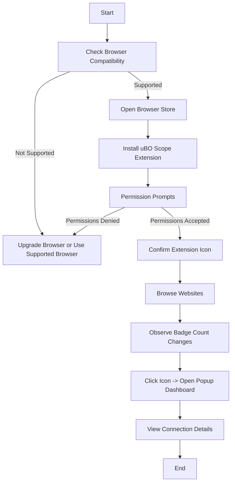

# Install, Setup, and Quickstart Guide for uBO Scope

Welcome to the quickstart guide for uBO Scope. This guide will help you install uBO Scope on your browser (Chromium, Firefox, or Safari), understand how to interpret the toolbar badge, and verify that the extension is running and monitoring network connections effectively.

---

## 1. What This Guide Helps You Accomplish

- **Install** uBO Scope effortlessly on supported browsers.
- **Understand** the meaning of the badge count shown on the toolbar icon.
- **Verify** that uBO Scope is actively monitoring network connections in your browser.

By following this guide, you will get uBO Scope up and running, ready to provide you with detailed visibility of remote server connection activity from your tabs.

---

## 2. Prerequisites

Before you begin, ensure:

- You have a supported browser:
  - Chromium-based browsers (Chrome 122 or newer)
  - Firefox 128 or newer
  - Safari 18.5 or newer
- You have a stable internet connection to access the browser's extension store.

If you want to confirm your browser version compatibility or need detailed prerequisites, please see the [Prerequisites & Supported Browsers](/getting-started/installation-and-setup/prerequisites) documentation.

---

## 3. Installation Steps

### Step 1: Choose Your Browser Store

uBO Scope is available in the following official extension stores:

| Browser         | Install Link                                                 |
|-----------------|--------------------------------------------------------------|
| Chromium-based   | [Chrome Web Store](https://chromewebstore.google.com/detail/ubo-scope/bbdpgcaljkaaigfcomhidmneffjjjfgp)  |
| Firefox         | [Firefox Add-ons](https://addons.mozilla.org/firefox/addon/ubo-scope/)                                  |

*Note*: Safari installation instructions are upcoming or may require manual loading; check your browser's extension gallery or your system administrator.

### Step 2: Install the Extension

1. Navigate to the official store link for your browser.
2. Click **Add to Browser** or **Install**.
3. Approve any permission prompts. uBO Scope requires permissions such as `activeTab`, `storage`, and `webRequest` to operate correctly.

### Step 3: Confirm Installation

- After installation, you should see the uBO Scope icon (a shield) near your browser's address bar.
- Clicking the icon will open the uBO Scope popup dashboard (see more in [Using the Popup: Navigating the Dashboard](/guides/getting-started/popup-navigation-basics)).

---

## 4. Understanding the Toolbar Badge

When uBO Scope is active, its toolbar icon badge shows a **count of distinct third-party domains** that your current tab has connected to. This count includes:

- Domains that connections were **allowed** (not blocked).
- The badge reflects the **number of distinct remote servers**, not the total requests.

A **lower badge count is better**, as it indicates fewer third-party connections, which aligns with better privacy and security practices.

### What the Badge Does NOT Show

- It does not indicate the number of blocked connections.
- It does not rank or compare content blockers but shows distinct remote servers contacted.

For detailed context on badge meaning and network outcomes, review the [Mythbusting: Understanding Block Counts and Badges](/guides/best-practices-expert-tips/mythbusting-block-counts) documentation.

---

## 5. Verifying uBO Scope Operation

### Step 1: Open a New Tab or Browser Window

Navigate to any website.

### Step 2: Observe the Badge

- Look at the uBO Scope icon in the toolbar.
- You should see a number indicating distinct third-party connections.

### Step 3: Open the Popup Dashboard

- Click the uBO Scope icon.
- The popup will display three sections:
  - **Not Blocked**: Domains to which connections were allowed.
  - **Stealth-Blocked**: Domains where connections were modified or stealth-blocked.
  - **Blocked**: Domains where connections were actively blocked.
- The summary shows how many distinct domains were contacted in total.

### Step 4: Test Dynamic Updates

- Refresh or navigate to different websites.
- Observe the badge count and popup dashboard update accordingly.

---

## 6. Expected Outcome

By completing these steps:

- uBO Scope is installed and running in your browser.
- The toolbar icon badge reflects real-time counts of third-party remote connections.
- The popup dashboard shows detailed connection outcomes per domain.

This setup equips you with immediate visibility into your browsing network connections.

---

## 7. Best Practices and Tips

- Keep your browser updated to meet or exceed minimum version requirements.
- If the badge does not appear, try disabling and re-enabling the extension or restarting your browser.
- Familiarize yourself with the permissions requested; these are essential for capturing reliable network data.
- Use the popup dashboard often to get a clear understanding of your network exposure.

---

## 8. Troubleshooting Common Issues

<AccordionGroup title="Common Issues with Installation and Startup">
<Accordion title="The uBO Scope icon or badge is not visible">
- Confirm your browser version meets minimum requirements.
- Check the extension is enabled in your browser’s extensions manager.
- Restart your browser to refresh extension state.
</Accordion>
<Accordion title="The badge count is always zero or missing">
- Reload the active tab.
- Verify that the site is making network connections (try sites with multiple third-party resources).
- Ensure permissions for `webRequest` and `storage` are granted.
</Accordion>
<Accordion title="Popup dashboard shows 'NO DATA' or no domain entries">
- Allow a few seconds after loading a page for data to populate.
- Refresh the tab or change to a different site with known third-party resources.
</Accordion>
<Accordion title="Installation fails or permission prompts are blocked">
- Review your browser’s extension installation policies (could be administrative restrictions).
- Reinstall from official browser stores.
</Accordion>
</AccordionGroup>

For a comprehensive list of troubleshooting steps, please visit [Troubleshooting Common Issues](/getting-started/validation-and-troubleshooting/troubleshooting-common-issues).

---

## 9. What’s Next?

After confirming successful installation and operation:

- Explore the [Using the Popup: Navigating the Dashboard](/guides/getting-started/popup-navigation-basics) to dive deeper into connection data.
- Learn about [Core Concepts and Terminology](/overview/architecture-concepts/core-concepts-terminology) to fully understand connection categories.
- Check out [Validating a Successful Install](/getting-started/validation-and-troubleshooting/validating-install) for ways to ensure ongoing operation.

---

## Appendix: Quick Reference Commands for Manual Packaging (Advanced Users)

For advanced users or developers interested in building the extension package manually for specific platforms (e.g., Chromium, Firefox, Safari), here is an excerpt from the build script:

```sh
#!/usr/bin/env bash

if [ -z "$1" ]; then
    echo "*** Error: need platform name"
    exit 1
fi

PLATFORM="$1"
DES=build/uBO-Scope."$PLATFORM"

rm -rf "$DES"
mkdir -p "$DES"

cp -R assets                       "$DES"/
cp -R css                          "$DES"/
cp -R img                          "$DES"/
cp -R js                           "$DES"/
cp ./*.html                        "$DES"/
cp platform/"$PLATFORM"/manifest.json "$DES"/
cp LICENSE.txt                     "$DES"/
cp README.md                       "$DES"/

mkdir -p "$DES"/js/lib
cp node_modules/punycode/punycode.es6.js "$DES"/js/lib/

# Version provided as argument
if [ -n "$2" ]; then
    tmp=$(mktemp)
    jq --arg a "$2" '.version = $a' "$DES/manifest.json" > "$tmp" && \
        mv "$tmp" "$DES/manifest.json"
fi
```

---

## Visual Summary: Installation Flowchart



---

## Summary

This guide walks you through installing uBO Scope on your browser, understanding its toolbar badge indicator, and verifying that it actively monitors network requests with visual connection reporting in the popup.

Successful completion means uBO Scope will give you transparent, real-time insight into third-party network connections per browser tab.

For more detailed information on prerequisites, installation steps, and troubleshooting, refer to the linked documentation throughout this guide.
