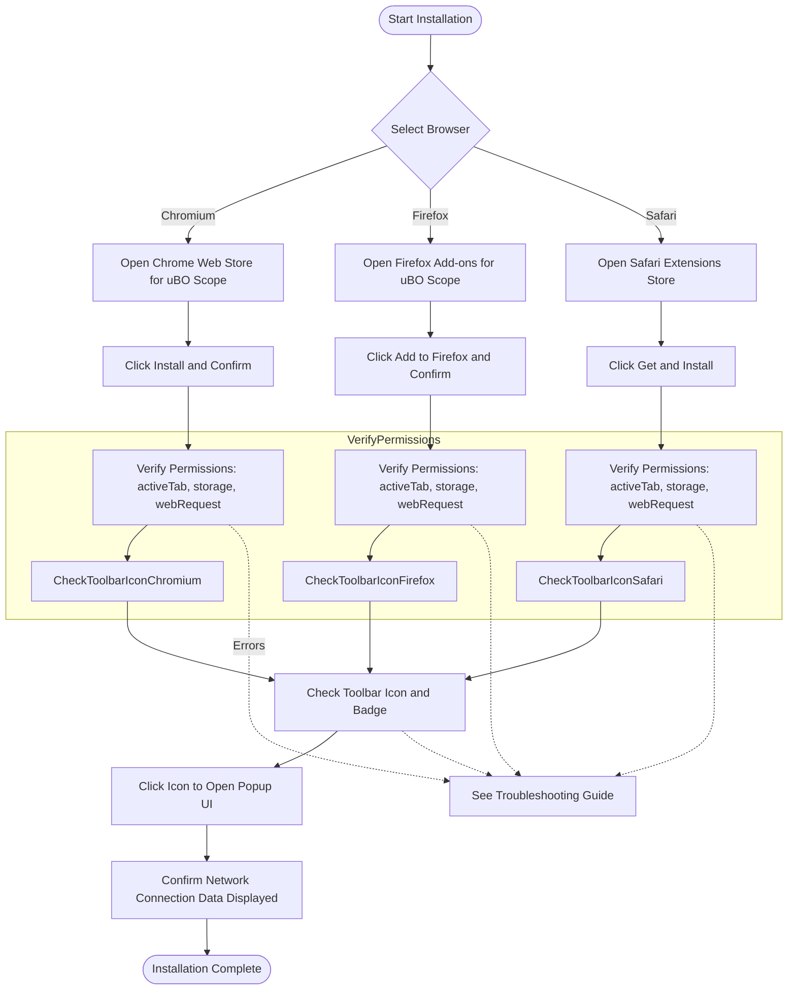

# Installation and Setup Guide for uBO Scope

## 1. Overview

This guide provides clear, step-by-step instructions to install the uBO Scope browser extension on supported browsers: Chromium-based browsers (such as Google Chrome), Firefox, and Safari. By following this walkthrough, you'll have uBO Scope running and monitoring your browser's third-party network connections immediately.

### What This Guide Covers
- Installing uBO Scope from official browser stores
- Understanding and verifying necessary extension permissions
- Confirming the extension's initial launch and readiness for monitoring

### Prerequisites
- A supported browser:
  - Chromium version 122.0 or later (e.g., Chrome, Edge)
  - Firefox version 128.0 or later
  - Safari version 18.5 or later
- Access to the browser’s extension/add-ons store
- Basic familiarity with installing browser extensions

### Expected Outcome
Once complete, your browser's toolbar will display the uBO Scope icon, ready to report on all network connections made to third-party servers during your browsing sessions.

### Time Estimate
Installation and setup typically take less than 5 minutes.

### Difficulty Level
Beginner

---

## 2. Step-by-Step Installation Instructions

### Step 1: Choose Your Browser
Select the browser where you want to install uBO Scope. This guide covers Chromium, Firefox, and Safari.

---

### Step 2: Access the Official Extension Store

- **Chromium/Chrome:**
  - Visit the [Chrome Web Store page for uBO Scope](https://chromewebstore.google.com/detail/ubo-scope/bbdpgcaljkaaigfcomhidmneffjjjfgp).

- **Firefox:**
  - Visit the [Firefox Add-ons page for uBO Scope](https://addons.mozilla.org/firefox/addon/ubo-scope/).

- **Safari:**
  - Use the macOS App Store or Safari Extensions Gallery and search for 'uBO Scope' compatible with Safari 18.5+

---

### Step 3: Install the Extension

- Click the install/add button for uBO Scope in your browser's extension store page.
- Confirm any prompts to allow and install the extension.

---

### Step 4: Verify Required Permissions

uBO Scope needs specific permissions to operate effectively. After installation, ensure the following permissions are allowed:

- **Active Tab Access:** Allows monitoring the currently active tab.
- **Storage:** Necessary to save session data and preferences.
- **WebRequest:** Grants access to network request details so the extension can log third-party connections.

If your browser asks for permission requests during or after installation, accept them for uBO Scope to function properly.

---

### Step 5: Confirm the Toolbar Icon and Badge

- Look for the uBO Scope icon in the browser toolbar; the icon uses distinctive uBO graphics.
- Upon browsing any webpage, the badge on the icon will display a number representing the count of distinct third-party domains your browser has connected to.

This badge shows that uBO Scope is actively monitoring and reporting network connections.

---

### Step 6: Open the Popup UI

- Click the uBO Scope toolbar icon to open its popup interface.
- The popup will display:
  - The domain name of the active tab.
  - Counts and lists of domains in three categories:
    - **Not Blocked** (allowed connections)
    - **Stealth-Blocked** (requests blocked silently)
    - **Blocked** (requests outright blocked)

This interface reflects uBO Scope’s monitoring in real time.

---

## 3. Practical Tips & Best Practices

- **Keep Your Browser Updated:** To ensure compatibility and security, use the latest browser versions.
- **Permissions May Vary:** Different browsers may prompt for permissions differently; always allow the required permissions for full functionality.
- **Browsing Generates Data:** The badge and popup populate with data only after visiting websites that make external third-party connections.
- **Use uBO Scope Alongside Your Content Blocker:** uBO Scope does not interfere with existing content blockers but provides transparent insight into network activity regardless of what blockers are installed.

---

## 4. Troubleshooting Common Installation Issues

<AccordionGroup title="Common Installation and Setup Issues">
<Accordion title="uBO Scope Icon Does Not Appear After Installation">
- Ensure the extension is enabled in your browser’s extensions/add-ons manager.
- Restart your browser if needed.
- On some browsers, the extension icon may be hidden behind the overflow menu; check there.
</Accordion>
<Accordion title="Permissions Not Granted or Prompt Does Not Appear">
- Check your browser's permission settings for the extension and manually adjust permissions if available.
- If necessary, remove and reinstall the extension.
</Accordion>
<Accordion title="Badge Count Always Empty or Zero">
- Visit popular websites with known third-party content.
- The badge only counts distinct third-party domains connected during active browsing sessions.
- Verify that other content blockers don’t prevent uBO Scope from receiving network request events (uBO Scope observes all requests the browser processes).
</Accordion>
</AccordionGroup>

---

## 5. What’s Next?

After installing and confirming uBO Scope is monitoring your browser, explore these next steps:

- Visit [Your First Session: Checking Connections](../../getting-started/first-use-and-validation/first-use) to learn how to interpret your first network connection data.
- Read [Initial Configuration](../../getting-started/installation-and-setup/first-configuration) to adjust setup for your workflow.
- If you encounter difficulties, consult [Troubleshooting Common Issues](../../getting-started/first-use-and-validation/troubleshooting).

---

## 6. Additional Resources

- [uBO Scope GitHub Repository](https://github.com/gorhill/uBO-Scope) for source and updates
- [How uBO Scope Works: System Overview](../architecture-core-concepts/system-overview-architecture) for architectural details

---

## Summary

This guide ensures you easily install and start using uBO Scope across supported browsers. Following these instructions guarantees that you receive immediate network connection transparency insights to better understand your browsing privacy and blocking effectiveness.

---

# Visual Installer Workflow Diagram

---

# Summary

uBO Scope Installation and Setup guide provides clear, sequential steps to install the extension on Chromium, Firefox, and Safari browsers from official stores, verify required permissions, and confirm the extension’s active monitoring status through the toolbar icon and popup UI. Included are troubleshooting tips for common issues and recommendations for best practices.

---