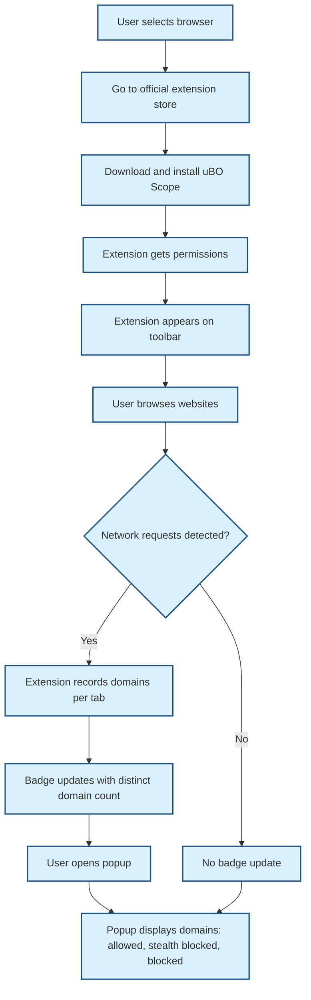

# Installing and Setting Up uBO Scope

## Workflow Overview

### Task Description
This guide walks you through installing uBO Scope, a browser extension that reveals all network connections webpages attempt or successfully make. You will learn how to acquire the extension for your preferred browser, install it correctly, and verify that it is active and monitoring connections.

### Prerequisites
- A supported browser: Chromium (Chrome, Edge), Firefox, or Safari.
- Ensure your browser version meets the minimum required version:
  - Chromium-based browsers: version 122 or later.
  - Firefox: version 128 or later.
  - Safari: version 18.5 or later.

### Expected Outcome
- uBO Scope is installed and visible in your browser's toolbar.
- The extension icon badge dynamically updates to reflect third-party network connections.
- You can open the uBO Scope popup to review current network connection data.

### Time Estimate
Approximately 5 to 10 minutes depending on your familiarity with browser extensions.

### Difficulty Level
Beginner

---

## Step-by-Step Installation and Setup Instructions

### 1. Choose Your Browser and Download uBO Scope

- Navigate to the appropriate extension store for your browser:
  - **Chromium** (Google Chrome, Microsoft Edge): [Chrome Web Store - uBO Scope](https://chromewebstore.google.com/detail/ubo-scope/bbdpgcaljkaaigfcomhidmneffjjjfgp)
  - **Firefox**: [Firefox Add-ons - uBO Scope](https://addons.mozilla.org/firefox/addon/ubo-scope/)
  - **Safari**: Visit the Mac App Store or Safari Extensions Gallery; ensure your Safari version is 18.5 or above.

<Tip>
Always download extensions from official extension stores to ensure secure, verified versions.
</Tip>

### 2. Install the Extension

- Click the 'Add to Browser' or equivalent button in the store page.
- Grant the requested permissions when prompted. uBO Scope requires:
  - Access to active tabs.
  - Use of storage for session data.
  - Web request monitoring permissions to observe network activity.

<Note>
uBO Scope only monitors requests routed through the browser's `webRequest` API, which sometimes depends on granted permissions.
</Note>

### 3. Confirm Installation

- Look for the uBO Scope icon in your browser toolbar. It shows the extension logo.
- If the icon is not visible:
  - Verify the extension is enabled via your browser’s extensions management page.
  - Pin the extension icon to the toolbar if your browser supports it.

### 4. Verify Functionality

- Visit any website known to load external resources (e.g., news sites, content-heavy portals).
- Observe the uBO Scope badge count on the toolbar icon:
  - The badge displays the number of distinct third-party remote servers the site connected to.
  - A lower number generally means fewer third-party connections.

- Click the uBO Scope icon to open the popup view.
- Review the data broken down into three categories:
  - **Not Blocked:** Domains successfully connected.
  - **Stealth Blocked:** Connections prevented stealthily by content blockers.
  - **Blocked:** Connections explicitly blocked.

<Tip>
If you see ‘NO DATA’ or no domains listed, reload the page to trigger capture of network requests.
</Tip>

### 5. Basic Usage Tips

- The badge number indicates live network connection count per tab.
- Click the extension icon anytime to inspect connection details for the current tab.
- Keep the extension enabled alongside your regular content blocker for comprehensive insight.

---

## Troubleshooting Common Issues

### Extension Icon Not Visible
- Check if the extension is enabled:
  - Chrome: `chrome://extensions/`
  - Firefox: `about:addons`
  - Safari: Safari Extensions in Preferences.
- Pin the icon to the toolbar.

### Badge Count Not Updating
- Reload the active webpage to force new data capture.
- Confirm permissions include webRequest in your browser settings.
- Restart the browser to reset the extension state.

### Popup Shows No Data
- Wait a few seconds after page load for data collection.
- Ensure you are viewing an active tab with network activity.
- Disable other extensions that might interfere with network monitoring.

<Tip>
Consult the official uBO Scope GitHub repository for community tips and reporting issues: [uBO-Scope GitHub](https://github.com/gorhill/uBO-Scope)
</Tip>

---

## Additional Resources

- [What is uBO Scope?](../../overview/product-introduction-core-concepts/what-is-ubo-scope) — Understand the purpose and core ideas.
- [First Use & Configuration Guide](../../getting-started/onboard-intro-basics/first-use-and-configuration) — Learn how to interpret popup data.
- [Troubleshooting Setup Issues](../../getting-started/onboard-intro-basics/troubleshooting-setup) — Fix common problems.

---

## Summary

Installing uBO Scope equips you with a powerful tool to transparently monitor third-party network connections initiated by webpages. By following this guide, you ensure the extension is properly set up and working, ready to provide real-time insights into your browsing security and privacy.

---

## How uBO Scope Integrates

Behind the scenes, uBO Scope hooks into your browser's `webRequest` API to monitor network requests per tab. It collects detailed information about domains connected, categorizing them by their outcome (allowed, blocked, or stealth-blocked). This data is persistently stored per browsing session and visually summarized in the toolbar badge and popup UI.

---

## Visual Overview: Installation and Data Flow

---

## Best Practices

- Keep uBO Scope updated by installing official updates from your browser store.
- Combine uBO Scope with recommended content blockers to maximize privacy.
- Use the popup to identify unexpected third-party connections for advanced privacy auditing.

---

## Common Pitfalls

- Installing outdated versions on unsupported browser versions causes failures.
- Ignoring permission prompts prevents uBO Scope from functioning.
- Relying solely on badge count without checking popup details can mislead regarding blocking effectiveness.

---

## Summary
Ensure you install uBO Scope from your browser’s official extension store, confirm permissions, and verify that the toolbar icon and badge react to network activity. Use the popup interface to explore detailed connection outcomes, enabling deeper insight into your browsing security and privacy.
