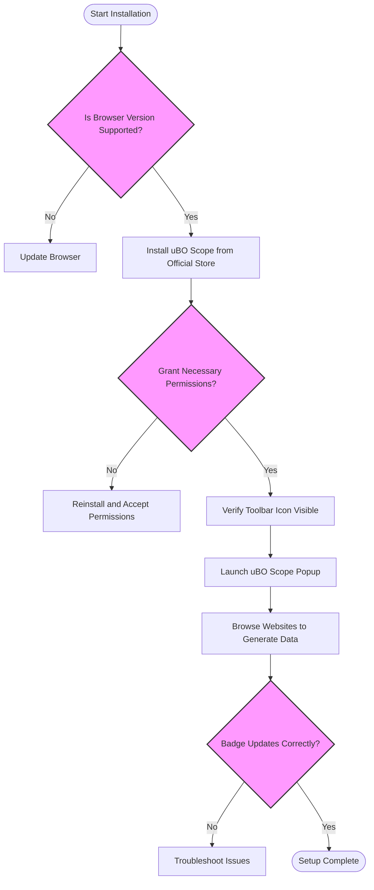

# Installing and Launching uBO Scope

## Workflow Overview

This guide will walk you through installing the uBO Scope extension on supported browsers (Chromium-based browsers, Firefox, and Safari), enabling it properly, and launching the popup interface for the first time. You will learn how to verify the extension is installed and working, so you can begin monitoring web page connections immediately.

### Prerequisites
- A supported browser version installed:
  - Chromium-based browsers (Chrome, Edge, Brave, etc.) version 122 or later
  - Firefox version 128 or later
  - Safari version 18.5 or later
- Basic familiarity with browser extensions and how to install them from official stores
- Internet connection to download and install the extension

### Expected Outcome
- uBO Scope installed and enabled
- Browser toolbar shows the uBO Scope icon
- Popup opens displaying no data initially or connection summaries after browsing
- Badge count on the icon reflects the number of third-party domains connected

### Time Estimate
5-10 minutes

### Difficulty Level
Beginner

---

## Step-by-Step Instructions

### 1. Choose Your Browser and Confirm Version

To ensure compatibility, verify your browser version:
- **Chrome/Chromium:** Go to `chrome://settings/help` and confirm version is 122 or above
- **Firefox:** Go to `about:support` and check Application Update version is 128 or above
- **Safari:** Use `Safari > About Safari` and confirm version is 18.5 or later

<Tip>
If your browser version is below the required minimum, update to the latest stable release before proceeding.
</Tip>

### 2. Install uBO Scope Extension

Depending on your browser, install uBO Scope from the official store to ensure security and automatic updates.

- **For Chromium-based browsers:**
  1. Visit the [Chrome Web Store uBO Scope page](https://chromewebstore.google.com/detail/ubo-scope/bbdpgcaljkaaigfcomhidmneffjjjfgp)
  2. Click **Add to Chrome** (or the equivalent button)
  3. Confirm installation

- **For Firefox:**
  1. Go to the [Firefox Add-ons page for uBO Scope](https://addons.mozilla.org/firefox/addon/ubo-scope/)
  2. Click **Add to Firefox**
  3. Confirm any permission prompts

- **For Safari:**
  1. Open the Mac App Store or Safari Extensions Gallery
  2. Search for "uBO Scope"
  3. Install and enable the extension in Safari's Extensions preferences

<Warning>
Do not install uBO Scope from untrusted third-party sites to avoid security risks.
</Warning>

### 3. Enable Necessary Permissions

After installation, uBO Scope requires permissions to monitor network requests and function correctly:

- **Active Tab** permission: For accessing current tab info
- **Web Request** permission: To intercept network requests
- **Storage** permission: To save session data

Usually, these are granted automatically during installation. If prompted, accept all permissions.

### 4. Confirm uBO Scope Icon Appears in Toolbar

Locate the uBO Scope extension icon in your browser's toolbar (often near the address bar).

- In Chromium browsers, you may need to pin the extension icon via the extensions menu
- On Firefox, it generally appears immediately after installation
- Safari shows the icon after enabling the extension in Preferences

### 5. Launch the Popup Interface

Click the uBO Scope icon to open its popup window. Upon first launch, you may see:

- **NO DATA** message if no page connections have been recorded yet
- Or a domain summary if the current tab has recorded connections

The popup displays connection data tabulated by categories: *allowed*, *stealth-blocked*, and *blocked* domains.

### 6. Start Browsing and Verify Activity

Navigate to any webpage to trigger network requests. Then, click the uBO Scope icon again to:

- View the updated domains connected
- See the toolbar badge update with the number of distinct third-party domains connected

<Tip>
Browsing popular sites with multiple third-party resources (e.g. news sites, e-commerce) offers a good way to test uBO Scope's visibility.
</Tip>

### 7. Verify Extension Operation

- The icon badge shows a number (or remains blank if none)
- The popup updates dynamically with domain connection counts
- Categories (allowed, stealth, blocked) populate appropriately

If these behaviors are observed, uBO Scope is fully installed and active.

<Check>
If the popup shows 'NO DATA' after browsing websites, or the badge remains empty despite network activity, re-check permissions or restart your browser.
</Check>

---

## Troubleshooting & Tips

### Common Issues

- **Extension icon not visible**: Pin it manually from the extensions menu or restart browser
- **Popup does not show data**: Confirm host permissions and that browsing activity has occurred
- **Permissions prompts declined**: Re-install and accept required permissions
- **Browser version too low**: Update browser to a supported release

### Best Practices

- Keep your browser updated to ensure compatibility and security
- Install uBO Scope from official stores only
- Regularly review popup data to monitor your browsing network footprint

### Performance Considerations

uBO Scope actively listens to all network requests on pages, which might incur minimal browser overhead. This is normal and optimized for modern browsers.

### Alternative Launch Method

If the toolbar icon is problematic, try accessing uBO Scope via the browser's extensions management page and launching its popup from there.

---

## Next Steps & Related Content

- After installation, explore the [Using the Extension for the First Time](/getting-started/first-use-and-validation/using-the-extension) guide to understand the popup and data interpretation.
- Consult [Prerequisites and System Requirements](/getting-started/installation-and-setup/prerequisites) for detailed environment info.
- If you encounter issues, refer to [Troubleshooting Common Installation & Setup Issues](/getting-started/troubleshooting-and-faq/common-issues).
- Dive into [Quick Validation Steps](/getting-started/first-use-and-validation/quick-validation) to confirm your setup quickly.
- For deeper understanding, visit [Core Concepts & Terminology](/overview/core-concepts-architecture/concepts-terminology) and [System Architecture Overview](/overview/core-concepts-architecture/system-architecture).

---

## Example Scenario

You have a fresh Chrome installation on version 124. You navigate to the Chrome Web Store and add uBO Scope. After adding, you check the extension icon pinned to the toolbar. Clicking it opens a popup with "NO DATA". You then open a news website, click the uBO Scope icon again, and now see a list of domains categorized by allowed, stealth, and blocked, with a badge count on the icon showing how many third parties were contacted.

This confirms successful installation and operation.

---

## Frequently Asked Questions

<AccordionGroup title="FAQs on Installing and Launching uBO Scope">
<Accordion title="Why doesn't the badge update or show a number?">
Make sure you have browsed some web pages after installing. The badge only updates when the extension processes connection data for the active tab. Also, verify permissions and that the extension is enabled.
</Accordion>
<Accordion title="Can I manually enable permissions if I declined them initially?">
Yes, remove and re-install the extension, ensuring that you accept permission prompts during installation.
</Accordion>
<Accordion title="Is uBO Scope compatible with all browsers?">
uBO Scope supports Chromium browsers (v122+), Firefox (v128+), and Safari (v18.5+). Other browsers are not supported.
</Accordion>
<Accordion title="How do I open the popup if the icon is not visible?">
Open your browser’s Extensions or Add-ons page, find uBO Scope, and use the provided interface to open its popup, or pin the icon to the toolbar.
</Accordion>
</AccordionGroup>

---

## Summary Diagram of Installation Flow

---

## Additional Resources
- [uBO Scope Official GitHub Repository](https://github.com/gorhill/uBO-Scope)
- [Prerequisites and System Requirements Guide](/getting-started/installation-and-setup/prerequisites)
- [Using the Extension for the First Time Guide](/getting-started/first-use-and-validation/using-the-extension)
- [Troubleshooting Common Issues](/getting-started/troubleshooting-and-faq/common-issues)

---