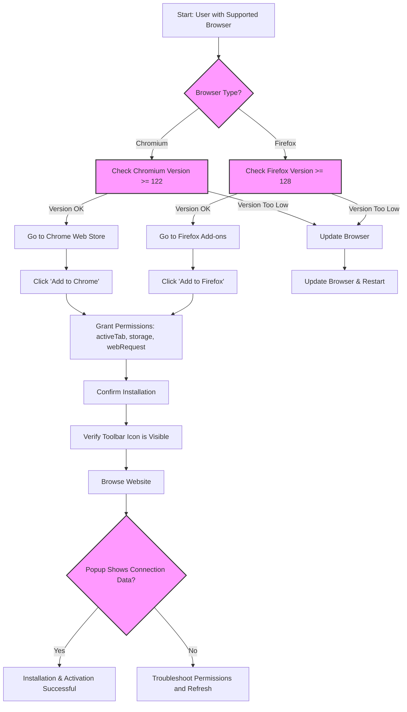

# Installation & Activation Guide

This guide provides a practical, step-by-step walkthrough to install uBO Scope on **Chromium-based** browsers (including Chrome) and **Firefox**. It ensures your extension is properly activated and ready to deliver detailed insights about all remote server connections initiated by webpages.

---

## 1. Installation Overview

uBO Scope is a lightweight browser extension designed to work seamlessly on modern browsers. This guide helps you quickly install and activate the extension from official stores, verify compatibility, and confirm proper activation.

### Supported Browsers & Minimum Requirements

- **Chromium-based browsers (Chrome, Edge, Brave, etc.)**
  - Minimum Chrome version: 122.0
- **Mozilla Firefox**
  - Minimum Firefox version: 128.0

> For other browsers like Safari, please refer to the dedicated platform-specific installation guides.

### What You Will Achieve

- Install uBO Scope securely from official extension stores
- Ensure all necessary permissions granted for full functionality
- Activate uBO Scope and verify it is running correctly on your browser

### Time Estimate

Approximately 5 minutes to install and confirm activation.

---

## 2. Installing on Chromium-Based Browsers

### Step 1: Confirm Browser Version

Before installing, confirm your browser version meets the minimum requirement (Chrome 122.0 or higher).

- Open your Chromium browser.
- Navigate to `chrome://settings/help`.
- Verify your version number.

### Step 2: Install uBO Scope from Chrome Web Store

1. Go to the [uBO Scope Chrome Web Store page](https://chromewebstore.google.com/detail/ubo-scope/bbdpgcaljkaaigfcomhidmneffjjjfgp).
2. Click the **Add to Chrome** button.
3. Review the requested permissions:
   - Access to active tabs
   - Storage of data
   - Access to network requests (`webRequest` API)
4. Confirm installation by clicking **Add extension**.

### Step 3: Verify Installation Completion

- Upon installation, the uBO Scope icon should appear in your browser toolbar.
- The icon badge will initially be empty or display a count after browsing web pages.

### Step 4: Check Permissions and Activation

- Click the uBO Scope icon.
- The popup should open and attempt to show connection data; if it says 'NO DATA', proceed to browse a website to generate network activity.

<Tip>
If the icon is missing, check if the extension is hidden behind the extensions menu and pin it to the toolbar for quick access.
</Tip>

---

## 3. Installing on Firefox

### Step 1: Confirm Browser Version

Ensure you are running Firefox 128.0 or above:

- Open Firefox.
- Navigate to `about:support` or `about:preferences`.
- Look for the version number.

### Step 2: Install uBO Scope from Firefox Add-ons

1. Visit the [uBO Scope Firefox Add-ons page](https://addons.mozilla.org/firefox/addon/ubo-scope/).
2. Click **Add to Firefox**.
3. Grant the requested permissions:
   - Access to current active tab
   - Storage
   - Access to web requests
4. Confirm installation.

### Step 3: Verify Installation and Activation

- The uBO Scope icon will appear in the toolbar.
- Open the popup by clicking the icon; it will be empty until you browse some websites.

<Tip>
If you do not see the extension icon, check the overflow menu and pin the extension for convenient access.
</Tip>

---

## 4. Post-Installation Activation and Validation

After installation:

1. Open a new tab and visit a website with some network activity (e.g., a news site).
2. Click the uBO Scope icon.
3. Observe the badge count on the icon indicating the number of distinct third-party domains connected.
4. The popup panel displays categorized connection outcomes:
   - **Not blocked**: Domains allowed through
   - **Stealth-blocked**: Domains subject to stealth blocking
   - **Blocked**: Domains fully blocked

<Check>
Seeing a badge count and categorized connections indicates successful installation and activation.
</Check>

### Troubleshooting Tips

- If the popup shows “NO DATA”:
  - Refresh the webpage that you want to monitor.
  - Ensure the extension has the necessary permissions.
  - Restart the browser if needed.

- If the icon badge never updates:
  - Confirm your browser version supports required APIs.
  - Check for conflicts with other extensions.

---

## 5. Best Practices and Recommendations

- Always install from official browser extension stores to ensure authenticity.
- Keep your browser up to date to benefit from the latest compatibility and security fixes.
- Pin the extension icon for ease of access and quick validation.
- Regularly visit trusted websites after installation to see how uBO Scope reports network connections.

---

## 6. Additional Resources

- [System Requirements & Prerequisites](../../getting-started/setup-overview/prerequisites)
- [First Launch: What to Expect](../../getting-started/setup-overview/first-launch)
- [Quick Validation: Is It Working?](../../getting-started/usage-validation/quick-validation)
- [Troubleshooting Common Setup Issues](../../getting-started/usage-validation/troubleshooting-installation)
- [Understanding the Popup Panel](../getting-started/reading-the-popup)

---

## Summary

By following this guide, you have successfully installed and activated uBO Scope on your Chromium-based browser or Firefox. You are now ready to explore the network connections your browser makes through comprehensive, real-time reporting.

If you encounter difficulties beyond installation, consult the troubleshooting documentation or contact support via the official GitHub repository.

---

## Visual: Installation & Activation Flow

---