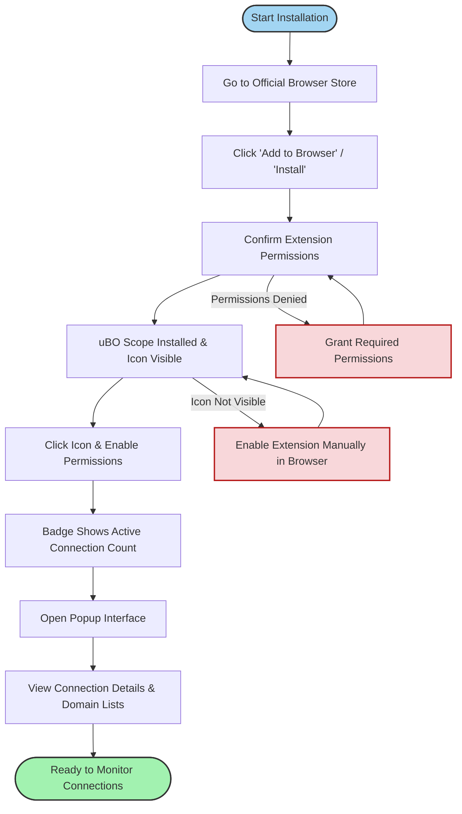

# Installing and Activating uBO Scope

## Overview
This guide walks you through the complete process of installing uBO Scope on supported browsers, activating it, and opening the extension popup for the first time. By following these steps, you will be ready to monitor third-party connections in real time, gaining visibility into all remote server connections your browser encounters.

---

## Prerequisites
Before you begin installation and activation, ensure the following:

- You are using a supported browser version:
  - **Chromium-based browsers** (Chrome 122.0 or later)
  - **Firefox** (version 128 or later, including Firefox for Android)
  - **Safari** (version 18.5 or later)
- Basic familiarity with adding browser extensions
- Internet connection to access your browser's extension store

---

## Expected Outcome
After completing this workflow, you will have uBO Scope installed and active in your browser toolbar. You'll be able to open the popup interface that displays real-time data about third-party connections made by the active tab, with clear categorization of allowed, stealth-blocked, and blocked domains.

---

## Estimated Time
Installation and activation typically take less than 5 minutes.

---

## Step-by-Step Instructions

<Steps>
<Step title="1. Access Your Browser's Extension Store">
Open your preferred browser and navigate to the official extension or add-on store:

- For Chromium-based browsers, go to the [Chrome Web Store](https://chromewebstore.google.com/detail/ubo-scope/bbdpgcaljkaaigfcomhidmneffjjjfgp)
- For Firefox, visit [Mozilla Add-ons](https://addons.mozilla.org/firefox/addon/ubo-scope/)
- For Safari, use the built-in Extensions section in your Safari browser settings (version 18.5+)

This ensures you install the official and latest version of uBO Scope.
</Step>

<Step title="2. Install uBO Scope Extension">
Click the “Add to Browser” button (or equivalent) on the extension's store page.

- Confirm any permission prompts required by the extension, specifically permissions to access active tabs, network requests, and storage.
- Wait for the installation to complete. The uBO Scope icon should appear in your browser's toolbar.

<Check>
If you do not see the icon immediately, check your browser’s extension management area to enable it manually.
</Check>
</Step>

<Step title="3. Enable and Activate uBO Scope">
After installation:

- Click the uBO Scope icon in the toolbar.
- If prompted, grant any remaining permissions needed to monitor network requests.

Activation requires these permissions so the extension can track requests made by webpages.

<Warning>
Without required permissions (especially `webRequest` and `activeTab`), uBO Scope cannot function properly.
</Warning>

Once activated, the icon badge will start displaying the number of distinct third-party remote servers your current tab connects to.

</Step>

<Step title="4. Open and Explore the Popup Interface">
Click the uBO Scope toolbar icon again to open the popup.

- The popup displays your current tab's primary hostname and domain.
- You’ll see three sections listing domains under categories:
  - **not blocked**: connections allowed
  - **stealth-blocked**: requests removed transparently during redirects
  - **blocked**: requests that failed or were blocked
- The count of connected domains is shown prominently.

This interface gives instant insight into your browsing exposure.

<Info>
For a detailed walkthrough of the popup interface, see the Explore the Popup Interface guide.
</Info>

</Step>
</Steps>

---

## Practical Tips & Best Practices

- **Refresh tabs after installation** to allow uBO Scope to start monitoring newly loaded content.
- Visit popular websites to see immediate connections and validate functionality.
- If you do not see badge counts or popup data, ensure the extension has all required permissions and your browser version is supported.

---

## Troubleshooting Common Issues

<AccordionGroup title="Common Setup Issues and Solutions">
<Accordion title="The uBO Scope icon badge is missing or shows no data">
- Confirm the extension is enabled in your browser’s extensions manager.
- Ensure you have granted necessary permissions during installation.
- Refresh the active tab to load monitoring.
- Check that you are on a webpage (not about:blank or browser settings).
</Accordion>

<Accordion title="The popup shows 'NO DATA' or empty sections">
- This may happen if the extension has not recorded any network activity yet.
- Reload the tab to initiate fresh network requests.
- Make sure your browser exposes network requests via the `webRequest` API without restrictions.
- For Safari users, verify minimum version 18.5 is installed.
</Accordion>

<Accordion title="Installation prompts fail or are blocked">
- Some browser environments restrict extension permissions; ensure you are installing from official stores.
- Restart the browser and attempt reinstalling if issues persist.
- Consult the Troubleshooting Common Setup Issues guide if problems continue.
</Accordion>
</AccordionGroup>

---

## Visualizing the Installation & Activation Flow

---

## Next Steps

After installing and activating uBO Scope:

- Explore [Exploring the Popup Interface](https://docs.example.com/guides/getting-started/exploring-popup) to understand the data presented.
- Review [Verifying Operation and Understanding the Badge](https://docs.example.com/getting-started/first-run-usage/validation-and-badge) to confirm your setup.
- Consult [Troubleshooting Common Setup Issues](https://docs.example.com/getting-started/first-run-usage/troubleshooting-install) for help resolving any unexpected behavior.

These next steps will help you get the most from uBO Scope's powerful monitoring capabilities.

---

## Additional Resources

- Official GitHub Repository: [https://github.com/gorhill/uBO-Scope](https://github.com/gorhill/uBO-Scope)
- Browser Store Links:
  - [Chrome Web Store](https://chromewebstore.google.com/detail/ubo-scope/bbdpgcaljkaaigfcomhidmneffjjjfgp)
  - [Firefox Add-ons](https://addons.mozilla.org/firefox/addon/ubo-scope/)
- System Requirements & Supported Browsers documentation for detailed compatibility info

