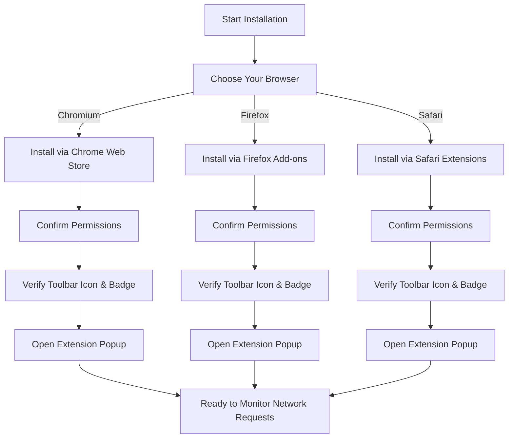

# Installation and Setup Guide for uBO Scope

## Overview
This guide walks you through installing uBO Scope on supported browsers, reviewing necessary permissions, and verifying that the extension is active and ready to use. Getting uBO Scope installed correctly is the first essential step to start monitoring all third-party remote server connections your browser attempts.

---

## Supported Browsers and Requirements
- **Chromium-based browsers (Chrome, Edge, Brave, etc.)**
  - Minimum version: 122.0
  - Install from the **Chrome Web Store**
- **Mozilla Firefox**
  - Minimum version: 128.0
  - Install from **Firefox Add-ons**
- **Apple Safari**
  - Minimum version: 18.5
  - Install via the **Safari Extensions Gallery or App Store**

uBO Scope requires permissions to monitor network requests and read tab data. These are granted automatically during installation but understanding them will help you troubleshoot if issues arise.

---

## Step-by-Step Installation

<Steps>
<Step title="Install from the Official Store">
1. Open your browser's official extension store:
   - [Chrome Web Store for Chromium browsers](https://chrome.google.com/webstore/detail/ubo-scope/bbdpgcaljkaaigfcomhidmneffjjjfgp)
   - [Firefox Add-ons for Firefox](https://addons.mozilla.org/firefox/addon/ubo-scope/)
   - Safari Extensions Gallery / App Store for Safari
2. Search for 'uBO Scope' or use the direct links.
3. Click **Add to Browser** or **Install**.
4. Confirm permissions during the installation prompt.

*Expected Result:* uBO Scope appears as an icon in the toolbar, and the extension is enabled.
</Step>

<Step title="Verify Toolbar Icon and Badge Appearance">
1. After installation, locate the uBO Scope icon in your browser’s toolbar.
2. Observe the badge number on the icon which indicates the number of distinct third-party remote servers connected on the active tab.

*Expected Result:* The icon is visible and the badge count updates as you browse.
</Step>

<Step title="Open the Extension Popup for Initial Overview">
1. Click the uBO Scope icon in your toolbar.
2. The popup displays:
   - The hostname of the active tab.
   - A summary of domains connected.
   - Separate lists showing domains grouped by connection outcome: **Not Blocked**, **Stealth-Blocked**, and **Blocked**.

*Expected Result:* The popup shows dynamic connection data for the current tab.
</Step>
</Steps>

---

## Understanding Key Permissions
uBO Scope requests the following permissions:
- **webRequest**: To observe all network requests and their outcomes.
- **activeTab**: To know which tab is active and display relevant data.
- **storage**: To save session data and public suffix lists for domain classification.
- **Host permissions**: Covers HTTP, HTTPS, and WebSocket schemes on all hosts.

These permissions ensure uBO Scope can provide accurate, real-time insights into your browser’s network traffic.

---

## Quick Start Tips
- If you have other content blockers installed, uBO Scope works alongside them without interference.
- The badge count reflects the number of distinct third-party domains currently connected, not total requests.
- Lower badge counts generally indicate fewer third-party connections, which may mean enhanced privacy.

---

## Common Pitfalls & Troubleshooting

<AccordionGroup title="Troubleshooting Installation Issues">
<Accordion title="The Toolbar Icon Does Not Appear">
- Confirm the extension is enabled in your browser’s extensions page.
- Restart your browser to refresh extension states.
- For Chromium browsers, check that minimum version 122 is met.
- In Firefox, verify version 128 or higher.
- Safari users ensure the extension is enabled in Safari's Extensions preferences.
</Accordion>
<Accordion title="Permissions Were Not Granted or Were Blocked">
- Reinstall uBO Scope and carefully accept all requested permissions.
- In browser settings, review permissions for uBO Scope and ensure none are disabled.
- Some organizational or security policies may restrict extension permissions.
</Accordion>
</AccordionGroup>

---

## What to Expect After Setup
- The toolbar badge updates in real time per active tab, reflecting observed third-party connections.
- The popup shows detailed breakdowns by connection outcome.
- You can immediately begin auditing your browsing sessions for transparency into network requests.

---

## Next Steps
- Explore the [First Look: Interpreting the Popup](https://your-docs-path/guides/getting-started/first-look-interpreting-the-popup) guide to understand the data displayed.
- Consult [Understanding Badge Counts and What They Mean](https://your-docs-path/guides/core-workflows/understanding-badge-counts) to decode the badge information.
- Visit [Troubleshooting Common Setup Issues](https://your-docs-path/getting-started/first-use/troubleshooting) if you encounter any problems.

---

## Additional Resources
- [uBO Scope Official Repository](https://github.com/gorhill/uBO-Scope)
- [Product Overview](https://your-docs-path/overview/getting-started-intro/product-overview)

---

## Visualizing Setup Flow

---

<small>uBO Scope © Raymond Hill - for more information, visit the <a href="https://github.com/gorhill/uBO-Scope">official GitHub repository</a>.</small>

