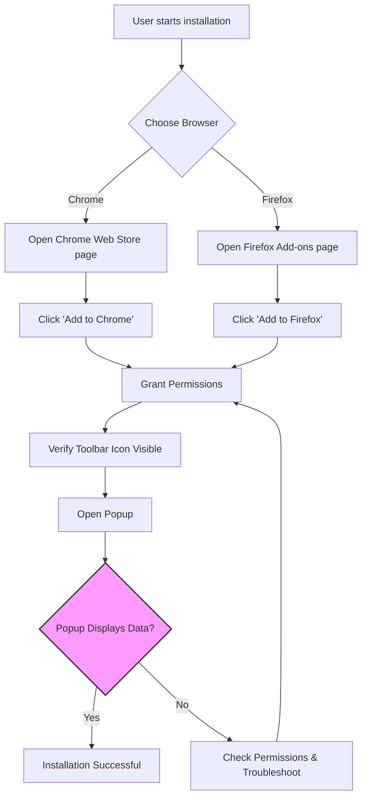

# Installation and Setup Guide for uBO Scope

## Overview
This guide takes you through the essential steps to successfully install uBO Scope on Chrome and Firefox browsers. You will learn how to enable the necessary permissions and verify that the extension is running correctly. This ensures you can start monitoring network connections immediately after installation.

---

## What You Will Achieve
- Install uBO Scope on your preferred supported browser.
- Enable all required permissions for full functionality.
- Confirm the extension is active and ready.

This setup puts you on track to gain real-time insights into network requests through uBO Scope.

---

## Prerequisites
Before you begin, ensure:
- Your system meets the minimum browser requirements outlined in the [System & Browser Requirements](https://your-docs-site/getting-started/installation-and-setup/system-requirements) guide.
- You are using a supported version of Chrome (122+), Firefox (128+), or Safari (18.5+).
- You have internet access to download the extension.

---

## Step-by-Step Installation and Setup

### 1. Install uBO Scope Extension

#### For Chrome:
1. Visit the [Chrome Web Store uBO Scope page](https://chromewebstore.google.com/detail/ubo-scope/bbdpgcaljkaaigfcomhidmneffjjjfgp).
2. Click *Add to Chrome*.
3. In the permission prompt, review and accept the required permissions.

#### For Firefox:
1. Go to the [Firefox Add-ons uBO Scope page](https://addons.mozilla.org/firefox/addon/ubo-scope/).
2. Click *Add to Firefox*.
3. Approve the requested permissions when prompted.

> **Tip:** For Safari users, installation requires Safari 18.5 or newer and is handled from the Mac App Store or Safari Extensions Gallery. See the system requirements page for details.

---

### 2. Enable Permissions and Configuration

uBO Scope requests the following permissions for comprehensive monitoring:
- Access to active tabs.
- Persistent storage for settings.
- Access to webRequest API to observe all network requests.

These are granted during installation, but you should verify:

- **Chrome/Firefox:** Access your browser’s extension settings and confirm the permissions are enabled.
- **Check for conflicts:** Ensure no other extensions block or interfere with uBO Scope’s permissions.

> **Note:** The extension requires host permissions for all HTTP, HTTPS, WS, and WSS URLs (i.e., `http://*/*`, `https://*/*`, `ws://*/*`, `wss://*/*`) to fully monitor network activity.

---

### 3. Confirm Extension Activation

Once installed, verify uBO Scope is active:
- Look for the uBO Scope icon in your browser toolbar.
- Click the toolbar icon to open the popup interface.
- The popup should show:
  - The domain of the active tab.
  - Categories of connection outcomes: not blocked, stealth-blocked, and blocked domains.
  - A badge count displaying the number of distinct third-party domains connected.

---

### 4. Initial Verification

After installation, perform these quick checks:

- Visit a commonly used website.
- Observe the badge count on the toolbar icon updating according to connections.
- Open the popup to see connection details.

For detailed verification methods, see the [First Launch Experience](https://your-docs-site/getting-started/installation-and-setup/first-launch) and [Quick Validation Steps](https://your-docs-site/getting-started/usage-and-troubleshooting/quick-validation).

---

## Best Practices
- **Keep your browser updated** to ensure compatibility, as uBO Scope requires minimum browser versions.
- **Review permissions carefully** during installation; partial permissions will limit extension effectiveness.
- **Avoid conflicting extensions** that disable or alter webRequest API behavior.

---

## Common Installation Pitfalls and How to Avoid Them

- **Extension not showing icon:** Check your browser’s extension toolbar overflow panel; pin the uBO Scope icon for easy access.

- **Empty popup or no data:** Ensure you have accepted all permissions and are browsing a supported webpage.

- **Unsupported browser version warnings:** Upgrade your browser to the required minimum version.

- **Permissions denied:** Reinstall the extension and accept all permission prompts fully.

Refer to the [Troubleshooting Installation & Setup Issues](https://your-docs-site/getting-started/usage-and-troubleshooting/troubleshooting) guide for detailed help.

---

## Summary
Following this guide guarantees that uBO Scope is installed correctly on your browser, ready to report network connections transparently and accurately. You will be set to explore the extension’s features with confidence and ensure reliable real-time monitoring.

---

## Additional Resources
- [System & Browser Requirements](https://your-docs-site/getting-started/installation-and-setup/system-requirements)
- [Installing uBO Scope](https://your-docs-site/getting-started/installation-and-setup/installing-ubo-scope)
- [First Launch Experience](https://your-docs-site/getting-started/installation-and-setup/first-launch)
- [Using the Extension](https://your-docs-site/getting-started/usage-and-troubleshooting/using-the-extension)
- [Troubleshooting Installation & Setup Issues](https://your-docs-site/getting-started/usage-and-troubleshooting/troubleshooting)

---

## Where to Go Next
After you have confirmed uBO Scope is installed and active, proceed to understand how to interpret its data in the popup and toolbar badge in the [Interpreting the Badge and Popup](https://your-docs-site/guides/getting-started/understanding-the-badge-and-popup) guide.

 

---

## Diagram: Simplified Installation Flow

This flow captures your installation journey visually, highlighting permission acceptance and verification as critical steps.

---

## FAQ

<AccordionGroup title="Common Installation Questions">
<Accordion title="Why do I need to grant webRequest permission?">
The webRequest permission is essential because it allows uBO Scope to observe all network requests made by web pages. Without it, the extension can’t track or report connection statuses.
</Accordion>
<Accordion title="What if I deny permissions by mistake?">
You will need to remove and reinstall the extension to trigger the permission prompts again. Accept all requested permissions to ensure full functionality.
</Accordion>
<Accordion title="Can I install uBO Scope on browsers other than Chrome or Firefox?">
Yes, uBO Scope supports Safari as well (minimum version 18.5). See the system requirements documentation for details.
</Accordion>
<Accordion title="What if the toolbar badge does not appear after installation?">
Ensure the extension icon isn't hidden in the browser toolbar overflow menu. Pin it to the toolbar for constant visibility and refresh open tabs.
</Accordion>
</AccordionGroup>

---

## Support and Feedback
If you encounter further issues or have questions, visit the GitHub repository:

[uBO Scope on GitHub](https://github.com/gorhill/uBO-Scope)

You can report bugs, request features, or explore the source code.

---