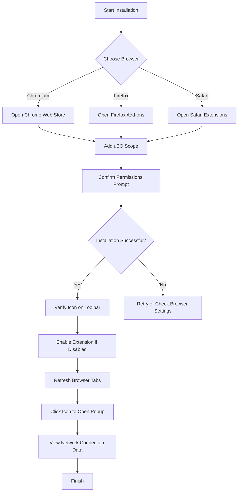

# Installation and Setup

## Overview

This guide walks you through installing uBO Scope on your preferred browser, understanding the permissions the extension requires, and confirming that it is enabled and ready to use. You'll learn how to install the extension from official browser stores and take your first steps by activating the extension's popup interface.

---

## 1. What This Guide Covers

- Installing uBO Scope from official browser extension stores
- Understanding the permissions uBO Scope requires and why
- Ensuring the extension is enabled after installation
- Launching and using the extension’s popup for initial inspection

## 2. Prerequisites

Before proceeding, ensure:

- You are using a supported browser:
  - Chromium-based browsers (Chrome, Edge, Brave, etc.) with version 122.0 or higher
  - Firefox with version 128.0 or higher
  - Safari with version 18.5 or higher
- You have internet access to reach your browser’s extension or add-ons store
- Your browser is configured to allow installing third-party extensions

> For detailed system requirements and permissions, see the [Prerequisites & System Requirements](../getting-started/installation-and-setup/prerequisites-and-system-requirements) guide.

---

## 3. Installing uBO Scope

Follow these steps to add uBO Scope to your browser:

### Step 1: Access the Official Extension Store

Choose your browser and open the matching store:

- **Google Chrome (Chromium-based browsers):**
  - Visit the [Chrome Web Store uBO Scope page](https://chromewebstore.google.com/detail/ubo-scope/bbdpgcaljkaaigfcomhidmneffjjjfgp)
- **Mozilla Firefox:**
  - Visit the [Firefox Add-ons uBO Scope page](https://addons.mozilla.org/firefox/addon/ubo-scope/)
- **Safari:**
  - Use the Mac App Store or Safari Extensions Gallery, searching for "uBO Scope" (requires Safari 18.5+)

### Step 2: Install the Extension

- Click the **Add to [Browser]** or **Install** button on the store page.
- Confirm any prompts to allow installation.
- Wait for the extension to download and install.


### Step 3: Verify Installation

- Look for the uBO Scope icon in your browser’s toolbar — it displays the extension’s badge.
- Open your browser extension menu or settings page and verify uBO Scope appears as enabled.

### Step 4: Enable or Activate the Extension (if necessary)

- Some browsers or configurations may disable newly installed extensions by default.
- Navigate to your browser’s extensions management page.
- Ensure the toggle for uBO Scope is **ON** / enabled.

---

## 4. Understanding Required Permissions

uBO Scope works by monitoring network requests made by webpages to detect connections to remote servers. To do this effectively, it requires certain permissions:

- `activeTab` — Allows the extension to interact with the currently active tab for data gathering.
- `storage` — Enables saving session data to maintain state between browser sessions.
- `webRequest` — Grants the ability to observe and intercept network requests, critical for real-time connection monitoring.
- **Host Permissions:**
  - Access to URLs matching `https://*/*` and `http://*/*` on all HTTP/S traffic.
  - For Chromium and Firefox, also includes WebSocket protocols `ws://*/*` and `wss://*/*`.

> These permissions are essential for uBO Scope to count and categorize network connections, giving you a precise view of third-party requests.

For detailed information about permissions and privacy implications, refer to the [Initial Configuration](../getting-started/installation-and-setup/initial-configuration) guide.

---

## 5. First Steps After Installation

### Opening the Extension Popup

- Click the uBO Scope icon in your browser toolbar.
- This opens the popup window displaying network connection data related to the current tab.

### What to Expect in the Popup

- **Hostname Header:** Shows the hostname of the active tab or 'NO DATA' if information is unavailable.
- **Domains Connected Summary:** Displays the count of distinct domains contacted.
- **Categories:**
  - **Not Blocked:** Domains that successfully connected.
  - **Stealth-Blocked:** Domains blocked silently.
  - **Blocked:** Domains explicitly blocked.

### Example Scenario

When visiting a webpage, uBO Scope monitors all network requests. Clicking the icon reveals how many third-party domains loaded resources and which ones were blocked or allowed, giving you transparent insights into your exposure.

---

## 6. Common Pitfalls and Tips

- **Ensure the Extension Is Enabled:** Sometimes, after installing, an extension may be disabled by the browser or user settings.
- **Browser Version Compatibility:** Older browser versions may not support required APIs; verify your browser meets minimum version requirements.
- **Refresh Tabs:** After installing, refresh open tabs to allow uBO Scope to start monitoring network requests accurately.
- **Popup May Show 'NO DATA' Initially:** This occurs if you open the popup on empty tabs or immediately after installation; navigate to a webpage and reopen.

<Tip>
Refresh your active web pages after installing uBO Scope to start receiving proper network connection data in the popup.
</Tip>

---

## 7. Verifying Your Installation

Check the following to confirm uBO Scope is working:

1. The extension icon appears on the toolbar with no warning or disabled overlay.
2. The badge on the icon updates with numbers representing distinct third-party domains.
3. Clicking the icon shows the popup with categorized domains and counts.

For advanced verification steps, see the [Validating Extension Activity](../getting-started/first-run-and-troubleshooting/validating-extension-activity) documentation.

---

## 8. Additional Installation Notes

### Cross-Browser Considerations

- uBO Scope uses Manifest v3, adhering to modern browser extension standards.
- Background scripts run differently per platform (service workers on Chromium, modules on others), but installation is consistent.
- Permissions and host access are adapted per browser manifest files.

### Manual Installation

While this guide focuses on installation via stores, advanced users may build and install using source code from the repository:

```bash
# Example for Linux platforms using provided script
./tools/make-package.sh chromium 1.0.1
# Load the package into your browser as an unpacked extension
```

Source code and scripts are available at the [uBO Scope GitHub repository](https://github.com/gorhill/uBO-Scope).

---

## Troubleshooting Installation Issues

<AccordionGroup title="Troubleshooting Installation and Setup">
<Accordion title="Extension Not Appearing after Installation">
- Confirm you installed the extension from the official store.
- Check your browser’s extension management page for disablement or errors.
- Restart the browser and reload tabs.
</Accordion>
<Accordion title="Permissions Prompt Not Shown or Denied">
- Extensions require explicit permission approvals; if denied, uninstall and reinstall.
- Verify your browser allows extensions and pop-ups.
</Accordion>
<Accordion title="Badge Does Not Update or Shows Zero">
- Refresh all web pages after installing.
- Verify the extension is enabled.
- Check for conflicting extensions that may block network requests.
</Accordion>
</AccordionGroup>

For more detailed troubleshooting, visit the [Common Setup Issues](../getting-started/first-run-and-troubleshooting/common-setup-issues) guide.

---

## Summary

By following this guide, you will have uBO Scope installed and enabled on your preferred browser, with the extension ready to monitor and display third-party network connections transparently. The extension’s toolbar icon badge and popup provide immediate insights into your browsing exposure.

---

## Related Documentation

- [Prerequisites & System Requirements](../getting-started/installation-and-setup/prerequisites-and-system-requirements)
- [Initial Configuration](../getting-started/installation-and-setup/initial-configuration)
- [Validating Extension Activity](../getting-started/first-run-and-troubleshooting/validating-extension-activity)
- [Troubleshooting Common Setup Issues](../getting-started/first-run-and-troubleshooting/common-setup-issues)
- [uBO Scope GitHub Repository](https://github.com/gorhill/uBO-Scope)

---

## Visual Map of Installation Flow



<Check>
Following these steps ensures a smooth installation and setup of uBO Scope, providing clear visibility into your browsing network activities.
</Check>