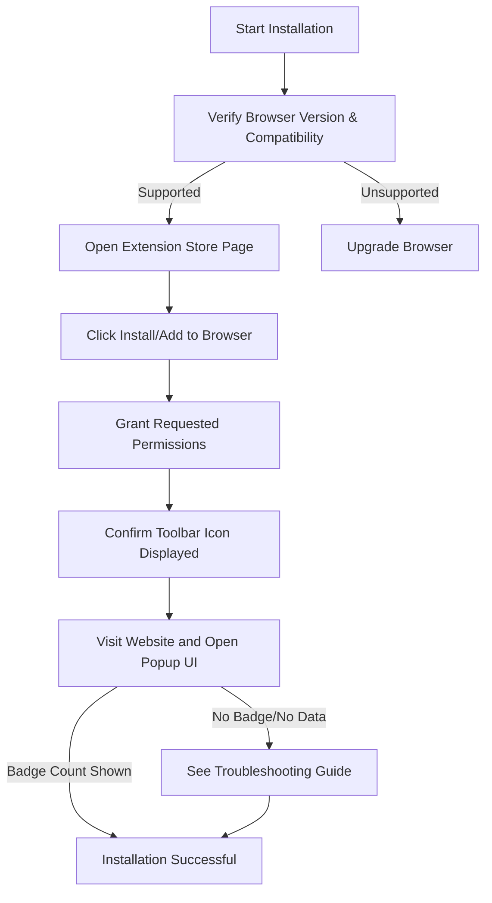

# Installation and Setup

This guide provides a straightforward, step-by-step walkthrough to get uBO Scope installed and running on your preferred major browser. By the end of this guide, you’ll have the extension correctly installed, verified, and ready to monitor your browser’s network connections.

---

## 1. Installation Overview

uBO Scope is available for the following browsers:

- Chromium-based browsers (Chrome, Edge, Brave, etc.)
- Firefox (desktop and Android)
- Safari (18.5 and later)

Each browser uses its official extension store or marketplace for installation, ensuring you get the authentic and latest version.

### Prerequisites

Before installing:

- Ensure your browser version meets the minimum requirements:
  - Chromium 122 or later
  - Firefox 128 or later
  - Safari 18.5 or later
- Confirm you have permissions to install extensions on your device.
- Have an active internet connection to access the extension store.

### Expected Outcome

Once installed and enabled, the uBO Scope extension will actively monitor and report third-party network connections made by your browser, visible through its toolbar icon and popup interface.

### Time Estimate

Installation and initial checks typically take 5–10 minutes.

### Difficulty Level

Beginner-friendly, with clear UI-driven steps.

---

## 2. Step-by-Step Installation Instructions

### Step 1: Choose Your Browser's Extension Store

- **Chromium Browsers:** Visit the [Chrome Web Store for uBO Scope](https://chrome.google.com/webstore/detail/ubo-scope/bbdpgcaljkaaigfcomhidmneffjjjfgp).
- **Firefox:** Use the [Firefox Add-ons page for uBO Scope](https://addons.mozilla.org/firefox/addon/ubo-scope/).
- **Safari:** Extensions for Safari require installation through the Mac App Store or Safari Extensions page on macOS 13.4+ or Safari 18.5+.

<Tip>
Always install extensions from the official browser stores to guarantee security and authenticity.
</Tip>

### Step 2: Install the Extension

1. Navigate to the extension page in your browser's store.
2. Click the **Add to Browser** or **Install** button.
3. Review the requested permissions — uBO Scope requests permissions primarily for monitoring network requests (`webRequest`), active tab access, and storage.
4. Confirm and complete the installation.

<Tip>
The permissions requested are essential for the extension to monitor real network connections effectively.
</Tip>

### Step 3: Verify the Extension is Enabled

- After installation, confirm the uBO Scope icon appears in your browser toolbar.
- In browsers where extensions can be disabled or hidden (for example, Chrome’s extensions puzzle icon), ensure uBO Scope is active and visible.

<Tip>
If you don’t see the toolbar icon:
- Check your browser’s extension management page (e.g., `chrome://extensions/` or `about:addons`).
- Enable the extension or pin it to the toolbar if your browser has this feature.
</Tip>

### Step 4: Confirm Permissions & Browser Compatibility

- The extension requires **webRequest** permission to track network calls.
- To confirm:
  - Chromium and Firefox browsers handle this automatically upon installation.
  - Safari might prompt for permissions or require browser-specific enablement steps.

<Tip>
Review the permissions granted in your browser’s extensions page if you face any connection tracking issues.
</Tip> 

### Step 5: Initial Operation Check

- Visit any website with third-party content (for example, news or social media sites).
- Click the uBO Scope toolbar icon to open the popup interface.
- Check for a badge count indicating distinct third-party connections.
- The popup should list detected domains under categories "not blocked", "stealth-blocked", and "blocked".

<Check>
Seeing a non-zero badge count and domain list means the extension is working properly.
</Check>

### Step 6: Handling Installation Issues

If the extension:

- **Does not appear** in toolbar or extension list, verify if installation succeeded or reinstall.
- **Fails to report connections**, check:
  - Browser version compatibility.
  - Permissions granted.
  - Conflicts with other extensions.

For troubleshooting, see the [Troubleshooting Common Setup Issues](../../getting-started/troubleshooting-support/common-issues) guide.

---

## 3. Best Practices and Tips

- **Keep your browser up to date** to maintain compatibility.
- Use the extension alongside any content blocker to get true network visibility.
- Avoid installing multiple overlapping extensions that modify network requests, as this might interfere with accurate reporting.
- Regularly check the popup UI for any sudden spikes in third-party domains to monitor privacy exposure.

---

## 4. Summary Diagram - Installation Flow

---

## 5. Next Steps & Further Reading

After successfully installing uBO Scope, continue by:

- Reviewing the [Initial Configuration](../../getting-started/first-run-usage/initial-configuration) guide to set up permissions and browser behaviors for full functionality.
- Exploring the [Running and Using the Extension](../../getting-started/first-run-usage/running-and-using-extension) guide for practical usage tips.
- Consulting the [Feature Quickstart](../../overview/feature-overview-and-integration/feature-quickstart) to understand the popup UI and interpretation of badge counts.

---

## 6. Additional Resources

- [Prerequisites & System Requirements](../../getting-started/setup-installation/prerequisites-requirements): Verify your environment before installation.
- [Troubleshooting Common Setup Issues](../../getting-started/troubleshooting-support/common-issues): Resolve common problems impacting setup.
- [Product Introduction](../../overview/product-introduction/what-is-ubo-scope): Understand the core purpose and value of uBO Scope.

---

For source code and project details, visit the uBO Scope GitHub repository: [https://github.com/gorhill/uBO-Scope](https://github.com/gorhill/uBO-Scope)

---