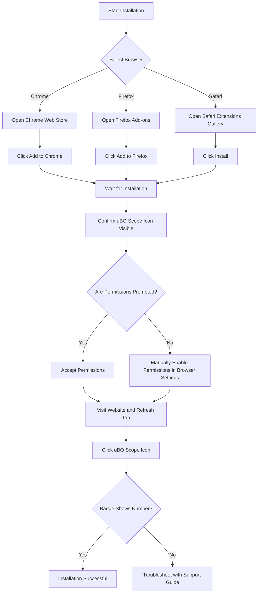

# Installation and Setup Guide for uBO Scope

Welcome to the step-by-step guide for installing and setting up uBO Scope, a powerful browser extension designed to reveal all remote server connections made by your browser. This guide walks you through installation across supported browsers, configuring necessary permissions, and verifying successful activation to ensure you start gaining insights without delay.

---

## 1. Overview of Installation and Setup

### Task Description
This guide helps you install uBO Scope on supported browsers—Chrome, Firefox, and Safari—configure required permissions, and verify that the extension is running correctly with real-time connection reporting.

### Prerequisites
- A compatible browser (minimum versions, see [System Requirements](../install-and-requirements/system-requirements)):
  - Chrome (Chromium-based) version 122.0 or above
  - Firefox version 128.0 or above
  - Safari version 18.5 or above
- Internet access to download the extension from the official stores.

### Expected Outcome
- uBO Scope installed and enabled in your browser.
- Permissions for network monitoring granted.
- Toolbar icon visible with a badge showing active connection count.
- Popup interface accessible displaying domain connection details.

### Time Estimate
About 5–10 minutes depending on your browser and internet speed.

### Difficulty Level
Beginner-friendly with straightforward instructions.

---

## 2. Step-by-Step Installation Instructions

### Step 1: Download uBO Scope from Your Browser’s Extension Store

- **Chrome:**
  1. Open the [Chrome Web Store page for uBO Scope](https://chromewebstore.google.com/detail/ubo-scope/bbdpgcaljkaaigfcomhidmneffjjjfgp).
  2. Click **Add to Chrome**, then **Add extension** in the confirmation dialog.

- **Firefox:**
  1. Open the [Firefox Add-ons page for uBO Scope](https://addons.mozilla.org/firefox/addon/ubo-scope/).
  2. Click **Add to Firefox**, then **Add** in the prompt.

- **Safari:**
  1. Open the Mac App Store or Safari Extensions Gallery.
  2. Search for `uBO Scope`.
  3. Click **Install** or **Get** and then authorize the installation.

### Step 2: Confirm Installation and Toolbar Icon Appearance

- After installation, locate the uBO Scope icon in your browser’s toolbar.
- If the icon is hidden, reveal it using the browser’s extension or toolbar customization menu:
  - Chrome: Click the puzzle piece icon, then pin uBO Scope.
  - Firefox: Click the menu (three lines) > Add-ons and themes > Extensions, then select “Show in toolbar”.
  - Safari: Open Safari > Settings > Extensions, then check uBO Scope and enable "Show in Toolbar".

### Step 3: Grant Necessary Permissions

- uBO Scope requires permissions to monitor web requests.
- When you first open the popup or reload a page, the browser will prompt you to grant permissions.
- Approve these to allow real-time monitoring of network connections.

### Step 4: Verify Extension Activation

- Click the uBO Scope toolbar icon to open the popup.
- If the popup shows _NO DATA_, reload the current webpage.
- The badge on the toolbar icon should update to a number indicating the count of distinct third-party domains connected.
- The popup lists domains grouped by **not blocked**, **stealth-blocked**, and **blocked** statuses.

<Tip>
If the badge is not updating or the popup shows no domains, ensure that you have refreshed the tab after installation and the extension has the appropriate permissions (see troubleshooting).
</Tip>

### Step 5: (Optional) Pin the Extension for Easy Access

For faster access, pin the uBO Scope icon:
- Click the extensions menu (puzzle piece) and click the pin icon next to uBO Scope.

---

## 3. Practical Examples

### Example: Confirming Installation on Chrome

1. Download from Chrome Web Store.
2. Pin the extension.
3. Visit your favorite news site.
4. Click the uBO Scope icon.
5. Notice the badge showing "3" meaning 3 distinct third-party domains connected.
6. The popup shows domains under "not blocked" reflecting live data.

### Example: Permission Request on Firefox

- After adding the extension, the first webpage access triggers a permission prompt.
- Accept these to enable network request monitoring.
- Without these permissions, uBO Scope cannot report connection outcomes.

---

## 4. Troubleshooting & Best Practices

### Common Issues

- **Extension Icon Missing:**
  - Check the extensions menu and enable visibility.
  - Restart browser if newly installed.

- **Badge Not Updating / No Data Shown:**
  - Refresh the current tab or open a new tab.
  - Confirm all host permissions are granted.
  - Disable conflicting extensions that may interfere with webRequest API.

- **Permissions Not Prompting or Denied:**
  - Reinstall the extension.
  - Check browser privacy settings for extension permissions.

### Best Practices

- Always install uBO Scope from official browser extension stores.
- Keep your browser updated to meet minimum API support versions.
- Regularly refresh tabs to ensure current data visibility.
- Use the popup interface to inspect domain activities for privacy insights.

### Performance Considerations

- uBO Scope uses browser-provided `webRequest` listeners and runs efficiently in the background.
- Having many active tabs or extensions may affect reporting speed.

---

## 5. Next Steps

### Explore Additional Guides

- [Understanding the uBO Scope Interface](../understanding-the-ui) to learn interpreting allowed, stealth, and blocked domains.
- [Analyzing Allowed, Stealth, and Blocked Domains](../../core-workflows/analyzing-allowed-stealth-blocked) for deeper workflow insights.
- [Debunking Myths About Content Blockers](../../core-workflows/debunking-content-blocker-myths) to understand data interpretation nuances.

### Support & Feedback

Visit the [Support and Feedback](../../troubleshooting/support-and-feedback) page for assistance or to report issues.

---

## 6. Additional Notes

- uBO Scope is designed to provide transparency on network requests regardless of other content blockers.
- It relies on the browser's `webRequest` API; hence, your browser must support Manifest V3 and related APIs.
- The extension runs differently depending on the browser platform, using service workers on Chromium and background scripts on Firefox/Safari.

---

## 7. Visual Diagram: Installation Flow

---

## 8. Source Reference

For source code and further technical details, visit the official repository at [https://github.com/gorhill/uBO-Scope](https://github.com/gorhill/uBO-Scope).

---

End of Installation and Setup Guide.
