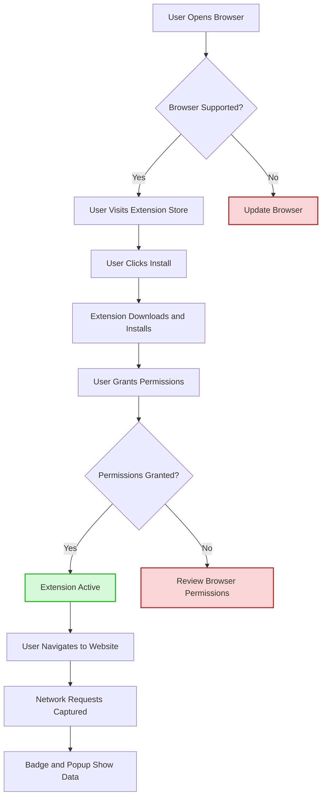

# Installation and Setup

## Overview
This guide walks you through installing uBO Scope on supported browsers—Chrome, Firefox, and Safari—and ensuring the extension is correctly running. You will learn about prerequisites, installation steps, verifying the extension’s operation, and troubleshooting common issues encountered during setup.

---

## 1. Supported Browsers and Prerequisites

### Supported Browsers
- **Google Chrome:** Minimum required version 122.0
- **Mozilla Firefox:** Minimum required version 128.0
- **Apple Safari:** Minimum required version 18.5

Each browser requires manifest permissions (`webRequest`, `storage`, `activeTab`) for uBO Scope to monitor network requests effectively.

### Key Prerequisites
- **Web Request Permissions:** Ensures uBO Scope can observe and categorize network traffic.
- **Host Permissions:** Access to all HTTP, HTTPS, and WebSocket URLs (`http://*/*`, `https://*/*`, `ws://*/*`, `wss://*/*`).
- **Storage Permissions:** For saving session and configuration data.

<Tip>
Ensure your browser version meets or exceeds the minimum requirements to guarantee full functionality and compatibility with uBO Scope.
</Tip>

---

## 2. Installation Instructions

### Google Chrome
1. Open the [Chrome Web Store on uBO Scope](https://chromewebstore.google.com/detail/ubo-scope/bbdpgcaljkaaigfcomhidmneffjjjfgp).
2. Click **Add to Chrome**.
3. Confirm the permissions dialog that appears.
4. Wait for the extension to download and install automatically.

### Mozilla Firefox
1. Visit the [Firefox Add-ons page for uBO Scope](https://addons.mozilla.org/firefox/addon/ubo-scope/).
2. Click **Add to Firefox**.
3. Review and accept the requested permissions.
4. The extension installs and activates automatically.

### Apple Safari
1. Go to the Mac App Store or Safari Extensions Gallery.
2. Locate uBO Scope (ensure it meets the minimum Safari version requirement).
3. Install and enable the extension via Safari preferences.

<Warning>
Safari extensions have limited host permissions compared to Chromium and Firefox versions; full WebSocket monitoring may be restricted.
</Warning>

---

## 3. Post-Installation Verification

Confirm the installation and operation of uBO Scope with the following steps:

1. **Check Extension Activation:** Ensure the uBO Scope icon appears in your browser toolbar.
2. **Load a Webpage:** Navigate to any website with third-party content (e.g., news portal or major e-commerce site).
3. **Observe Badge Count:** The extension badge icon should display a number indicating the count of distinct third-party servers connected.
4. **Open the Popup Panel:** Click the icon to view a summary showing "not blocked," "stealth-blocked," and "blocked" domains connected to the active tab.

<Tip>
If the badge shows zero or the popup lists no domains, visit various websites with rich third-party content to ensure proper network request detection.
</Tip>

---

## 4. What to Expect on First Launch

- The extension badge will report the number of distinct third-party domains for which there were network connections.
- The popup panel lists domains categorized as:
  - **Not Blocked:** Connections allowed by the browser.
  - **Stealth-Blocked:** Connections hidden or redirected by stealth blocking.
  - **Blocked:** Connections that failed or were explicitly blocked.
- These categories help you understand your network footprint and the behavior of content blockers in place.

<Info>
Remember, a lower badge count generally signifies fewer third-party connections, indicating better privacy and blocking efficiency.
</Info>

---

## 5. Common Issues During Installation and How to Fix Them

<AccordionGroup title="Troubleshooting Installation Issues">
<Accordion title="Extension Icon or Badge Does Not Appear">
- Confirm browser version compatibility.
- Verify extension installation in browser’s extensions or add-ons page.
- Try restarting the browser.
- Check if extension is disabled or blocked by the browser or other software.
</Accordion>
<Accordion title="Permissions Prompt Not Showing or Denied">
- Manually review permissions granted to the extension.
- Remove and reinstall the extension if permissions are stuck.
- Ensure no organization or system policy blocks these permissions.
</Accordion>
<Accordion title="No Domains Shown in Popup or Badge Count is Zero"
>
- Visit websites known to load third-party content.
- Ensure the browser does not override or block `webRequest` API calls.
- Disable conflicting extensions that may interfere with uBO Scope.
- Wait a few seconds after page load for network requests to process.
</Accordion>
<Accordion title="Extension Behavior Differs Between Browsers">
- Note Safari has limited support for WebSocket permissions, which may reduce visibility.
- See separate browser-specific docs if persistent issues arise.
</Accordion>
</AccordionGroup>

---

## 6. Additional Tips for a Smooth Setup

- **Grant all requested permissions:** They enable accurate network monitoring.
- **Test across multiple sites:** This ensures the extension captures diverse network scenarios.
- **Keep the extension updated:** For latest fixes and compatibility improvements.
- **Reference the popup panel:** It is your primary dashboard to inspect connections per tab.

---

## 7. Next Steps

- Proceed to the [First Launch & Basic Configuration](https://example.com/getting-started/first-use-and-validation/first-launch) guide to understand how to interpret the data you see.
- Review [Validating Your Setup](https://example.com/getting-started/first-use-and-validation/validating-setup) to ensure uBO Scope operates correctly.
- Consult [Troubleshooting Common Issues](https://example.com/getting-started/first-use-and-validation/troubleshooting) if you encounter problems.

---

## 8. Resources

- Official GitHub Repository: [https://github.com/gorhill/uBO-Scope](https://github.com/gorhill/uBO-Scope)
- Chrome Web Store: [Link](https://chromewebstore.google.com/detail/ubo-scope/bbdpgcaljkaaigfcomhidmneffjjjfgp)
- Firefox Add-ons: [Link](https://addons.mozilla.org/firefox/addon/ubo-scope/)
- Browser Compatibility and Permissions: See manifest files for Chrome, Firefox, Safari

---

## Diagram: Installation and Setup Flow

